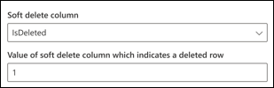

<!---Previous ms.author: vivg --->

# Conectores de SQL e Microsoft SQL Server Graph Azure

O Microsoft SQL Server ou conector do Azure SQL Graph permite que sua organização descubra e indexe dados de um banco de dados SQL Server local ou um banco de dados hospedado em sua instância do Azure SQL na nuvem.
O Graph conectores indexa o conteúdo especificado em Pesquisa da Microsoft. Para manter o índice atualizado com dados de origem, ele oferece suporte a rastreamentos periódicos completos e incrementais. Com esses SQL conectores, você também pode restringir o acesso aos resultados da pesquisa para determinados usuários.

> [!NOTE]
> Leia o [**artigo Configurar seu Graph conector para**](configure-connector.md) entender as instruções gerais Graph configuração de conectores.

Este artigo é para qualquer pessoa que configure, executa e monitore um conector de SQL do Azure e SQL servidor Graph Microsoft. Ele complementa o processo de instalação geral e mostra instruções que se aplicam apenas ao conector do servidor SQL do Azure e SQL do Graph. Este artigo também inclui informações sobre [limitações](#limitations) para o servidor microsoft SQL e conectores SQL Azure.

## Antes de começar

### Instale o Graph conector (necessário apenas para o conector Microsoft SQL Server local)

Para acessar seus dados de terceiros locais, você deve instalar e configurar o Graph conector. Consulte [Instalar o Graph conector de dados](graph-connector-agent.md) para saber mais.

>[!NOTE]
>Se você usar Windows autenticação durante a configuração do conector Microsoft SQL Server Graph, o usuário com o qual você está tentando entrar precisa ter direitos de logon interativos para o computador onde o Graph conector está instalado. Consulte a documentação sobre [o gerenciamento de política de logon](/windows/security/threat-protection/security-policy-settings/allow-log-on-locally#policy-management) para verificar os direitos de logon.

## Etapa 1: adicionar um conector Graph no Centro de administração do Microsoft 365

Siga as instruções [gerais de instalação](./configure-connector.md).
<!---If the above phrase does not apply, delete it and insert specific details for your data source that are different from general setup 
instructions.-->

## Etapa 2: nomear a conexão

Siga as instruções [gerais de instalação](./configure-connector.md).
<!---If the above phrase does not apply, delete it and insert specific details for your data source that are different from general setup 
instructions.-->

## Etapa 3: Configurar as configurações de conexão

### Registrar um aplicativo (somente para o SQL do Azure)

Para o conector SQL do Azure, você deve registrar um aplicativo no Azure Active Directory para permitir que Pesquisa da Microsoft aplicativo acesse dados para indexação. Para saber mais sobre como registrar um aplicativo, consulte a documentação Graph Microsoft sobre como [registrar um aplicativo.](/graph/auth-register-app-v2)

Depois de concluir o registro do aplicativo e anotar o nome do aplicativo, a ID do aplicativo (cliente) e a ID do locatário, você precisa gerar um novo segredo [do cliente.](/azure/healthcare-apis/register-confidential-azure-ad-client-app#application-secret) O segredo do cliente só será exibido uma vez. Lembre-se de & armazenar o segredo do cliente com segurança. Use a ID do cliente e o segredo do cliente durante a configuração de uma nova conexão no Pesquisa da Microsoft.

Para adicionar o aplicativo registrado ao seu Banco de Dados SQL do Azure, você precisa:

- Faça logoff no seu Azure SQL DB
- Abrir uma nova janela de consulta
- Criar um novo usuário executando o comando "CRIAR USUÁRIO [nome do aplicativo] DO PROVEDOR EXTERNO"
- Adicionar usuário à função executando o comando 'exec sp_addrolemember 'db_datareader', [nome do aplicativo]' ou 'ALTER ROLE db_datareader ADD MEMBER [nome do aplicativo]'

>[!NOTE]
>Para revogar o acesso a qualquer aplicativo registrado no Azure Active Directory, consulte a documentação do Azure sobre [como remover um aplicativo registrado.](/azure/active-directory/develop/quickstart-remove-app)

### Configurações de conexão

Para conectar seu conector Microsoft SQL Server a uma fonte de dados, você deve configurar o servidor de banco de dados que deseja rastrear e o agente local. Em seguida, você pode se conectar ao banco de dados com o método de autenticação necessário.

> [!NOTE] 
> Seu banco de dados deve SQL Server versão 2008 ou posterior para que o conector Microsoft SQL Server possa se conectar.

Para o conector de SQL do Azure, você só precisa especificar o nome do servidor ou o endereço IP ao qual deseja se conectar. O conector SQL do Azure dá suporte Azure Active Directory autenticação OIDC (Conexão de ID Aberta) para se conectar ao banco de dados.

Para maior segurança, você pode configurar regras de firewall IP para seu SQL Server ou banco de dados do Azure. Para saber mais sobre como configurar regras de firewall IP, consulte documentação sobre regras [de firewall IP.](/azure/azure-sql/database/firewall-configure) Adicione os seguintes intervalos de IP do cliente nas configurações de firewall.

| Região | Intervalo DE IP |
| ------------ | ------------ |
| NAM | 52.250.92.252/30, 52.224.250.216/30 |
| EUR | 20.54.41.208/30, 51.105.159.88/30 |
| APC | 52.139.188.212/30, 20.43.146.44/30 |

Para pesquisar o conteúdo do banco de dados, você deve especificar SQL consultas ao configurar o conector. Essas SQL precisam nomear todas as colunas de banco de dados que você deseja indexar (ou seja, propriedades de origem), incluindo qualquer SQL que precise ser executada para obter todas as colunas. Para restringir o acesso aos resultados da pesquisa, especifique As LISTAS de Controle de Acesso (ACLs) em SQL consultas ao configurar o conector.

## Etapa 3a: Rastreamento completo (Obrigatório)

Nesta etapa, você configura a SQL que executa um rastreamento completo do banco de dados. O rastreamento completo seleciona todas as colunas ou propriedades onde você deseja selecionar as opções **Consulta,** **Pesquisa** ou **Recuperar**. Você também pode especificar colunas ACL para restringir o acesso de resultados de pesquisa a usuários ou grupos específicos.

> [!Tip]
> Para obter todas as colunas de que você precisa, você pode ingressar em várias tabelas.

### Selecione colunas de dados (obrigatório) e colunas ACL (Opcional)

O exemplo demonstra uma seleção de cinco colunas de dados que reterão os dados da pesquisa: OrderId, OrderTitle, OrderDesc, CreatedDateTime e IsDeleted. Para definir permissões de exibição para cada linha de dados, você pode, opcionalmente, selecionar essas colunas ACL: AllowedUsers, AllowedGroups, DeniedUsers e DeniedGroups. Todas essas colunas de dados também têm as opções **para Consulta,** **Pesquisa** ou **Recuperar**.

Selecione colunas de dados conforme mostrado nesta consulta de exemplo: `SELECT OrderId, OrderTitle, OrderDesc, AllowedUsers, AllowedGroups, DeniedUsers, DeniedGroups, CreatedDateTime, IsDeleted`

Para gerenciar o acesso aos resultados da pesquisa, você pode especificar uma ou mais colunas ACL na consulta. O SQL conector permite controlar o acesso por nível de registro. Você pode optar por ter o mesmo controle de acesso para todos os registros de uma tabela. Se as informações da ACL são armazenadas em uma tabela separada, talvez seja preciso fazer uma junção com essas tabelas em sua consulta.

O uso de cada uma das colunas ACL na consulta acima é descrito abaixo. A lista a seguir explica os quatro **mecanismos de controle de acesso**.

- **AllowedUsers**: Esta coluna especifica a lista de IDs de usuário que podem acessar os resultados da pesquisa. No exemplo a seguir, lista de usuários: john@contoso.com, keith@contoso.com e lisa@contoso.com teriam acesso apenas a um registro com OrderId = 12.
- **AllowedGroups**: esta coluna especifica o grupo de usuários que poderão acessar os resultados da pesquisa. No exemplo a seguir, sales-team@contoso.com grupo teria acesso apenas ao registro com OrderId = 12.
- **DeniedUsers**: Esta coluna especifica a lista de usuários que **não têm** acesso aos resultados da pesquisa. No exemplo a seguir, os usuários john@contoso.com e keith@contoso.com não têm acesso para gravar com OrderId = 13, enquanto todos os outros têm acesso a esse registro.
- **DeniedGroups**: Esta coluna especifica o grupo de usuários que **não têm** acesso aos resultados da pesquisa. No exemplo a seguir, os grupos engg-team@contoso.com e pm-team@contoso.com não têm acesso para gravar com OrderId = 15, enquanto todos os outros têm acesso a esse registro.  

### Tipos de dados com suporte

A tabela a seguir resume os SQL de dados que são suportados nos conectores MS SQL e Azure SQL. A tabela também resume o tipo de dados de indexação para o tipo de SQL de dados com suporte. Para saber mais sobre os conectores Graph microsoft com suporte para tipos de dados para indexação, consulte a documentação sobre tipos de recursos [de propriedade.](/graph/api/resources/property?preserve-view=true&view=graph-rest-beta#properties)

| Categoria | Tipo de dados de origem | Tipo de dados de indexação |
| ------------ | ------------ | ------------ |
| Data e hora | data   datetime   datetime2   smalldatetime | datetime |
| Numérico exato | bigint   int   smallint   tinyint | int64 |
| Numérico exato | bit | booliano |
| Numérico aproximado | flutuação   real | double |
| Conjunto de caracteres | char   varchar   texto | string |
| Cadeias de caracteres Unicode | nchar   nvarchar   ntext | string |
| Outros tipos de dados | uniqueidentifier | string |

Para qualquer outro tipo de dados atualmente não suportado diretamente, a coluna precisa ser explicitamente lançada para um tipo de dados com suporte.

### Marca d'água (obrigatório)

Para evitar sobrecarregar o banco de dados, o conector em lotes e retoma consultas de rastreamento completo com uma coluna de marca d'água de rastreamento completo. Usando o valor da coluna de marca d'água, cada lote subsequente é buscado e a consulta é retomada do último ponto de verificação. Essencialmente, esses mecanismos controlam a atualização de dados para rastreamentos completos.

Crie trechos de consulta para marcas d'água, conforme mostrado nestes exemplos:

- `WHERE (CreatedDateTime > @watermark)`. Cite o nome da coluna de marca d'água com a palavra-chave `@watermark` reservada . Se a ordem de classificação da coluna de marca d'água for crescente, use `>` ; caso contrário, use `<` .
- `ORDER BY CreatedDateTime ASC`. Classificar na coluna marca d'água em ordem crescente ou decrescente.

Na configuração mostrada na imagem a seguir, `CreatedDateTime` está a coluna de marca d'água selecionada. Para buscar o primeiro lote de linhas, especifique o tipo de dados da coluna de marca d'água. Nesse caso, o tipo de dados é `DateTime` .

A primeira consulta busca o primeiro **número N** de linhas usando: "CreatedDateTime > 1º de janeiro de 1753 00:00:00" (valor mínimo do tipo de dados DateTime). Depois que o primeiro lote é buscado, o maior valor de retornado no lote é salvo como o ponto de verificação se as linhas são classificação em `CreatedDateTime` ordem crescente. Um exemplo é 1º de março de 2019 03:00:00. Em seguida, o próximo lote de linhas **N** é buscado usando "CreatedDateTime > 1º de março de 2019 03:00:00" na consulta.

### Ignorar linhas excluídas de forma suave (Opcional)

Para excluir linhas excluídas de forma suave em seu banco de dados de serem indexadas, especifique o nome da coluna de exclusão suave e o valor que indica que a linha é excluída.

### Rastreamento completo: Gerenciar permissões de pesquisa

Selecione **Gerenciar permissões para** escolher as várias colunas de controle de acesso (ACL) que especificam o mecanismo de controle de acesso. Selecione o nome da coluna que você especificou na consulta SQL rastreamento completo.

Cada uma das colunas ACL deve ser uma coluna de vários valores. Esses vários valores de ID podem ser separados por separadores, como ponto e vírgula (;), vírgula (,) e assim por diante. Você precisa especificar esse separador no campo **separador de** valores.

Os seguintes tipos de ID são suportados para uso como ACLs:

- **Nome principal do usuário (UPN)**: Um Nome de Entidade de Usuário (UPN) é o nome de um usuário do sistema em um formato de endereço de email. Um UPN (por exemplo: john.doe@domain.com) consiste no nome de usuário (nome de logon), separador (o símbolo @) e nome de domínio (sufixo UPN).
- **Azure Active Directory (AAD) ID**: no Azure AD, cada usuário ou grupo tem uma ID de objeto que se parece com 'e0d3ad3d-0000-1111-2222-3c5f5c52ab9b'.
- ID de Segurança do **Active Directory (AD)**: Em uma configuração do AD local, cada usuário e grupo tem um identificador de segurança imutável e exclusivo que se parece com 'S-1-5-21-3878594291-2115959936-132693609-65242.'

## Etapa 3b: Rastreamento incremental (Opcional)

Nesta etapa opcional, forneça uma SQL para executar um rastreamento incremental do banco de dados. Com essa consulta, o conector SQL determina quaisquer alterações nos dados desde o último rastreamento incremental. Como no rastreamento completo, selecione todas as colunas onde você deseja selecionar as opções **Consulta,** **Pesquisa** ou **Recuperar**. Especifique o mesmo conjunto de colunas ACL que você especificou na consulta de rastreamento completo.

Os componentes na imagem a seguir se parecem com os componentes de rastreamento completos com uma exceção. Nesse caso, "ModifiedDateTime" é a coluna de marca d'água selecionada. Revise as [etapas completas de rastreamento](#step-3a-full-crawl-required) para saber como escrever sua consulta de rastreamento incremental e veja a imagem a seguir como um exemplo.

## Etapa 4: Atribuir rótulos de propriedade

Siga as instruções [gerais de instalação](./configure-connector.md).

<!---If the above phrase does not apply, delete it and insert specific details for your data source that are different from general setup 
instructions.-->

## Etapa 5: Gerenciar esquema

Siga as instruções [gerais de instalação](./configure-connector.md).
<!---If the above phrase does not apply, delete it and insert specific details for your data source that are different from general setup 
instructions.-->

## Etapa 6: Gerenciar permissões de pesquisa

Você pode optar por usar [as ACLs especificadas](#full-crawl-manage-search-permissions) na tela de rastreamento completa ou substituí-las para tornar seu conteúdo visível para todos.

## Etapa 7: Escolher configurações de atualização

Siga as instruções [gerais de instalação](./configure-connector.md).
<!---If the above phrase does not apply, delete it and insert specific details for your data source that are different from general setup 
instructions.-->

## Etapa 8: Revisar conexão

Siga as instruções [gerais de instalação](./configure-connector.md).
<!---If the above phrase does not apply, delete it and insert specific details for your data source that are different from general setup 
instructions.-->

<!---## Next steps: Customize the search results page

Create your own verticals and result types, so end users can view search results from new connections. Without this step, data from your connection won't show up on the search results page.

To learn more about how to create your verticals and MRTs, see [Search results page customization](customize-search-page.md).-->

## Solução de problemas

A seguir, um erro comum observado durante a configuração do conector e seu possível motivo.

| Etapa de configuração | Mensagem de erro | Possíveis motivos |
| ------------ | ------------ | ------------ |
| Rastreamento completo | `Error from database server: A transport level error has occurred when receiving results from the server.` | Esse erro ocorre devido a problemas de rede. É recomendável verificar logs de rede usando o [monitor de rede da Microsoft](https://www.microsoft.com/download/details.aspx?id=4865) e entrar em contato com o suporte ao cliente da Microsoft. |

## Limitações

Os SQL conectores têm essas limitações na versão de visualização:

- Microsoft SQL Server conector: o banco de dados local deve ser executado SQL Server versão 2008 ou posterior.
- A assinatura Microsoft 365 assinatura do Azure (hospedando o banco de dados do Azure SQL) deve estar no mesmo Azure Active Directory.
- As ACLs só têm suporte usando um Nome de Entidade de Usuário (UPN), Azure Active Directory (Azure AD) ou Segurança do Active Directory.
- Não há suporte para indexação de conteúdo rico dentro de colunas de banco de dados. Exemplos desse conteúdo são HTML, JSON, XML, blobs e análises de documentos que existem como links dentro das colunas de banco de dados.
