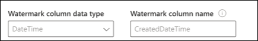
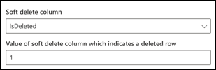

<!---Previous ms.author:vivg --->

# Conector SQL Graph Oracle

O conector SQL Graph Oracle permite que sua organização descubra e indexe dados de um banco de dados Oracle local. O conector indexa o conteúdo especificado em Pesquisa da Microsoft. Para manter o índice atualizado com dados de origem, ele oferece suporte a rastreamentos periódicos completos e incrementais. Com o conector de SQL Oracle, você também pode restringir o acesso aos resultados da pesquisa para determinados usuários.

> [!NOTE]
> Leia o [**artigo Instalação do conector Graph para**](configure-connector.md) entender as instruções gerais Graph configuração de conectores.

Este artigo é para qualquer pessoa que configure, executa e monitore um conector SQL Graph Oracle. Ele complementa o processo de instalação geral e mostra instruções que se aplicam somente ao conector SQL Graph Oracle. Este artigo também inclui informações sobre Solução de [Problemas](#troubleshooting) e [Limitações.](#limitations)

## Antes de começar

### Instalar o Graph conector

Para acessar seus dados de terceiros locais, você deve instalar e configurar o Graph conector. Consulte [Instalar o Graph conector de dados](graph-connector-agent.md) para saber mais.  

## Etapa 1: adicionar um conector Graph no Centro de administração do Microsoft 365

Siga as instruções [gerais de instalação](./configure-connector.md).
<!---If the above phrase does not apply, delete it and insert specific details for your data source that are different from general setup instructions.-->

## Etapa 2: nomear a conexão

Siga as instruções [gerais de instalação](./configure-connector.md).
<!---If the above phrase does not apply, delete it and insert specific details for your data source that are different from general setup instructions.-->

## Etapa 3: Configurar as configurações de conexão

Para conectar seu conector de SQL Oracle a uma fonte de dados, você deve configurar o servidor de banco de dados que deseja rastrear e o agente de conector Graph local. Em seguida, você pode se conectar ao banco de dados com o método de autenticação necessário.

Para o conector SQL Oracle, você precisa especificar o nome hostname, Porta e Serviço (banco de dados) juntamente com o método de autenticação preferencial, nome de usuário e senha.

> [!NOTE]
> Seu banco de dados deve executar o banco de dados Oracle versão 11g ou posterior para que o conector possa se conectar. O conector dá suporte ao banco de dados Oracle hospedado em Windows plataformas de VM do Linux e do Azure.

Para pesquisar o conteúdo do banco de dados, você deve especificar SQL consultas ao configurar o conector. Essas SQL precisam nomear todas as colunas de banco de dados que você deseja indexar (ou seja, propriedades de origem), incluindo qualquer SQL que precise ser executada para obter todas as colunas. Para restringir o acesso aos resultados da pesquisa, especifique As LISTAS de Controle de Acesso (ACLs) em SQL consultas ao configurar o conector.

## Etapa 3a: Rastreamento completo (Obrigatório)

Nesta etapa, você configura a SQL que executa um rastreamento completo do banco de dados. O rastreamento completo seleciona todas as colunas ou propriedades onde você deseja selecionar as opções **Consulta,** **Pesquisa** ou **Recuperar**. Você também pode especificar colunas ACL para restringir o acesso de resultados de pesquisa a usuários ou grupos específicos.

> [!Tip]
> Para obter todas as colunas de que você precisa, você pode ingressar em várias tabelas.

### Selecione colunas de dados (obrigatório) e colunas ACL (Opcional)

O exemplo demonstra a seleção de cinco colunas de dados que reterão os dados da pesquisa: OrderId, OrderTitle, OrderDesc, CreatedDateTime e IsDeleted. Para definir permissões de exibição para cada linha de dados, você pode, opcionalmente, selecionar essas colunas ACL: AllowedUsers, AllowedGroups, DeniedUsers e DeniedGroups. Para todas essas colunas de dados, você pode selecionar as opções **para Consulta,** **Pesquisa** ou **Recuperar**.

Selecione colunas de dados conforme mostrado nesta consulta de exemplo: `SELECT OrderId, OrderTitle, OrderDesc, AllowedUsers, AllowedGroups, DeniedUsers, DeniedGroups, CreatedDateTime, IsDeleted`

Para gerenciar o acesso aos resultados da pesquisa, você pode especificar uma ou mais colunas ACL na consulta. O SQL conector permite controlar o acesso por nível de registro. Você pode optar por ter o mesmo controle de acesso para todos os registros de uma tabela. Se as informações da ACL são armazenadas em uma tabela separada, talvez seja preciso fazer uma junção com essas tabelas em sua consulta.

O uso de cada uma das colunas ACL na consulta acima é descrito abaixo. A lista a seguir explica os quatro **mecanismos de controle de acesso**.

* **AllowedUsers**: Essa opção especifica a lista de IDs de usuário que poderão acessar os resultados da pesquisa. No exemplo a seguir, lista de usuários: john@contoso.com, keith@contoso.com e lisa@contoso.com teriam acesso apenas a um registro com OrderId = 12.
* **AllowedGroups**: essa opção especifica o grupo de usuários que poderão acessar os resultados da pesquisa. No exemplo a seguir, sales-team@contoso.com grupo teria acesso apenas ao registro com OrderId = 12.
* **DeniedUsers**: Essa opção especifica a lista de usuários que **não têm** acesso aos resultados da pesquisa. No exemplo a seguir, os usuários john@contoso.com e keith@contoso.com não têm acesso para gravar com OrderId = 13, enquanto todos os outros têm acesso a esse registro.
* **DeniedGroups**: essa opção especifica o grupo de usuários que **não têm** acesso aos resultados da pesquisa. No exemplo a seguir, os grupos engg-team@contoso.com e pm-team@contoso.com não têm acesso para gravar com OrderId = 15, enquanto todos os outros têm acesso a esse registro.  

### Tipos de dados com suporte

A tabela abaixo resume os tipos de dados suportados pelo conector SQL Oracle. A tabela também resume o tipo de dados de indexação para o tipo de SQL de dados com suporte. Para saber mais sobre os conectores Graph microsoft com suporte para tipos de dados para indexação, consulte a documentação sobre tipos de recursos [de propriedade.](/graph/api/resources/property?preserve-view=true&view=graph-rest-beta#properties)

| Categoria | Tipo de dados de origem | Tipo de dados de indexação |
| ------------ | ------------ | ------------ |
| Datatype de número | NUMBER(p,0) | int64 (para p <= 18)   double (para p > 18) |
| Datatype de número de ponto flutuante | NUMBER(p,s)   FLOAT(p) | double |
| Datatype de data | DATA   TIMESTAMP   TIMESTAMP(n) | datetime |
| Tipo de dados de caractere | CHAR(n)   VARCHAR   VARCHAR2   Longas   CLOB   NCLOB | string |
| Tipo de dados de caractere unicode | NCHAR   NVARCHAR | string |
| Tipo de dados RowID | ROWID   UROWID | string |

Para qualquer outro tipo de dados atualmente não suportado diretamente, a coluna precisa ser explicitamente lançada para um tipo de dados com suporte.

### Marca d'água (obrigatório)

Para evitar sobrecarregar o banco de dados, o conector em lotes e retoma consultas de rastreamento completo com uma coluna de marca d'água de rastreamento completo. Usando o valor da coluna de marca d'água, cada lote subsequente é buscado e a consulta é retomada do último ponto de verificação. Essencialmente, esse é um mecanismo para controlar a atualização de dados para rastreamentos completos.

Crie trechos de consulta para marcas d'água, conforme mostrado nestes exemplos:

* `WHERE (CreatedDateTime > @watermark)`. Cite o nome da coluna de marca d'água com a palavra-chave `@watermark` reservada . Você só pode classificar a coluna de marca d'água em ordem crescente.
* `ORDER BY CreatedDateTime ASC`. Classificar na coluna marca d'água em ordem crescente.

Na configuração mostrada na imagem a seguir, `CreatedDateTime` está a coluna de marca d'água selecionada. Para buscar o primeiro lote de linhas, especifique o tipo de dados da coluna de marca d'água. Nesse caso, o tipo de dados é `DateTime` .

A primeira consulta busca o primeiro **número N** de linhas usando: "CreatedDateTime > 1º de janeiro de 1753 00:00:00" (valor mínimo do tipo de dados DateTime). Depois que o primeiro lote é buscado, o maior valor de retornado no lote é salvo como o ponto de verificação se as linhas são classificação em `CreatedDateTime` ordem crescente. Um exemplo é 1º de março de 2019 03:00:00. Em seguida, o próximo lote de linhas **N** é buscado usando "CreatedDateTime > 1º de março de 2019 03:00:00" na consulta.

### Ignorar linhas excluídas de forma suave (Opcional)

Para excluir linhas excluídas de forma suave em seu banco de dados de serem indexadas, especifique o nome da coluna de exclusão suave e o valor que indica que a linha é excluída.

### Rastreamento completo: Gerenciar permissões de pesquisa

Selecione **Gerenciar permissões para** escolher as várias colunas de controle de acesso (ACL) que especificam o mecanismo de controle de acesso. Selecione o nome da coluna que você especificou na consulta SQL rastreamento completo.

Cada uma das colunas ACL deve ser uma coluna de vários valores. Esses vários valores de ID podem ser separados por separadores, como ponto e vírgula (;), vírgula (,) e assim por diante. Você precisa especificar esse separador no campo **separador de** valores.

Os seguintes tipos de ID são suportados para uso como ACLs:

* **Nome principal do usuário (UPN)**: Um Nome de Entidade de Usuário (UPN) é o nome de um usuário do sistema em um formato de endereço de email. Um UPN (por exemplo: john.doe@domain.com) consiste no nome de usuário (nome de logon), separador (o símbolo @) e nome de domínio (sufixo UPN).
* **Azure Active Directory (AAD) ID**: no Azure AD, cada usuário ou grupo tem uma ID de objeto que se parece com 'e0d3ad3d-0000-1111-2222-3c5f5c52ab9b'
* ID de Segurança do **Active Directory (AD)**: Em uma configuração do AD local, cada usuário e grupo tem um identificador de segurança imutável e exclusivo que se parece com 'S-1-5-21-3878594291-2115959936-132693609-65242.'

## Etapa 3b: Rastreamento incremental (Opcional)

Nesta etapa opcional, forneça uma SQL para executar um rastreamento incremental do banco de dados. Com essa consulta, o conector SQL determina quaisquer alterações nos dados desde o último rastreamento incremental. Como no rastreamento completo, selecione entre as opções **Consulta,** **Pesquisa** ou **Recuperar**. Especifique o mesmo conjunto de colunas ACL que você especificou na consulta de rastreamento completo.

Os componentes na imagem a seguir se parecem com os componentes de rastreamento completos com uma exceção. Nesse caso, "ModifiedDateTime" é a coluna de marca d'água selecionada. Revise as [etapas completas de rastreamento](#step-3a-full-crawl-required) para saber como escrever sua consulta de rastreamento incremental e veja a imagem a seguir como um exemplo.

## Etapa 4: Atribuir rótulos de propriedade

Siga as instruções [gerais de instalação](./configure-connector.md).
<!---If the above phrase does not apply, delete it and insert specific details for your data source that are different from general setup instructions.-->

## Etapa 5: Gerenciar esquema

Siga as instruções [gerais de instalação](./configure-connector.md).
<!---If the above phrase does not apply, delete it and insert specific details for your data source that are different from general setup instructions.-->

## Etapa 6: Gerenciar permissões de pesquisa

Você pode optar por usar [as ACLs especificadas](#full-crawl-manage-search-permissions) na tela de rastreamento completa ou substituí-las para tornar seu conteúdo visível para todos.

## Etapa 7: Escolher configurações de atualização

O conector SQL Oracle oferece suporte a agendas de atualização para rastreamentos completos e incrementais. Recomendamos que você desem conjunto ambos.

Uma agenda completa de rastreamento localiza linhas excluídas que foram sincronizadas anteriormente com o índice Pesquisa da Microsoft e quaisquer linhas que foram movidas para fora do filtro de sincronização. Quando você se conecta ao banco de dados pela primeira vez, um rastreamento completo é executado para sincronizar todas as linhas recuperadas da consulta de rastreamento completo. Para sincronizar novas linhas e fazer atualizações, você precisa agendar rastreamentos incrementais.

## Etapa 8: Revisar conexão

Siga as instruções [gerais de instalação](./configure-connector.md).
<!---If the above phrase does not apply, delete it and insert specific details for your data source that are different from general setup instructions.-->

<!--- ## Next steps: Customize the search results page

Create your own verticals and result types, so end users can view search results from new connections. Without this step, data from your connection won't show up on the search results page.

To learn more about how to create your verticals and MRTs, see [Search results page customization](customize-search-page.md). -->

## Solução de problemas

Abaixo está uma lista de erros comuns observados durante a configuração do conector e seus possíveis motivos.

| Etapa de configuração | Mensagem de erro | Possíveis motivos |
| ------------ | ------------ | ------------ |
| Configurações do banco de dados | Erro do servidor de banco de dados: Tempo de tempo de solicitação de conexão | Hostname inválido   Host não acessível |
| Configurações do banco de dados | Erro do servidor de banco de dados: ORA-12541: TNS: Nenhum ouvinte | Porta inválida |
| Configurações do banco de dados | Erro do servidor de banco de dados: ORA-12514: TNS: o ouvinte não sabe do serviço solicitado no descritor do conector | Nome de serviço inválido (banco de dados) |
| Configurações do banco de dados | Erro do servidor de banco de dados: Falha no logon do `user` usuário ' '. | Nome de usuário ou senha inválido |

## Limitações

O conector SQL Oracle tem essas limitações na versão de visualização:

* O banco de dados local deve executar o Banco de Dados Oracle versão 11g ou posterior.
* As ACLs só têm suporte usando um Nome de Entidade de Usuário (UPN), Azure Active Directory (Azure AD) ou Segurança do Active Directory.
* Não há suporte para indexação de conteúdo rico dentro de colunas de banco de dados. Exemplos desse conteúdo são HTML, JSON, XML, blobs e análises de documentos que existem como links dentro das colunas de banco de dados.