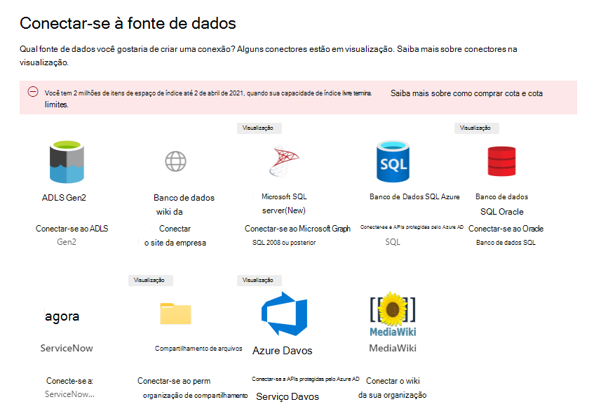
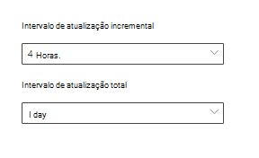

<!-- Previous ms.author: monaray -->

<!-- markdownlint-disable no-trailing-punctuation -->

# Visão geral da configuração dos conectores do Graph pela Microsoft 

Este artigo mostra o processo básico necessário para configurar os conectores Graph **de** Graph microsoft no [Centro de administração do Microsoft 365](https://admin.microsoft.com). O processo básico inclui as seguintes etapas:  
<!---Add links to each section in the doc--->

1. [Adicionar um conector do Graph no Centro de administração do Microsoft 365](#step-1-add-a-graph-connector-in-the-microsoft-365-admin-center)
2. [Dar um nome à conexão](#step-2-name-the-connection)
3. [Definir as configurações de conexão](#step-3-configure-the-connection-settings)
4. [Gerenciar as permissões de pesquisa](#step-4-manage-search-permissions)
5. [Atribuir os rótulos de propriedade](#step-5-assign-property-labels)
6. [Gerenciar esquema](#step-6-manage-schema)
7. [Atualizar as configurações](#step-7-refresh-settings)
8. [Analisar a conexão](#step-8-review-connection)

Este artigo também inclui informações sobre solução de problemas, limitações e próximas etapas:

* [Solução de Problemas](#troubleshooting)
* [Limites](#limitations)
* [Próximas etapas](#next-steps)

> [!NOTE]
> O processo de instalação é semelhante a todos os conectores Graph da Microsoft, mas não é exatamente o mesmo. **Além de ler este artigo, leia as informações específicas do conector para sua fonte de dados.**  

<!---## Before you get started-->

<!---Insert "Before you get started" recommendations for this data source-->

## Etapa 1: adicionar um conector Graph no Centro de administração do Microsoft 365

Conclua as etapas a seguir para configurar qualquer um dos conectores de Graph da Microsoft:

1. Entre em sua conta de administrador no [Centro de administração do Microsoft 365](https://admin.microsoft.com).

2. No painel de navegação, selecione **Configurações** e, em seguida, selecione **Pesquisar & inteligência**. Selecione a [guia Conectores](https://admin.microsoft.com/Adminportal/Home#/MicrosoftSearch/Connectors).

3. Selecione **+Adicionar** e selecione a fonte de dados de sua escolha no menu de opções disponíveis.

   > [!div class="mx-imgBorder"]
   > 

> [!NOTE]
> Você pode adicionar no máximo dez conexões Graph a cada locatário.

## Etapa 2: nomear a conexão

Especifique esses atributos:

* Nome (obrigatório)
* ID da conexão (obrigatório)
* Descrição (opcional)

A ID da conexão cria propriedades implícitas para o conector. Ele deve conter apenas caracteres alfanuméricos e ter no máximo 32 caracteres.

## Etapa 3: Configurar as configurações de conexão

O processo para configurar as configurações de conexão varia com base no tipo de fonte de dados. Consulte as informações específicas do Conector para o tipo de fonte de dados que você deseja adicionar ao seu locatário para concluir esta etapa no processo de instalação.  

Para saber mais sobre como se conectar a uma fonte de dados local, consulte [Install an on-premises data gateway](/data-integration/gateway/service-gateway-install).

## Etapa 4: Gerenciar permissões de pesquisa

As Listas de Controle de Acesso (ACLs) determinam quais usuários em sua organização podem acessar cada item de dados.  

Alguns conectores como [o Microsoft SQL](MSSQL-connector.md) e o [Azure Data Lake Armazenamento Gen2](azure-data-lake-connector.md) suportam Azure Active Directory [ACLs (Azure AD).](/azure/active-directory/)

Outros conectores, como [ServiceNow,](servicenow-connector.md) [Azure DevOps](azure-devops-connector.md)e [Salesforce,](salesforce-connector.md) suportam a sincronização de usuários e grupos que não são do Azure AD.  

## Etapa 5: Atribuir rótulos de propriedade

Você pode atribuir rótulos semânticos às suas propriedades de origem na página "Atribuir rótulos de propriedade". Rótulos são marcas conhecidas fornecidas pela Microsoft que fornecem significado semântico. Eles permitem que a Microsoft integre seus dados do conector Microsoft 365 experiências como pesquisa aprimorada, cartões de pessoas, descoberta inteligente e muito mais.  

A tabela a seguir lista os rótulos com suporte no momento e suas descrições.  

Rótulo | Descrição
--- | ---  
**título** | O título do item que você deseja mostrar na pesquisa e em outras experiências
**url** | A URL de destino do item no sistema de origem
**createdBy** | Nome da pessoa que criou o item
**lastModifiedBy** | Nome da pessoa que editou o item mais recentemente
**autores** | Nome das pessoas que participaram/colaboraram no item
**createdDateTime** | Quando o item foi criado
**lastModifiedDateTime** | Quando o item foi editado mais recentemente
**fileName** | Nome do item de arquivo
**FileExtension** | Tipo de item de arquivo como .pdf ou .word

As propriedades nesta página são pré-selecionadas com base em sua fonte de dados, mas você pode alterar essa seleção se houver uma propriedade diferente que seja mais adequada para um rótulo específico.  

O título **do rótulo** é o rótulo mais importante. É altamente **recomendável que** você tenha uma propriedade atribuída a esse rótulo para que sua conexão participe da experiência de [cluster de resultados.](result-cluster.md)

O mapeamento incorreto de rótulos causará uma experiência de pesquisa deteriorada. Não há problema em alguns rótulos não ter uma propriedade atribuída a ela.  

## Etapa 6: Gerenciar esquema

### Propriedade Content

É recomendável selecionar uma **Propriedade de Conteúdo** no menu suspenso de opções ou manter o padrão se uma estiver presente. Essa propriedade é usada para indexação de texto completo de conteúdo, geração de trecho de página de resultados de pesquisa, participação de [cluster](result-cluster.md) de resultados, detecção de idioma, suporte a HTML/texto, classificação e relevância e formulação de consulta.

Se você selecionar uma propriedade de conteúdo, terá a opção de usar a propriedade **ResultSnippet** gerada pelo sistema ao criar seu tipo [de resultado](customize-results-layout.md). Essa propriedade serve como um espaço reservado para os trechos dinâmicos gerados a partir da propriedade de conteúdo no momento da consulta. Se você usar essa propriedade no tipo de resultado, trechos serão gerados nos resultados da pesquisa.

### Criando aliases para propriedades de origem

Você pode adicionar aliases às suas propriedades na coluna "Alias" na página "Gerenciar esquema". Aliases são nomes amigáveis para suas propriedades e também usados em consultas e na criação de filtros. Eles também são usados para normalizar propriedades de origem de várias conexões, de forma que tenham o mesmo nome. Dessa forma, você pode criar um único filtro para um vertical com várias conexões. Para obter mais informações, consulte [Personalizar a página de resultados da pesquisa](customize-search-page.md).  

### Atributos de esquema de pesquisa

Você pode definir os atributos de esquema de pesquisa para controlar a funcionalidade de pesquisa de cada propriedade de origem. Um esquema de pesquisa ajuda a determinar quais resultados são exibidos na página de resultados da pesquisa e quais informações os usuários finais podem exibir e acessar.

Atributos de esquema de pesquisa incluem opções **para Consulta,** **Pesquisa,** **Recuperação** e **Refinar**. A tabela a seguir lista cada um dos atributos que a Microsoft Graph conectores suportam e explica suas funções.

Atributo de esquema de pesquisa | Função | Exemplo
--- | --- | ---
SEARCH | Torna o conteúdo de texto de uma propriedade pesquisável. O conteúdo da propriedade está incluído no índice de texto completo. | Se a propriedade for **title**, uma consulta para Enterprise **retornará** respostas que contêm a palavra **Enterprise** em qualquer texto ou título.
CONSULTA | Pesquisa por consulta para uma combinação de uma propriedade específica. Em seguida, o nome da propriedade pode ser especificado na consulta programaticamente ou verbatim. |  Se a **propriedade Title** puder ser consultada, a consulta **Title: Enterprise** será suportada.
RETRIEVE | Somente propriedades recuperáveis podem ser usadas no tipo de resultado e exibidas no resultado da pesquisa. |
REFINE | A opção refinar pode ser usada como na página Pesquisa da Microsoft resultados. | Os usuários em sua organização podem [filtrar](custom-filters.md) **por URL** na página de resultados da pesquisa se a propriedade refinar for marcada durante a configuração da conexão

Para todos os conectores, exceto o conector de compartilhamento de arquivos, os tipos personalizados devem ser definidos manualmente. Para ativar os recursos de pesquisa para cada campo, você precisa de um esquema de pesquisa mapeado para uma lista de propriedades. O assistente de conexão seleciona automaticamente um esquema de pesquisa com base no conjunto de propriedades de origem escolhidas. Você pode modificar esse esquema selecionando as caixas de seleção de cada propriedade e atributo na página de esquema de pesquisa.

> [!div class="mx-imgBorder"]
> 

### Restrições e recomendações para configurações de esquema de pesquisa

* A **propriedade** content é pesquisável somente. Depois de selecionada no menu suspenso, essa propriedade não pode ser usada com as opções **recuperadas** ou **consulta**.

* Problemas significativos de desempenho ocorrem quando os resultados da pesquisa são renderizar com **a propriedade de** conteúdo. Um exemplo é o **campo Conteúdo** de texto de um artigo da base de dados de conhecimento [ServiceNow.](https://www.servicenow.com)

* Somente propriedades marcadas como renderizáveis recuperáveis nos resultados da pesquisa e podem ser usadas para criar tipos de resultados modernos (MRTs).

* Somente propriedades de cadeia de caracteres podem ser marcadas pesquisáveis.

> [!NOTE]
> Depois de criar uma conexão, **não é possível** modificar o esquema. Para fazer isso, você precisa excluir sua conexão e criar uma nova.

## Etapa 7: Atualizar configurações

O intervalo de atualização determina com que frequência seus dados são sincronizados entre a fonte de dados e Pesquisa da Microsoft. Cada tipo de fonte de dados tem um conjunto diferente de agendas de atualização ideais com base na frequência com que os dados são modificados e no tipo de modificações.

Há dois tipos de intervalos  de atualização, que são Atualização Completa e Atualização **Incremental**, mas as atções incrementais não estão disponíveis para algumas fontes de dados.

Com uma atualização completa, o mecanismo de pesquisa processa e indexa os itens que foram alterados na fonte de conteúdo, independentemente dos rastreamentos anteriores. Uma atualização completa funciona melhor para essas situações:

* Detectando exclusões de dados.
* A atualização incremental encontrou erros e falhou.
* AS ACLs foram modificadas.
* As regras de rastreamento foram modificadas.
* O esquema da conexão foi atualizado (ainda não há suporte para atualizações de esquema).

Com uma **atualização Incremental,** o mecanismo de pesquisa pode processar e indexar apenas os itens que foram criados ou modificados desde o último rastreamento bem-sucedido. Como resultado, nem todos os dados na fonte de conteúdo são reindexados. As atualizações incrementais funcionam melhor para detectar conteúdo, metadados, permissão e outras atualizações.

As atções incrementais são muito mais rápidas do que as atções completas porque itens inalterados não são processados. No entanto, se você optar por executar at atualizados incrementais, ainda precisará executar as atções completas periodicamente para manter a sincronização correta de dados entre a fonte de conteúdo e o índice de pesquisa.

> [!div class="mx-imgBorder"]
> 

<!---Change screenshot for one that shows both options in new UI (try ServiceNow)--->

## Etapa 8: Revisar conexão

Você pode revisar toda a configuração e editar as configurações conforme necessário antes de concluir a conexão. **Leia as informações específicas do conector para sua fonte de dados se ainda não tiver feito isso.** Selecione **Concluir a atualização** quando estiver pronto para concluir a conexão.

### Confirmar se a instalação da conexão funcionou

Vá para a lista de suas conexões **publicadas** na guia Conectores no centro [de administração.](https://admin.microsoft.com) Para saber como fazer atualizações e exclusões, consulte [Manage your connector](manage-connector.md).

## Solução de problemas
<!---Insert troubleshooting recommendations for this data source-->
Leia as informações específicas do conector para sua fonte de dados. 

> [!NOTE]
> Nem todos os artigos específicos do conector incluem recomendações de solução de problemas neste ponto.

## Limitações
<!---Insert limitations for this data source-->
Para saber mais sobre limitações que se aplicam a todas as fontes de dados, consulte o artigo [Visão geral dos](connectors-overview.md) conectores Graph Microsoft.

Consulte as informações específicas do conector para sua fonte de dados para descobrir se outras limitações se aplicam a esse conector Graph específico.

## Próximas etapas

Depois de publicar a conexão, você precisa personalizar a página de resultados da pesquisa. Para saber mais sobre como personalizar resultados de pesquisa, consulte [Personalizar a página de resultados da pesquisa](customize-search-page.md).