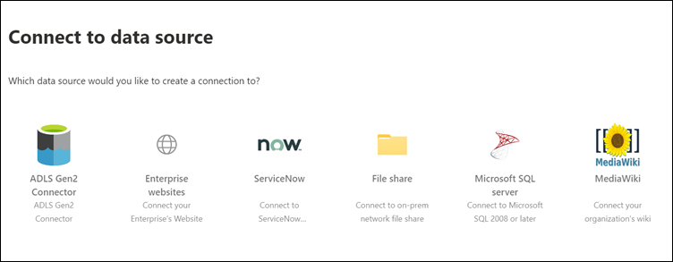

<!-- markdownlint-disable no-trailing-punctuation -->

# Configurar seu conector criado pela Microsoft para a pesquisa da Microsoft

Este artigo orienta você pelas etapas de configuração de um conector criado pela Microsoft. Descreve o fluxo de configurar uma conexão no [centro de administração](https://admin.microsoft.com)do Microsoft 365. Para obter mais detalhes sobre como configurar conectores criados específicos da Microsoft, consulte estes artigos:

* [Azure Data Lake Storage Gen2](azure-data-lake-connector.md)
* [Sites empresariais](enterprise-web-connector.md)
* [Compartilhamento de arquivos](file-share-connector.md)
* [MediaWiki](mediawiki-connector.md)
* [Microsoft SQL server](MSSQL-connector.md)
* [ServiceNow](servicenow-connector.md)

## Configurar

Para configurar qualquer um dos conectores criados pela Microsoft, vá para o [centro de administração](https://admin.microsoft.com):

1. Entre em sua conta com as credenciais do [Microsoft 365](https://www.microsoft.com/microsoft-365) Test locatário.
2. Vá até **configurações**  >  **Microsoft Search**  >  **conectores**de pesquisa da Microsoft.
3. Selecione **Adicionar um conector**.
4. Na lista de conectores disponíveis, selecione o conector de sua escolha.

### Nomear o conector

Para criar uma conexão, primeiro especifique estes atributos:

1. Nome da conexão
2. ID de conexão
3. Descrição (opcional)

A ID de conexão cria propriedades implícitas para seu conector. Ele deve conter apenas caracteres alfanuméricos e ter no máximo 32 caracteres.

### Conectar-se a uma fonte de dados

O processo de conexão de dados varia de acordo com o tipo de conector. Para saber mais sobre como se conectar à sua fonte de dados local, consulte [install an local data gateway](https://aka.ms/configuregateway).

### Selecionar Propriedades de origem

Os campos de dados definidos por sua fonte de dados de terceiros como propriedades de origem são indexados na pesquisa da Microsoft. Para modificar essas propriedades, selecione **Editar propriedades** na barra lateral à direita da página **conectores** . Você pode selecionar **até 64 Propriedades de origem**.

### Gerenciar o esquema de pesquisa

Os administradores podem definir os atributos de esquema de pesquisa para controlar a funcionalidade de pesquisa de cada propriedade de origem. Um esquema de pesquisa ajuda a determinar quais resultados são exibidos na página de resultados da pesquisa e quais informações os usuários finais podem exibir e acessar.

Os atributos de esquema de pesquisa incluem **pesquisáveis**, **consultáveis**e **recuperáveis**. A tabela a seguir lista cada um dos atributos aos quais os conectores do Microsoft Graph dão suporte e explica suas funções.

**Atributo de esquema de pesquisa** | **Function** | **Exemplo**
--- | --- | ---
PESQUISÁVEIS | Torna o conteúdo de texto de uma propriedade pesquisável. O conteúdo da propriedade está incluído no índice de texto completo. | Se a propriedade for **título**, uma consulta de **empresa** retornará as respostas que contenham a palavra **Enterprise** em qualquer texto ou título.
Question | Pesquisa por consulta para uma correspondência de uma determinada propriedade. O nome da propriedade pode ser especificado na consulta de forma programática ou textual. |  Se a propriedade **title** for consultável, o título da consulta **: Enterprise** será suportado.
RECUPERÁVEIS | Somente as propriedades recuperáveis podem ser usadas no tipo de resultado e no resultado da pesquisa. |

Para todos os conectores, exceto o conector de compartilhamento de arquivos, os tipos personalizados devem ser definidos manualmente. Para ativar os recursos de pesquisa para cada campo, você precisa de um esquema de pesquisa mapeado para uma lista de propriedades. O assistente de conexão seleciona automaticamente um esquema de pesquisa com base no conjunto de propriedades de origem que você escolher. Você pode modificar esse esquema marcando as caixas de seleção de cada propriedade e atributo na página de esquema de pesquisa.

Essas restrições e recomendações se aplicam às configurações de esquema de pesquisa:

* Para conectores que indexam tipos personalizados, recomendamos que você **não** marque o campo que contém o conteúdo principal que pode ser **recuperado**. Problemas de desempenho significativos ocorrem quando os resultados da pesquisa são renderizados com esse atributo de pesquisa. Um exemplo é o campo de conteúdo de **texto** para um artigo da base de dados de conhecimento do [ServiceNow](https://www.servicenow.com) .
* Somente as propriedades marcadas como recuperáveis são renderizadas nos resultados da pesquisa e podem ser usadas para criar tipos de resultados modernos (MRTs).
* Somente as propriedades de cadeia de caracteres podem ser marcadas como pesquisáveis.

> [!Note]
> Após criar uma conexão, você **não poderá** modificar o esquema. Para fazer isso, você precisa excluir sua conexão e criar uma nova.

### Gerenciar permissões de pesquisa

As listas de controle de acesso (ACLs) determinam quais usuários em sua organização podem acessar cada item de dados. O conector de compartilhamento de arquivos suporta apenas as ACLs que podem ser mapeadas para o [Azure Active Directory (Azure AD)](https://docs.microsoft.com/azure/active-directory/). Todos os outros conectores dão suporte a permissões de pesquisa que são visíveis para todos os usuários.

### Definir o agendamento de atualização

O agendamento de atualização determina com que frequência seus dados serão sincronizados com o índice no Microsoft Graph e no Microsoft Search. Você pode agendar a atualização de duas maneiras: rastreamento completo ou rastreamento incremental.

Com um **rastreamento completo**, o mecanismo de pesquisa processa e indexa todos os itens na fonte de conteúdo, independentemente dos rastreamentos anteriores. O rastreamento completo funciona melhor nessas situações:

* É necessário detectar exclusões de dados.
* O rastreamento incremental não pôde rastrear o conteúdo para erros.
* É necessária uma atualização de software para o Microsoft Search. As atualizações modificam o esquema de pesquisa.
* ACLs foram modificadas.
* As regras de rastreamento foram modificadas.

Com um **rastreamento incremental**, o mecanismo de pesquisa pode processar e indexar somente os itens que foram criados ou modificados desde o último rastreamento bem-sucedido. Portanto, nem todos os dados na fonte de conteúdo são re-indexados. Os rastreamentos incrementais funcionam melhor para detectar conteúdo, metadados, permissões e outras atualizações.

Os rastreamentos incrementais são muito mais rápidos do que os rastreamentos completos porque não foram processados itens não alterados. Para manter uma sincronização de dados precisa entre a fonte de conteúdo e o índice de pesquisa, você precisa executar os dois rastreamentos periodicamente.

Cada conector terá um conjunto ideal diferente de agendas de atualização com base na frequência com que os dados são modificados e o tipo de modificações.

### Revisar configurações do conector

Depois de configurar seu conector, o [centro de administração](https://admin.microsoft.com) leva você para uma página onde você pode examinar suas configurações. Você pode voltar pelo processo de configuração para editar qualquer configuração antes de confirmar a conexão. Para saber mais, confira [gerenciar seu conector](manage-connector.md).

## Próximas etapas: personalizar a página de resultados de pesquisa

Com a interface de usuário do Microsoft Search (UI), os usuários finais podem pesquisar conteúdo de seus aplicativos de produtividade do [microsoft 365](https://www.microsoft.com/microsoft-365) e do ecossistema mais amplo da Microsoft. Uma vertical de pesquisa refere-se às guias mostradas quando um usuário exibe seus resultados de pesquisa no [SharePoint](https://sharepoint.com/), no [Microsoft Office](https://Office.com)e no Microsoft Search no [Bing](https://Bing.com). Você pode personalizar os verticais de pesquisa para restringir os resultados, de modo que apenas um determinado tipo de resultados de pesquisa seja exibido. Essas verticais aparecem como uma guia na parte superior da página de resultados da pesquisa. Um tipo de resultado moderno (MRT) é a interface do usuário que designa como os resultados são apresentados.

Você deve criar seus próprios tipos de resultados e verticais, de modo que os usuários finais possam exibir os resultados de pesquisa de novas conexões. Sem esta etapa, os dados da sua conexão não aparecerão na página de resultados da pesquisa.

Para saber mais sobre como criar seus verticais e MRTs, confira [personalização da página de resultados da pesquisa](customize-search-page.md).

## Como saber se funcionou?

Vá para a lista de suas conexões publicadas na guia **conectores** do [centro de administração](https://admin.microsoft.com). Para saber como fazer atualizações e exclusões, confira [gerenciar o conector](manage-connector.md).
