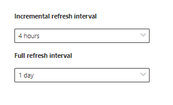

# Configurar seu conector criado pela Microsoft para a pesquisa da MicrosoftSet up your Microsoft-built connector for Microsoft Search

Este artigo orienta você pelas etapas de configuração de um conector criado pela Microsoft.This article guides you through the steps of configuring a Microsoft-built connector. Descreve o fluxo de configurar uma conexão no [centro de administração](https://admin.microsoft.com)do Microsoft 365.It outlines the flow of setting up a connection in the Microsoft 365 [admin center](https://admin.microsoft.com). Para obter mais detalhes sobre como configurar conectores criados específicos da Microsoft, consulte estes artigos:For more details on how to set up specific Microsoft-built connectors, see these articles:
* [Azure Data Lake Storage Gen2Azure Data Lake Storage Gen2](azure-data-lake-connector.md)
* [Sites empresariaisEnterprise websites](enterprise-web-connector.md)
* [Compartilhamento de arquivosFile share](file-share-connector.md)
* [MediaWikiMediaWiki](mediawiki-connector.md)
* [Microsoft SQL serverMicrosoft SQL server](MSSQL-connector.md)
* [ServiceNowServiceNow](servicenow-connector.md)

## ConfigurarSet up
Para configurar qualquer um dos conectores criados pela Microsoft, vá para o [centro de administração](https://admin.microsoft.com):To configure any of the Microsoft-built connectors, go to the [admin center](https://admin.microsoft.com):
1. Entre em sua conta com as credenciais do [Microsoft 365](https://www.microsoft.com/microsoft-365) Test locatário.Sign in to your account with the credentials for your [Microsoft 365](https://www.microsoft.com/microsoft-365) test tenant.
2. Vá até **configurações** > \*\*\*\* > **conectores**de pesquisa da Microsoft.Go to **Settings** > **Microsoft Search** > **Connectors**.
3. Selecione **Adicionar um conector**.Select **Add a connector**.
4. Na lista de conectores disponíveis, selecione o conector de sua escolha.From the list of available connectors, select the connector of your choice.

### Nomear o conectorName the connector
Para criar uma conexão, primeiro especifique estes atributos:To create a connection, first specify these attributes:
1. Nome da conexãoName of the connection
2. ID de conexãoConnection ID
3. Descrição (opcional)Description (optional)

A ID de conexão cria propriedades implícitas para seu conector.The connection ID creates implicit properties for your connector. Ele deve conter apenas caracteres alfanuméricos e ter no máximo 32 caracteres.It must contain only alphanumeric characters and be a maximum of 32 characters.

### Conectar-se a uma fonte de dadosConnect to a data source
O processo de conexão de dados varia de acordo com o tipo de conector.The data connection process varies based on the type of connector. Para saber mais sobre como se conectar à sua fonte de dados local, consulte [install an local data gateway](https://aka.ms/configuregateway).To learn more about connecting to your on-premises data source, see [Install an on-premises data gateway](https://aka.ms/configuregateway).

### Selecionar Propriedades de origemSelect source properties
Os campos de dados definidos por sua fonte de dados de terceiros como propriedades de origem são indexados na pesquisa da Microsoft.The data fields set by your third-party data source as source properties are indexed into Microsoft Search. Para modificar essas propriedades, selecione **Editar propriedades** na barra lateral à direita da página **conectores** .To modify these properties, select **Edit properties** in the side bar on the right of the **Connectors** page. Você pode selecionar **até 64 Propriedades de origem**.You can select **up to 64 source properties**.

###  Gerenciar o esquema de pesquisaManage the search schema 
Os administradores podem definir os atributos de esquema de pesquisa para controlar a funcionalidade de pesquisa de cada propriedade de origem.Admins can set the search schema attributes to control search functionality of each source property. Um esquema de pesquisa ajuda a determinar quais resultados são exibidos na página de resultados da pesquisa e quais informações os usuários finais podem exibir e acessar.A search schema helps determine what results display on the search results page and what information end users can view and access.

Os atributos de esquema de pesquisa incluem **pesquisáveis**, **consultáveis**e **recuperáveis**.Search schema attributes include **searchable**, **queryable**, and **retrievable**. A tabela a seguir lista cada um dos atributos aos quais os conectores do Microsoft Graph dão suporte e explica suas funções.The following table lists each of the attributes that Microsoft Graph connectors support and explains their functions.

**Atributo de esquema de pesquisa****Search schema attribute** | **Function****Function** | **Exemplo****Example**
--- | --- | ---
PESQUISÁVEISSEARCHABLE | Torna o conteúdo de texto de uma propriedade pesquisável.Makes the text content of a property searchable. O conteúdo da propriedade está incluído no índice de texto completo.Property contents are included in the full-text index. | Se a propriedade for **título**, uma consulta de **empresa** retornará as respostas que contenham a palavra **Enterprise** em qualquer texto ou título.If the property is **title**, a query for **Enterprise** returns answers that contain the word **Enterprise** in any text or title.
QuestionQUERYABLE | Pesquisa por consulta para uma correspondência de uma determinada propriedade.Searches by query for a match for a particular property. O nome da propriedade pode ser especificado na consulta de forma programática ou textual.The property name can then be specified in the query either programmatically or verbatim. |  Se a propriedade **title** for consultável, o título da consulta **: Enterprise** será suportado.If the **Title** property is queryable, then the query **Title: Enterprise** is supported.
RECUPERÁVEISRETRIEVABLE | Somente as propriedades recuperáveis podem ser usadas no tipo de resultado e no resultado da pesquisa.Only retrievable properties can be used in the result type and display in the search result. | 

Para todos os conectores, exceto o conector de compartilhamento de arquivos, os tipos personalizados devem ser definidos manualmente.For all connectors except the file share connector, custom types must be set manually. Para ativar os recursos de pesquisa para cada campo, você precisa de um esquema de pesquisa mapeado para uma lista de propriedades.To activate search capabilities for each field, you need a search schema mapped to a list of properties. O assistente de conexão seleciona automaticamente um esquema de pesquisa com base no conjunto de propriedades de origem que você escolher.The connection wizard automatically selects a search schema based on the set of source properties you choose. Você pode modificar esse esquema marcando as caixas de seleção de cada propriedade e atributo na página de esquema de pesquisa.You can modify this schema by selecting the check boxes for each property and attribute in the search schema page.

Essas restrições e recomendações se aplicam às configurações de esquema de pesquisa:These restrictions and recommendations apply to search schema settings:
* Para conectores que indexam tipos personalizados, recomendamos que você **não** marque o campo que contém o conteúdo principal que pode ser **recuperado**.For connectors that index custom types, we recommend that you **do not** mark the field that contains the main content **retrievable**. Problemas de desempenho significativos ocorrem quando os resultados da pesquisa são renderizados com esse atributo de pesquisa.Significant performance issues occur when search results render with that search attribute. Um exemplo é o campo de conteúdo de **texto** para um artigo da base de dados de conhecimento do [ServiceNow](https://www.servicenow.com) .An example is the **Text** content field for a [ServiceNow](https://www.servicenow.com) knowledge-base article.
* Somente as propriedades marcadas como recuperáveis são renderizadas nos resultados da pesquisa e podem ser usadas para criar tipos de resultados modernos (MRTs).Only properties marked as retrievable render in the search results and can be used to create modern result types (MRTs).
* Somente as propriedades de cadeia de caracteres podem ser marcadas como pesquisáveis.Only string properties can be marked searchable.

> [!Note]
> Após criar uma conexão, você **não poderá** modificar o esquema.After you create a connection, you **can't** modify the schema. Para fazer isso, você precisa excluir sua conexão e criar uma nova.To do that, you need to delete your connection and create a new one.

###  Gerenciar permissões de pesquisaManage search permissions
As listas de controle de acesso (ACLs) determinam quais usuários em sua organização podem acessar cada item de dados.Access Control Lists (ACLs) determine which users in your organization can access each item of data. O conector de compartilhamento de arquivos suporta apenas as ACLs que podem ser mapeadas para o [Azure Active Directory (Azure AD)](https://docs.microsoft.com/azure/active-directory/).The file share connector supports only ACLs that can be mapped to [Azure Active Directory (Azure AD)](https://docs.microsoft.com/azure/active-directory/). Todos os outros conectores dão suporte a permissões de pesquisa que são visíveis para todos os usuários.All the other connectors support search permissions that are visible to all users.

### Definir o agendamento de atualizaçãoSet the refresh schedule
O agendamento de atualização determina com que frequência seus dados serão sincronizados com o índice no Microsoft Graph e no Microsoft Search.The refresh schedule determines how often your data is synced with the index in Microsoft Graph and Microsoft Search. Você pode agendar a atualização de duas maneiras: rastreamento completo ou rastreamento incremental.You can schedule the refresh in two ways: full crawl or incremental crawl.

Com um **rastreamento completo**, o mecanismo de pesquisa processa e indexa todos os itens na fonte de conteúdo, independentemente dos rastreamentos anteriores.With a **full crawl**, the search engine processes and indexes every item in the content source, regardless of previous crawls. O rastreamento completo funciona melhor nessas situações:Full crawl works best in these situations:
* É necessário detectar exclusões de dados.You need to detect deletions of data.
* O rastreamento incremental não pôde rastrear o conteúdo para erros.The incremental crawl failed to crawl content for errors.
* É necessária uma atualização de software para o Microsoft Search.A software update for Microsoft Search is required. As atualizações modificam o esquema de pesquisa.Updates modify the search schema.
* ACLs foram modificadas.ACLs were modified.
* As regras de rastreamento foram modificadas.Crawl rules were modified.

Com um **rastreamento incremental**, o mecanismo de pesquisa pode processar e indexar somente os itens que foram criados ou modificados desde o último rastreamento bem-sucedido.With an **incremental crawl**, the search engine can process and index only the items that were created or modified since the last successful crawl. Portanto, nem todos os dados na fonte de conteúdo são re-indexados.Therefore, not all the data in the content source is re-indexed. Os rastreamentos incrementais funcionam melhor para detectar conteúdo, metadados, permissões e outras atualizações.Incremental crawls works best to detect content, metadata, permission, and other updates.

Os rastreamentos incrementais são muito mais rápidos do que os rastreamentos completos porque não foram processados itens não alterados.Incremental crawls are much faster than full crawls because unchanged items aren’t processed. Para manter uma sincronização de dados precisa entre a fonte de conteúdo e o índice de pesquisa, você precisa executar os dois rastreamentos periodicamente.To maintain an accurate data sync between the content source and the search index, you need to run both crawls periodically.

Cada conector terá um conjunto ideal diferente de agendas de atualização com base na frequência com que os dados são modificados e o tipo de modificações.Each connector will have a different optimal set of refresh schedules based on how often data is modified and the type of modifications.

### Revisar configurações do conectorReview connector settings
Depois de configurar seu conector, o [centro de administração](https://admin.microsoft.com) leva você para uma página onde você pode examinar suas configurações.After you configure your connector, the [admin center](https://admin.microsoft.com) takes you to a page where you can review your settings. Você pode voltar pelo processo de configuração para editar qualquer configuração antes de confirmar a conexão.You can go back through the configuration process to edit any setting before you confirm the connection. Para saber mais, confira [gerenciar seu conector](manage-connector.md).To learn more, see [Manage your connector](manage-connector.md).

## Próximas etapas: personalizar a página de resultados de pesquisaNext steps: Customize the search results page
Com a interface de usuário do Microsoft Search (UI), os usuários finais podem pesquisar conteúdo de seus aplicativos de produtividade do [microsoft 365](https://www.microsoft.com/microsoft-365) e do ecossistema mais amplo da Microsoft.With the Microsoft Search user interface (UI), your end users can search content from your [Microsoft 365](https://www.microsoft.com/microsoft-365) productivity apps and the broader Microsoft ecosystem. Uma vertical de pesquisa refere-se às guias mostradas quando um usuário exibe seus resultados de pesquisa no [SharePoint](http://sharepoint.com/), no [Microsoft Office](https://Office.com)e no Microsoft Search no [Bing](https://Bing.com).A search vertical refers to the tabs that are shown when a user views their search results in [SharePoint](http://sharepoint.com/), [Microsoft Office](https://Office.com), and Microsoft Search in [Bing](https://Bing.com). Você pode personalizar os verticais de pesquisa para restringir os resultados, de modo que apenas um determinado tipo de resultados de pesquisa seja exibido.You can customize search verticals to narrow down results, so that only a certain type of search results is displayed. Essas verticais aparecem como uma guia na parte superior da página de resultados da pesquisa.These verticals appear as a tab on the top of the search results page. Um tipo de resultado moderno (MRT) é a interface do usuário que designa como os resultados são apresentados.A modern result type (MRT) is the UI that designates how results are presented.

Você deve criar seus próprios tipos de resultados e verticais, de modo que os usuários finais possam exibir os resultados de pesquisa de novas conexões.You must create your own verticals and result types, so end users can view search results from new connections. Sem esta etapa, os dados da sua conexão não aparecerão na página de resultados da pesquisa.Without this step, data from your connection won’t show up on the search results page.

Para saber mais sobre como criar seus verticais e MRTs, confira [personalização da página de resultados da pesquisa](customize-search-page.md).To learn more about how to create your verticals and MRTs, see [Search results page customization](customize-search-page.md).

## Como saber se funcionou?How do I know this worked?
Vá para a lista de suas conexões publicadas na guia **conectores** do [centro de administração](https://admin.microsoft.com).Go to the list of your published connections under the **Connectors** tab in the [admin center](https://admin.microsoft.com). Para saber como fazer atualizações e exclusões, confira [gerenciar o conector](manage-connector.md).To learn how to make updates and deletions, see [Manage your connector](manage-connector.md).
