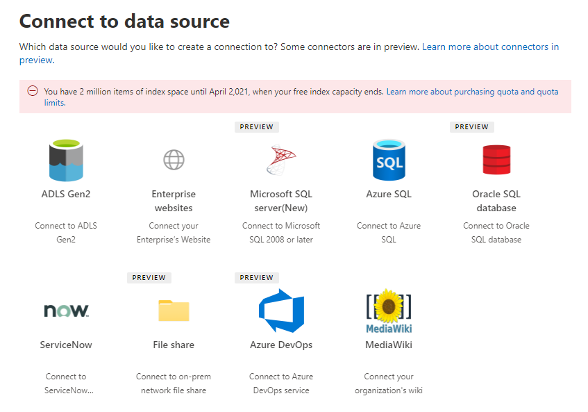

<!-- Previous ms.author: monaray -->

<!-- markdownlint-disable no-trailing-punctuation -->

# Visão geral da instalação para conectores do Graph pela MicrosoftSetup overview for Graph connectors by Microsoft 

Este artigo mostra o processo básico necessário para configurar os conectores do Graph pela **Microsoft** no centro de administração [do Microsoft 365.](https://admin.microsoft.com)This article shows the basic process required to set up the Graph connectors **by Microsoft** in the [Microsoft 365 admin center](https://admin.microsoft.com). O processo básico inclui as seguintes etapas:The basic process includes the following steps:  
<!---Add links to each section in the doc--->

1. [Adicionar um conector graph no centro de administração do Microsoft 365Add a Graph connector in the Microsoft 365 admin center](#step-1-add-a-graph-connector-in-the-microsoft-365-admin-center)
2. [Nomear a conexãoName the connection](#step-2-name-the-connection)
3. [Configurar as configurações de conexãoConfigure the connection settings](#step-3-configure-the-connection-settings)
4. [Gerenciar permissões de pesquisaManage search permissions](#step-4-manage-search-permissions)
5. [Atribuir rótulos de propriedadeAssign property labels](#step-5-assign-property-labels)
6. [Gerenciar esquemaManage schema](#step-6-manage-schema)
7. [Configurações de atualizaçãoRefresh settings](#step-7-refresh-settings)
8. [Analisar conexãoReview connection](#step-8-review-connection)

Este artigo também inclui informações sobre solução de problemas, limitações e próximas etapas:This article also includes information about troubleshooting, limitations, and next steps:

* [Solução de ProblemasTroubleshooting](#troubleshooting)
* [LimitesLimitations](#limitations)
* [Próximas etapasNext steps](#next-steps)

> [!NOTE]
> O processo de instalação é semelhante a todos os conectores do Graph pela Microsoft, mas não é exatamente o mesmo.The setup process is similar for all the Graph connectors by Microsoft but is not exactly the same. **Além de ler este artigo, leia as informações específicas do conector para sua fonte de dados.****In addition to reading this article, be sure to read the connector-specific information for your data source.**  

<!---## Before you get started-->

<!---Insert "Before you get started" recommendations for this data source-->

## Etapa 1: Adicionar um conector graph no centro de administração do Microsoft 365Step 1: Add a Graph connector in the Microsoft 365 admin center

Conclua as etapas a seguir para configurar qualquer um dos conectores do Graph criado pela Microsoft:Complete the following steps to configure any of the Microsoft-built Graph connectors:

1. Entre em sua conta de administrador no Centro de administração [do Microsoft 365.](https://admin.microsoft.com)Sign into your admin account in the [Microsoft 365 admin center](https://admin.microsoft.com).

2. No painel de navegação, selecione **Configurações** e, em seguida, selecione **Pesquisar & inteligência**.In the navigation pane, select **Settings**, and then select **Search & intelligence**. Selecione a [guia Conectores](https://admin.microsoft.com/Adminportal/Home#/MicrosoftSearch/Connectors).Select the [Connectors tab](https://admin.microsoft.com/Adminportal/Home#/MicrosoftSearch/Connectors).

3. Selecione **+Adicionar** e selecione a fonte de dados de sua escolha no menu de opções disponíveis.Select **+Add**, and then select the data source of your choice from the menu of available options.

   > [!div class="mx-imgBorder"]
   > 

> [!NOTE]
> Você pode adicionar no máximo dez conexões graph a cada locatário.You can add a maximum of ten Graph connections to each tenant.

## Etapa 2: nomear a conexãoStep 2: Name the connection

Especifique esses atributos:Specify these attributes:

* Nome (obrigatório)Name (required)
* ID da conexão (obrigatório)Connection ID (required)
* Descrição (opcional)Description (optional)

A ID da conexão cria propriedades implícitas para o conector.The connection ID creates implicit properties for your connector. Ele deve conter apenas caracteres alfanuméricos e ter no máximo 32 caracteres.It must contain only alphanumeric characters and be a maximum of 32 characters.

## Etapa 3: Configurar as configurações de conexãoStep 3: Configure the connection settings

O processo para configurar as configurações de conexão varia com base no tipo de fonte de dados.The process to configure the connection settings varies based on the type of data source. Consulte as informações específicas do Conector para o tipo de fonte de dados que você deseja adicionar ao seu locatário para concluir esta etapa no processo de instalação.See the Connector-specific information for the type of data source you want to add to your tenant to complete this step in the setup process.  

Para saber mais sobre como se conectar a uma fonte de dados local, consulte [Install an on-premises data gateway](/data-integration/gateway/service-gateway-install).To learn more about connecting to an on-premises data source, see [Install an on-premises data gateway](/data-integration/gateway/service-gateway-install).

## Etapa 4: Gerenciar permissões de pesquisaStep 4: Manage search permissions

As Listas de Controle de Acesso (ACLs) determinam quais usuários em sua organização podem acessar cada item de dados.Access Control Lists (ACLs) determine which users in your organization can access each item of data.  

Alguns conectores, como [o Microsoft SQL](MSSQL-connector.md) e o [Azure Data Lake Storage Gen2,](azure-data-lake-connector.md) suportam as ACLs do [Azure Active Directory (Azure AD).](/azure/active-directory/)Some connectors like [Microsoft SQL](MSSQL-connector.md) and [Azure Data Lake Storage Gen2](azure-data-lake-connector.md) natively support [Azure Active Directory (Azure AD)](/azure/active-directory/) ACLs.

Outros conectores como [ServiceNow,](servicenow-connector.md) [Azure DevOps](azure-devops-connector.md)e [Salesforce](salesforce-connector.md) suportam a sincronização de usuários e grupos que não são do Azure AD.Other connectors like [ServiceNow](servicenow-connector.md), [Azure DevOps](azure-devops-connector.md), and [Salesforce](salesforce-connector.md) support syncing of non-Azure AD users and groups.  

## Etapa 5: Atribuir rótulos de propriedadeStep 5: Assign property labels

Você pode atribuir rótulos semânticos às suas propriedades de origem na página "Atribuir rótulos de propriedade".You can assign semantic labels to your source properties on the "Assign property labels" page. Rótulos são marcas conhecidas fornecidas pela Microsoft que fornecem significado semântico.Labels are well-known tags provided by Microsoft that provide semantic meaning. Eles permitem que a Microsoft integre seus dados do conector às experiências do Microsoft 365, como pesquisa aprimorada, cartões de pessoas, descoberta inteligente e muito mais.They allow Microsoft to integrate your connector data into Microsoft 365 experiences such as enhanced search, people cards, intelligent discovery, and more.  

A tabela a seguir lista os rótulos com suporte no momento e suas descrições.The following table lists the currently supported labels and their descriptions.  

RótuloLabel | DescriçãoDescription
--- | ---  
**título****title** | O título do item que você deseja mostrar na pesquisa e em outras experiênciasThe title for the item that you want shown in search and other experiences
**url****url** | A URL de destino do item no sistema de origemThe target url of the item in the source system
**createdBy****createdBy** | Nome da pessoa que criou o itemName of the person who created the item
**lastModifiedBy****lastModifiedBy** | Nome da pessoa que editou o item mais recentementeName of the person who most recently edited the item
**autores****authors** | Nome das pessoas que participaram/colaboraram no itemName of the people who participated/collaborated on the item
**createdDateTime****createdDateTime** | Quando o item foi criadoWhen was the item created
**lastModifiedDateTime****lastModifiedDateTime** | Quando o item foi editado mais recentementeWhen was the item most recently edited
**fileName****fileName** | Nome do item de arquivoName of the file item
**FileExtension****fileExtension** | Tipo de item de arquivo como .pdf ou .wordType of file item such as .pdf or .word

As propriedades nesta página são pré-selecionadas com base em sua fonte de dados, mas você pode alterar essa seleção se houver uma propriedade diferente que seja mais adequada para um rótulo específico.The properties on this page are pre-selected based on your data source, but you can change this selection if there's a different property that is better suited for a particular label.  

O título **do rótulo** é o rótulo mais importante.The label **title** is the most important label. É altamente **recomendável que** você tenha uma propriedade atribuída a esse rótulo para que sua conexão participe da experiência de [cluster de resultados.](result-cluster.md)It's **strongly recommended** you have a property assigned to this label in order for your connection to participate in the [result cluster experience](result-cluster.md).

O mapeamento incorreto de rótulos causará uma experiência de pesquisa deteriorada.Incorrectly mapping labels will cause a deteriorated search experience. Não há problema em alguns rótulos não ter uma propriedade atribuída a ela.It's okay for some labels to not have a property assigned to it.  

## Etapa 6: Gerenciar esquemaStep 6: Manage schema

### Propriedade ContentContent property

É recomendável selecionar uma **Propriedade de Conteúdo** no menu suspenso de opções ou manter o padrão se uma estiver presente.It's recommended you select a **Content Property** from the drop-down menu of options, or keep the default if one is present. Essa propriedade é usada para indexação de texto completo de conteúdo, geração de trecho de página de resultados de pesquisa, participação de [cluster](result-cluster.md) de resultados, detecção de idioma, suporte a HTML/texto, classificação e relevância e formulação de consulta.This property is used for full-text indexing of content, search results page snippet generation, [result cluster](result-cluster.md) participation, language detection, HTML/text support, ranking and relevance, and query formulation.

Se você selecionar uma propriedade de conteúdo, terá a opção de usar a propriedade **ResultSnippet** gerada pelo sistema ao criar seu tipo [de resultado](customize-results-layout.md).If you select a content property, you will have the option of using the system-generated property **ResultSnippet** when you [create your result type](customize-results-layout.md). Essa propriedade serve como um espaço reservado para os trechos dinâmicos gerados a partir da propriedade de conteúdo no momento da consulta.This property serves as a placeholder for the dynamic snippets that are generated from the content property at query time. Se você usar essa propriedade no tipo de resultado, trechos serão gerados nos resultados da pesquisa.If you use this property in your result type, snippets will be generated in your search results.

### Criando aliases para propriedades de origemCreating aliases for source properties

Você pode adicionar aliases às suas propriedades na coluna "Alias" na página "Gerenciar esquema".You can add aliases to your properties under the "Alias" column on the "Manage schema" page. Aliases são nomes amigáveis para suas propriedades e também usados em consultas e na criação de filtros.Aliases are friendly names for your properties, and also used in queries and in the creation of filters. Eles também são usados para normalizar propriedades de origem de várias conexões, de forma que tenham o mesmo nome.They're also used to normalize source properties from multiple connections such that they have the same name. Dessa forma, você pode criar um único filtro para um vertical com várias conexões.That way you can create a single filter for a vertical with multiple connections. Para obter mais informações, consulte [Personalizar a página de resultados da pesquisa](customize-search-page.md).For more information, see [Customize the search results page](customize-search-page.md).  

### Atributos de esquema de pesquisaSearch schema attributes

Você pode definir os atributos de esquema de pesquisa para controlar a funcionalidade de pesquisa de cada propriedade de origem.You can set the search schema attributes to control search functionality of each source property. Um esquema de pesquisa ajuda a determinar quais resultados são exibidos na página de resultados da pesquisa e quais informações os usuários finais podem exibir e acessar.A search schema helps determine what results display on the search results page and what information end users can view and access.

Atributos de esquema de pesquisa incluem opções **para Consulta,** **Pesquisa,** **Recuperação** e **Refinar**.Search schema attributes include options to **Query**, **Search**, **Retrieve**, and **Refine**. A tabela a seguir lista cada um dos atributos que os conectores do Microsoft Graph suportam e explica suas funções.The following table lists each of the attributes that Microsoft Graph connectors support and explains their functions.

Atributo de esquema de pesquisaSearch schema attribute | FunçãoFunction | ExemploExample
--- | --- | ---
SEARCHSEARCH | Torna o conteúdo de texto de uma propriedade pesquisável.Makes the text content of a property searchable. O conteúdo da propriedade está incluído no índice de texto completo.Property contents are included in the full-text index. | Se a propriedade for **title**, uma consulta para **Enterprise** retornará respostas que contenham a palavra **Enterprise** em qualquer texto ou título.If the property is **title**, a query for **Enterprise** returns answers that contain the word **Enterprise** in any text or title.
CONSULTAQUERY | Pesquisa por consulta para uma combinação de uma propriedade específica.Searches by query for a match for a particular property. Em seguida, o nome da propriedade pode ser especificado na consulta programaticamente ou verbatim.The property name can then be specified in the query either programmatically or verbatim. |  Se a **propriedade Title** puder ser consultada, a consulta **Title: Enterprise** será suportada.If the **Title** property can be queried, then the query **Title: Enterprise** is supported.
RETRIEVERETRIEVE | Somente propriedades recuperáveis podem ser usadas no tipo de resultado e exibidas no resultado da pesquisa.Only retrievable properties can be used in the result type and display in the search result. |
REFINEREFINE | A opção refinar pode ser usada como na página de resultados da Pesquisa da Microsoft.The refine option can be used as in the Microsoft Search results page. | Os usuários em sua organização podem [filtrar](custom-filters.md) **por URL** na página de resultados da pesquisa se a propriedade refinar for marcada durante a configuração da conexãoUsers in your organization can [filter](custom-filters.md) by **URL** in the search results page if the refine property is marked during connection setup

Para todos os conectores, exceto o conector de compartilhamento de arquivos, os tipos personalizados devem ser definidos manualmente.For all connectors except the File share connector, custom types must be set manually. Para ativar os recursos de pesquisa para cada campo, você precisa de um esquema de pesquisa mapeado para uma lista de propriedades.To activate search capabilities for each field, you need a search schema mapped to a list of properties. O assistente de conexão seleciona automaticamente um esquema de pesquisa com base no conjunto de propriedades de origem escolhidas.The connection wizard automatically selects a search schema based on the set of source properties you choose. Você pode modificar esse esquema selecionando as caixas de seleção de cada propriedade e atributo na página de esquema de pesquisa.You can modify this schema by selecting the check boxes for each property and attribute in the search schema page.

> [!div class="mx-imgBorder"]
> 

### Restrições e recomendações para configurações de esquema de pesquisaRestrictions and recommendations for search schema settings

* A **propriedade** content é pesquisável somente.The **content** property is searchable only. Depois de selecionada no menu suspenso, essa propriedade não pode ser usada com as opções **recuperadas** ou **consulta**.Once selected in the dropdown, this property cannot be used with the options **retrieve** or **query**.

* Problemas significativos de desempenho ocorrem quando os resultados da pesquisa são renderizar com **a propriedade de** conteúdo.Significant performance issues occur when search results render with the **content** property. Um exemplo é o **campo Conteúdo** de texto de um artigo da base de dados de conhecimento [ServiceNow.](https://www.servicenow.com)An example is the **Text** content field for a [ServiceNow](https://www.servicenow.com) knowledge-base article.

* Somente propriedades marcadas como renderizáveis recuperáveis nos resultados da pesquisa e podem ser usadas para criar tipos de resultados modernos (MRTs).Only properties marked as retrievable render in the search results and can be used to create modern result types (MRTs).

* Somente propriedades de cadeia de caracteres podem ser marcadas pesquisáveis.Only string properties can be marked searchable.

> [!NOTE]
> Depois de criar uma conexão, **não é possível** modificar o esquema.After you create a connection, you **can't** modify the schema. Para fazer isso, você precisa excluir sua conexão e criar uma nova.To do that, you need to delete your connection and create a new one.

## Etapa 7: Atualizar configuraçõesStep 7: Refresh settings

O intervalo de atualização determina com que frequência seus dados são sincronizados entre a fonte de dados e a Pesquisa da Microsoft.The refresh interval determines how often your data is synced between the data source and Microsoft Search. Cada tipo de fonte de dados tem um conjunto diferente de agendas de atualização ideais com base na frequência com que os dados são modificados e no tipo de modificações.Each type of data source has a different set of optimal refresh schedules based on how often data is modified and the type of modifications.

Há dois tipos de intervalos  de atualização, que são Atualização Completa e Atualização **Incremental**, mas as atções incrementais não estão disponíveis para algumas fontes de dados.There are two types of refresh intervals, which are **Full refresh** and **Incremental refresh**, but incremental refreshes aren't available for some data sources.

Com uma atualização completa, o mecanismo de pesquisa processa e indexa cada item na fonte de conteúdo, independentemente dos rastreamentos anteriores.With a full refresh, the search engine processes and indexes every item in the content source, regardless of previous crawls. Uma atualização completa funciona melhor para essas situações:A full refresh works best for these situations:

* Detectando exclusões de dados.Detecting deletions of data.
* A atualização incremental encontrou erros e falhou.The incremental refresh found errors, and failed.
* AS ACLs foram modificadas.ACLs were modified.
* As regras de rastreamento foram modificadas.Crawl rules were modified.
* O esquema da conexão foi atualizado (ainda não há suporte para atualizações de esquema).The schema for the connection has been updated (schema updates aren't yet supported).

Com uma **atualização Incremental,** o mecanismo de pesquisa pode processar e indexar apenas os itens que foram criados ou modificados desde o último rastreamento bem-sucedido.With an **Incremental refresh**, the search engine can process and index only the items that were created or modified since the last successful crawl. Como resultado, nem todos os dados na fonte de conteúdo são reindexados.As a result, not all the data in the content source is reindexed. As atualizações incrementais funcionam melhor para detectar conteúdo, metadados, permissão e outras atualizações.Incremental refreshes work best to detect content, metadata, permission, and other updates.

As atções incrementais são muito mais rápidas do que as atções completas porque itens inalterados não são processados.Incremental refreshes are much faster than full refreshes because unchanged items aren't processed. No entanto, se você optar por executar at atualizados incrementais, ainda precisará executar as atções completas periodicamente para manter a sincronização correta de dados entre a fonte de conteúdo e o índice de pesquisa.However, if you choose to run incremental refreshes, you still need to run full refreshes periodically to maintain correct data sync between the content source and the search index.

> [!div class="mx-imgBorder"]
> 

<!---Change screenshot for one that shows both options in new UI (try ServiceNow)--->

## Etapa 8: Revisar conexãoStep 8: Review connection

Você pode revisar toda a configuração e editar as configurações conforme necessário antes de concluir a conexão.You can review your entire configuration and edit settings as needed before completing the connection. **Leia as informações específicas do conector para sua fonte de dados se ainda não tiver feito isso.****Be sure to read the connector-specific information for your data source if you haven't already done so.** Selecione **Concluir a atualização** quando estiver pronto para concluir a conexão.Select **Finish updating** when you're ready to complete the connection.

### Confirmar se a instalação da conexão funcionouConfirm if the connection setup worked

Vá para a lista de suas conexões **publicadas** na guia Conectores no centro [de administração.](https://admin.microsoft.com)Go to the list of your published connections under the **Connectors** tab in the [admin center](https://admin.microsoft.com). Para saber como fazer atualizações e exclusões, consulte [Manage your connector](manage-connector.md).To learn how to make updates and deletions, see [Manage your connector](manage-connector.md).

## Solução de problemasTroubleshooting
<!---Insert troubleshooting recommendations for this data source-->
Leia as informações específicas do conector para sua fonte de dados.Read the connector-specific information for your data source. 

> [!NOTE]
> Nem todos os artigos específicos do conector incluem recomendações de solução de problemas neste ponto.Not all connector-specific articles include troubleshooting recommendations at this point.

## LimitaçõesLimitations
<!---Insert limitations for this data source-->
Para saber mais sobre limitações que se aplicam a todas as fontes de dados, consulte o artigo [Visão geral dos conectores do Microsoft Graph.](connectors-overview.md)To learn about limitations that apply to all data sources see the [Overview of Microsoft Graph connectors](connectors-overview.md) article.

Consulte as informações específicas do conector para sua fonte de dados para descobrir se outras limitações se aplicam a esse conector graph específico.See the connector-specific information for your data source to find out if other limitations apply to that  particular Graph connector.

## Próximas etapasNext steps

Depois de publicar a conexão, você precisa personalizar a página de resultados da pesquisa.After publishing the connection, you need to customize the search results page. Para saber mais sobre como personalizar resultados de pesquisa, consulte [Personalizar a página de resultados da pesquisa](customize-search-page.md).To learn about customizing search results, see [Customize the search results page](customize-search-page.md).