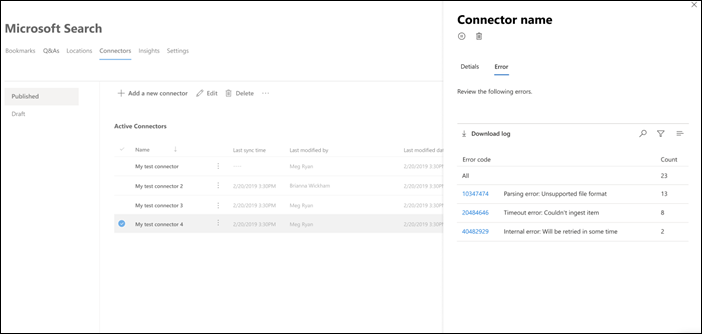
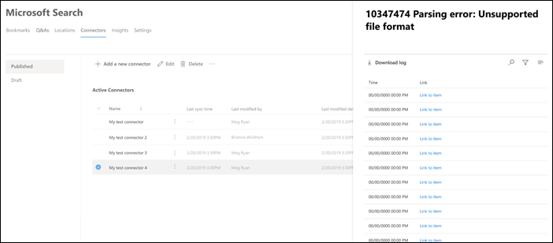

<!-- markdownlint-disable no-inline-html -->

# Exibir detalhes e erros de conexão

Para acessar e gerenciar seus conectores, você deve ser designado como administrador de pesquisa para seu locatário. Entre em contato com o administrador do locatário para provisioná-lo para a função de administrador de pesquisa.

Navegue até [a guia Conectores](https://admin.microsoft.com/Adminportal/Home#/MicrosoftSearch/Connectors) no centro de administração [do Microsoft 365.](https://admin.microsoft.com)

Você pode exibir detalhes e erros de conexão quando clicar na conexão na guia [Conectores.](https://admin.microsoft.com/Adminportal/Home#/MicrosoftSearch/Connectors)  

## Exibir suas últimas informações de rastreamento

Depois que o primeiro rastreamento incremental ou completo é concluído com êxito, os últimos valores de dados de rastreamento são exibidos sob o último header de rastreamento no painel de detalhes. Se não houve nenhum último rastreamento que foi feito, você não verá nenhuma informação sob o último header de rastreamento. Essas informações sobre o último rastreamento ajudarão você a obter informações sobre como o rastreamento foi executado e as etapas necessárias sempre que necessário.

Os seguintes últimos valores de rastreamento estarão disponíveis para cada conexão:

Valor | Descrição
--- | ---
**Concluído em** | Data e hora em que o último rastreamento foi concluído
**Tipo** | Rastreamento incremental ou completo
**Duration** | quanto tempo o último rastreamento leva para ser concluído
**Sucessos** | Número de itens que foram ingeridos com êxito no último rastreamento
**Erros** | Número de itens que errou no último rastreamento

## Monitorar erros

Para cada **Conector Ativo** na guia **Conectores,** quaisquer erros de rastreamento existentes aparecem na **guia Erro.** A guia lista os códigos de erro, a contagem de cada um e as opções de download do log de erros. Consulte o exemplo na imagem a seguir. Selecione um **código de erro** para exibir os detalhes do erro.

Para exibir os detalhes específicos de um erro, selecione seu código de erro. Uma tela aparece com detalhes de erro e um link. Os erros mais recentes aparecem na parte superior. Consulte o exemplo na tabela a seguir.

Abaixo está a lista de erros diferentes que podem aparecer em qualquer conexão.

Código de erro | Mensagem de erro | Solução
--- | --- | ---
1000 | A fonte de dados não está disponível. Verifique sua conexão com a Internet ou verifique se a fonte de dados ainda está acessível pelo conector. | Esse erro ocorre quando a fonte de dados não pode ser alcançada devido a um problema de rede ou quando a própria fonte de dados é excluída, movida ou renomeada. Verifique se os detalhes da fonte de dados fornecidos ainda são válidos.
1001 | Não é possível atualizar os dados, porque a fonte de dados está 300%. | Para desaforar a fonte de dados, verifique se seus limites de escala podem ser aumentados ou aguarde até um horário menos intenso do dia.
1002 | Não é possível autenticar com a fonte de dados. Verifique se as credenciais associadas a essa fonte de dados estão corretas. | Clique **em Editar** para atualizar as credenciais de autenticação.
1003 | A conta associada ao conector não tem permissão para acessar o item. |  Verifique se a conta adequada tem acesso ao item que você deseja indexado.
1004 | Não é possível alcançar o gateway de dados local. Certifique-se de que o serviço de gateway está em execução e que os detalhes do gateway sejam atualizados na configuração da conexão. | Verifique o computador com o gateway, abra o aplicativo Gateway do Power BI e verifique se o gateway está em execução. Verifique se o gateway está usando a mesma conta de administrador do Microsoft Search e verifique se todos os detalhes do gateway estão atualizados na configuração da conexão.
1005 | As credenciais associadas a essa fonte de dados expiraram. Renove as credenciais e atualize a conexão. | Clique **em Editar** para atualizar as credenciais de autenticação.
1006 | Sua versão do gateway está desaparada e não dá mais suporte a esse conector. Você precisará atualizar o gateway. | Visite [Instalar um gateway de](/data-integration/gateway/service-gateway-install) dados local para baixar e instalar a versão mais recente do gateway do Power BI no computador que contém o gateway.
1007 | Nenhuma licença válida do Power BI detectada. Você precisa de uma licença válida do Power BI para executar esse rastreamento. | Você precisa de uma licença válida do Power BI para executar esse rastreamento. Verifique se sua organização tem uma licença válida. Se isso acontecer, tente novamente. Se isso não acontecer, obtenha uma licença e tente novamente.
1008 | A utilização total da cota de seu locatário atingiu seu limite. | Tente excluir uma conexão para liberar parte de sua cota ou ajustar seus filtros de ingestão para trazer menos dados. Se eles não resolverem o problema, contate o suporte da Microsoft.
1009 | A utilização total da cota para sua conexão atingiu seu limite. | Tente ajustar seus filtros de ingestão para trazer menos dados. Se isso não resolver o problema, contate o suporte da Microsoft.
1010 | A utilização total da cota para indexação de grupos que não são do Azure AD atingiu seu limite de 100.000. | Tente excluir uma conexão para liberar parte de sua cota ou ajustar seus filtros de ingestão para trazer menos dados. Se eles não resolverem o problema, contate o suporte da Microsoft.
1011 | O agente do [conector do](on-prem-agent.md) Graph não é acessível ou offline. | 
1012 | A autenticação para sua conexão falhou devido a um modo de autenticação sem suporte. | Edite a conexão para atualizar as configurações de autenticação para sua conexão.
2001 | A indexação é acelerada devido a um grande número de atualizações na fila. Dependendo da fila, pode levar algum tempo para que as atualizações possam ser concluídas. | Aguarde até que a fila seja limpa.
2002 | A indexação falhou devido à formatação de item sem suporte. | Consulte a documentação específica do conector para obter mais informações.
2003 | Falha na indexação devido ao conteúdo do item sem suporte. | Consulte a documentação específica do conector para obter mais informações.
2004 | Falha na indexação devido a um item ou tamanho de arquivo sem suporte. | Consulte a documentação específica do conector para obter mais informações.
2005 | A indexação falhou porque o URI é muito longo. | Consulte a documentação específica do conector para obter mais informações.
2006 | O mapeamento do usuário falhou devido a uma fórmula de mapeamento inválida ou a nenhum usuário do Azure AD com essa propriedade. | Tente excluir e recriar a conexão com uma fórmula de mapeamento diferente. 
2007 | Esse item não será exibido na Pesquisa da Microsoft porque alguns usuários ou grupos sem permissão para exibir esse item não puderam ser indexados. | 
2008 | As conexões não podem ter grupos que não são do Azure AD com mais de 50.000 membros. | Tente remover usuários de um grupo ou tente remover itens ACLed com esse grupo da ingestão e recrie a conexão.
2009 | A indexação de grupos do Azure AD está temporariamente pausada devido a um grande número de solicitações. A indexação será retomada quando o sistema concluir o processamento dessas solicitações. Verifique novamente mais tarde. | 
2010 | Essa conexão não é mais válida devido a uma atualização feita pela Microsoft. Exclua a conexão e crie uma nova. | Exclua a conexão e crie uma nova.
5000 | Algo deu errado. Se isso continuar, contate o suporte. |