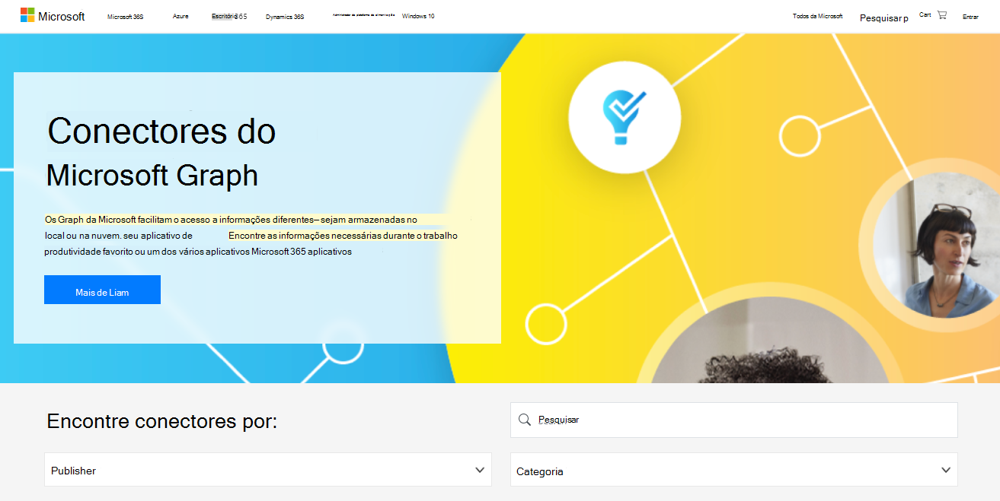

# Galeria Graph conectores da Microsoft

A [galeria Graph conectores](https://www.microsoft.com/microsoft-search/connectors) da Microsoft inclui uma breve descrição de cada um dos conectores criados pela Microsoft e nossos parceiros e um link para o site de cada parceiro.

Com mais de 100 conectores disponíveis no momento, você pode se conectar à Microsoft popular e não-serviços Microsoft como serviços do Azure, Box, Confluence, MediaWiki, ServiceNow, SalesForce, serviços google, MediaWiki e muito mais.

Visite a [galeria Graph conectores do Microsoft](http://www.microsoft.com/microsoft-search/connectors) agora e encontre todas as informações necessárias.

 

