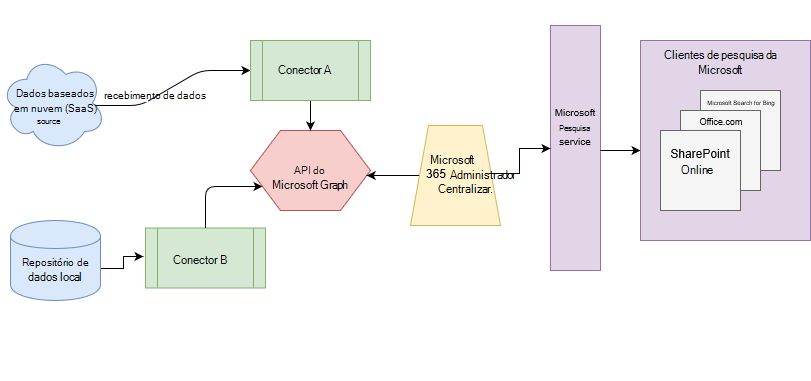

# Visão geral dos conectores do Microsoft GraphOverview of Microsoft Graph connectors

O Microsoft Search indexa todos os seus dados do [microsoft 365](https://www.microsoft.com/microsoft-365) para torná-los pesquisáveis para os usuários.Microsoft Search indexes all your [Microsoft 365](https://www.microsoft.com/microsoft-365) data to make it searchable for users. Com os conectores do Microsoft Graph, sua organização pode indexar dados de terceiros para que eles apareçam nos resultados da pesquisa da Microsoft.With Microsoft Graph connectors, your organization can index third-party data to appear in Microsoft Search results. Os dados de terceiros podem ser hospedados no local ou nas nuvens públicas ou privadas.The third-party data can be hosted on-premises or in the public or private clouds. Os conectores expandem os tipos de fontes de conteúdo que podem ser pesquisados em seus aplicativos de produtividade do Microsoft 365 e no ecossistema mais amplo da Microsoft.Connectors expand the types of content sources that are searchable in your Microsoft 365 productivity apps and the broader Microsoft ecosystem.

> [!IMPORTANT]
> **Isenção de responsabilidade**: os conectores do Microsoft Graph e as APIs de pesquisa da Microsoft (consulta e índice) estão atualmente no status de visualização disponível para locatários no lançamento direcionado.**DISCLAIMER**: Microsoft Graph connectors and Microsoft Search APIs (query and index) are currently in preview status available for tenants in Targeted release. Para usar conectores com o Microsoft Search ou para criar conectores, opte pelo [lançamento direcionado](https://docs.microsoft.com/office365/admin/manage/release-options-in-office-365?view=o365-worldwide).To use connectors with Microsoft Search or to build connectors, opt into [Targeted release](https://docs.microsoft.com/office365/admin/manage/release-options-in-office-365?view=o365-worldwide). Para saber mais sobre a visualização, consulte [Connectors Preview Program](connectors-preview.md).To learn more about the preview, see [connectors preview program](connectors-preview.md).

## ArquiteturaArchitecture

O seguinte diagrama de arquitetura da plataforma do Microsoft Graph mostra como o conteúdo do conector flui através da indexação de conteúdo para os resultados do usuário nos clientes de [pesquisa da Microsoft](https://docs.microsoft.com/microsoftsearch/overview-microsoft-search) .The following architectural diagram of the Microsoft Graph platform shows how connector content flows through content indexing to user results in [Microsoft Search](https://docs.microsoft.com/microsoftsearch/overview-microsoft-search) clients. Este artigo explica cada um dos principais blocos de construção no processo de fluxo de dados de conectores do Microsoft Graph.This article explains each of the key building blocks in the Microsoft Graph connectors data flow process.

A API instancia uma conexão por fonte de dados.The API instantiates one connection per data source. Em seguida, a API indexa e armazena os dados.Then the API indexes and stores the data. As conexões estabelecidas interagem com o Microsoft Search, para que os usuários possam obter resultados de pesquisa.Established connections interact with Microsoft Search, so users can get search results.

Você pode configurar todos os conectores criados pela Microsoft no centro de [Administração](https://admin.microsoft.com)do Microsoft 365.You can configure all the Microsoft-built connectors in the Microsoft 365 [admin center](https://admin.microsoft.com). O centro de administração simplifica a configuração do seu conector com uma interface do usuário simples.The admin center simplifies configuring your connector with a simple user interface.

Para criar uma **conexão** com uma fonte de dados, os administradores precisam de acesso autenticado aos dados e a todo o repositório de conteúdo.To create a **connection** to a data source, admins need authenticated access to the data and the entire content repository. Os dados são alimentados para o serviço do conector do Graph para indexação.The data is fed to the graph connector service for indexing.

## Conectores disponíveisAvailable connectors

No momento, há 6 conectores criados pela Microsoft e mais de 100 conectores estão disponíveis em nossos parceiros de ecossistema.There are currently 6 Microsoft-built connectors, and over 100 connectors are available from our ecosystem partners.

Para visualizar os conectores de um de nossos parceiros de ecossistema, entre em contato diretamente com eles.To preview connectors from one of our ecosystem partners, contact them directly. Para obter mais informações, consulte a [Galeria de conectores do Microsoft Graph](connectors-gallery.md).For more information, see the [Microsoft Graph connectors gallery](connectors-gallery.md).

Você também pode [criar seu próprio conector](https://docs.microsoft.com/graph/search-concept-overview).You can also [build your own connector](https://docs.microsoft.com/graph/search-concept-overview).

### Conectores criados pela MicrosoftConnectors by Microsoft

A versão prévia dos conectores do Microsoft Graph inclui 6 conectores criados pela Microsoft.The Microsoft Graph connectors preview release includes 6 Microsoft-built connectors. Você pode configurá-los no [centro de administração](https://admin.microsoft.com) e aprender como [configurar seu conector criado pela Microsoft](configure-connector.md).You can set them up in the [admin center](https://admin.microsoft.com) and learn how to [Set up your Microsoft-built connector](configure-connector.md).

As seções a seguir fornecem descrições breves para esses conectores criados pela Microsoft.The following sections provide brief descriptions for these Microsoft-built connectors. Você pode obter mais informações nos artigos vinculados para cada conector.You can get more information in the linked articles for each connector.

- **[Gen2 de armazenamento do Azure data Lake](https://docs.microsoft.com/azure/storage/blobs/data-lake-storage-introduction)**.**[Azure Data Lake Storage Gen2](https://docs.microsoft.com/azure/storage/blobs/data-lake-storage-introduction)**. Com esse conector do Microsoft Graph, os usuários em sua organização podem pesquisar arquivos e conteúdo armazenados em contêineres de blob do Azure.With this Microsoft Graph connector, users in your organization can search for files and content stored in Azure Blob containers. O conector do Gen2 de armazenamento do Azure data Lake também indexa pastas habilitadas por hierarquia nas contas do Gen2 de armazenamento do Azure data Lake que você especificar.The Azure Data Lake Storage Gen2 connector also indexes hierarchy-enabled folders in Azure Data Lake Storage Gen2 accounts that you specify.
Saiba mais sobre o [conector do Gen2 de armazenamento do Azure data Lake](azure-data-lake-connector.md).Learn more about the [Azure Data Lake Storage Gen2 connector](azure-data-lake-connector.md).

- **[DevOps do Azure](https://azure.microsoft.com/services/devops)**.**[Azure DevOps](https://azure.microsoft.com/services/devops)**. Com esse conector do Microsoft Graph, os usuários em sua organização podem pesquisar itens de trabalho de sua instância do DevOps do Azure.With this Microsoft Graph connector, users in your organization can search for work items from your Azure DevOps instance.
Saiba mais sobre o [conector DevOps do Azure](azure-devops-connector.md).Learn more about the [Azure DevOps connector](azure-devops-connector.md).

- **[Azure SQL](https://azure.microsoft.com/services/sql-database)**.**[Azure SQL](https://azure.microsoft.com/services/sql-database)**. Com esse conector do Microsoft Graph, os usuários em sua organização podem pesquisar dados de seu banco de dados SQL do Azure.With this Microsoft Graph connector, users in your organization can search for data from your Azure SQL database.
Saiba mais sobre o [Azure SQL Connector](MSSQL-connector.md).Learn more about the [Azure SQL connector](MSSQL-connector.md).

- **Sites corporativos**.**Enterprise websites**. Com esse conector do Microsoft Graph, os usuários da sua organização podem Pesquisar nas páginas de qualquer site que não seja do SharePoint Enterprise.With this Microsoft Graph connector, users in your organization can search over pages in any non-SharePoint enterprise website.
Saiba mais sobre o [conector de sites da empresa](enterprise-web-connector.md).Learn more about the [Enterprise websites connector](enterprise-web-connector.md).

- **[MediaWiki](https://www.mediawiki.org/wiki/MediaWiki)**.**[MediaWiki](https://www.mediawiki.org/wiki/MediaWiki)**. Com esse conector do Microsoft Graph, os usuários podem pesquisar artigos da base de conhecimento em sites wiki que sua organização cria com o MediaWiki.With this Microsoft Graph connector, users can search for knowledge-base articles on wiki sites your organization creates with MediaWiki.
Saiba mais sobre o [conector MediaWiki](mediawiki-connector.md).Learn more about the [MediaWiki connector](mediawiki-connector.md).

- **[Microsoft SQL Server](https://www.microsoft.com/sql-server/sql-server-2017)**.**[Microsoft SQL server](https://www.microsoft.com/sql-server/sql-server-2017)**. Com esse conector do Microsoft Graph, os usuários em sua organização podem pesquisar dados em bancos de dados do SQL Server local.With this Microsoft Graph connector, users in your organization can search for data in on-premises SQL server databases.
Saiba mais sobre o [Microsoft SQL Server Connector](MSSQL-connector.md).Learn more about the [Microsoft SQL server connector](MSSQL-connector.md).

- **[ServiceNow](https://www.servicenow.com)**.**[ServiceNow](https://www.servicenow.com)**. Com esse conector do Microsoft Graph, os usuários da sua organização podem pesquisar artigos da base de conhecimento da sua instância do ServiceNow.With this Microsoft Graph connector, users in your organization can search for knowledge-base articles from your ServiceNow instance.
Saiba mais sobre o [conector do ServiceNow](servicenow-connector.md).Learn more about the [ServiceNow connector](servicenow-connector.md).

### Conectores de nossos parceirosConnectors from our partners

Há mais de 100 conectores disponíveis para visualização de nossos parceiros de ecossistema.There are over 100 connectors available for preview from our ecosystem partners. Para visualizar os conectores de um de nossos parceiros de ecossistema, entre em contato diretamente com eles.To preview connectors from one of our ecosystem partners, contact them directly.
Saiba mais sobre conectores de nossos parceiros na [Galeria de conectores do Microsoft Graph](connectors-gallery.md).Learn more about connectors from our partners in the [Microsoft Graph connectors gallery](connectors-gallery.md).

### Criar seu próprio conectorBuild your own connector

Para indexar arquivos ou tipos de dados personalizados, os desenvolvedores podem criar conectores no [Microsoft Graph](https://developer.microsoft.com/graph/).To index custom data types or files, developers can create connectors in [Microsoft Graph](https://developer.microsoft.com/graph/). Um conector é um aplicativo que [cria uma conexão](https://docs.microsoft.com/graph/search-index-manage-connections) e empurra itens para o índice de pesquisa da Microsoft.A connector is an application that [creates a connection](https://docs.microsoft.com/graph/search-index-manage-connections) and pushes items into the Microsoft Search index. Para obter mais informações, consulte a [visão geral para estender a experiência de pesquisa da Microsoft para aplicativos no Microsoft Graph](https://docs.microsoft.com/graph/search-concept-overview).For more information, see the [Overview for extending the Microsoft Search experience for apps on Microsoft Graph](https://docs.microsoft.com/graph/search-concept-overview).

### Resultados da pesquisa com seu conector interno personalizadoSearch results with your custom-built connector

Após a indexação dos dados personalizados, os desenvolvedores podem [consultar esses dados](https://docs.microsoft.com/graph/search-concept-custom-types).After custom data is indexed, developers can [query this data](https://docs.microsoft.com/graph/search-concept-custom-types). Você pode exibir seus dados em qualquer aplicativo.You can view your data in any application. Para obter mais informações, consulte a [visão geral para estender a experiência de pesquisa da Microsoft para aplicativos no Microsoft Graph](https://docs.microsoft.com/graph/search-concept-overview).For more information, see the [Overview for extending the Microsoft Search experience for apps on Microsoft Graph](https://docs.microsoft.com/graph/search-concept-overview).

## Requisitos de licençaLicense requirements

Para exibir dados de conectores nos resultados da pesquisa, os usuários devem ter uma das seguintes assinaturas do Microsoft 365 ou do Office 365:To view data from connectors in your search results, users must have one of the following Microsoft 365 or Office 365 subscriptions:

- [Microsoft 365 ou Office 365 Enterprise E3 ou e5Microsoft 365 or Office 365 Enterprise E3 or E5](https://www.microsoft.com/microsoft-365/compare-all-microsoft-365-plans)

- [Microsoft 365 ou Office 365 educação a3 ou a5Microsoft 365 or Office 365 Education A3 or A5](https://www.microsoft.com/microsoft-365/academic/compare-office-365-education-plans?activetab=tab:primaryr1)
