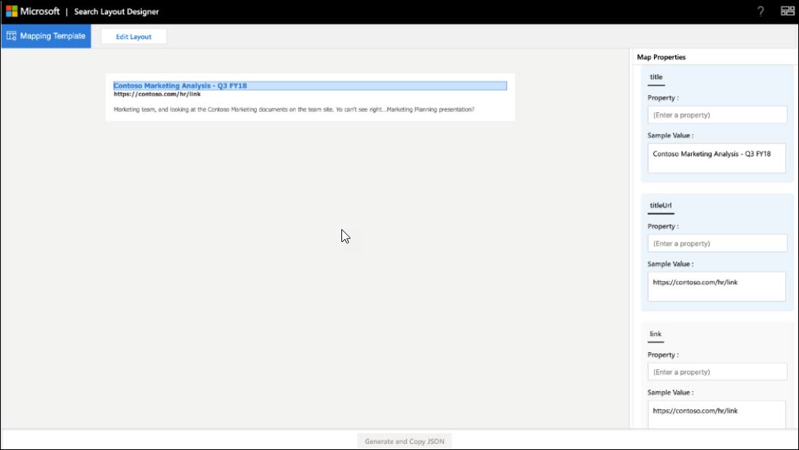

<!-- markdownlint-disable no-hard-tabs -->
# <a name="create-a-layout-to-customize-search-results"></a>Criar um layout para personalizar os resultados da pesquisa

Você pode criar o layout de resultado para uma vertical personalizada usando o designer de layout de pesquisa. Você pode começar a criar o layout escolhendo modelos oferecidos no designer de layout e usá-los se eles atenderem aos seus requisitos. Ou você pode optar por editar esses modelos de várias maneiras para atender aos seus requisitos. Por exemplo, adicionar/remover imagens, adicionar/remover texto e modificar texto. Se nenhum dos modelos atender aos seus requisitos, você poderá optar por começar a criar o layout usando um modelo em branco.  

Depois que o layout estiver pronto, use o [idioma do modelo de cartões adaptáveis](https://docs.microsoft.com/adaptive-cards/templating/language) para criar um JSON de layout de resultado que é usado para definir um tipo de resultado. Você mapeia as propriedades de resultado para o layout usando a etapa de mapeamento no designer de layout.  

## <a name="create-a-layout-on-your-own"></a>Criar um layout por conta própria

Criar um layout por conta própria requer conhecimento de [cartões adaptáveis](https://docs.microsoft.com/adaptive-cards/authoring-cards/getting-started) e seu [esquema](https://adaptivecards.io/explorer/). Layout do resultado da pesquisa usa um subconjunto dos elementos oferecidos por cartões adaptáveis e você pode usar o designer de layout para saber mais sobre o conjunto de elementos com suporte.  

Ao criar seu próprio layout, crie o layout do cartão adaptável usando dados do seu conector e Finalize o layout.
Há duas etapas principais na criação de seu próprio layout:

- Criar o layout.
- Separe os dados do modelo.

### <a name="design-the-layout"></a>Criar o layout

Neste exemplo, mostramos um layout com um cabeçalho, link e texto descritivo.


E aqui está o arquivo JSON associado do layout:

```json
{
    "type": "AdaptiveCard",
    "version": "1.0",
     "body": [
{

            "type": "ColumnSet",
             "columns": [
                 {
                     "type": "Column",
                     "width": 8,
                     "items": [
                         {
                             "type": "TextBlock",
                             "text": "Contoso Marketing Analysis - Q3 FY18",
                             "color": "Accent",
                             "size": "Medium",
                             "spacing": "None",
                             "$when": "{title != \"\"}",
                             "weight": "Bolder"
                        },
                        {
                        "type": "TextBlock",  
                        "text": "https://contoso.com/hr/link",
                        "spacing": "None",  
                        "color": "Dark",
                        "weight": "Bolder"

                        },

                        {  
                        "type": "TextBlock",
                        "text": "Marketing team at Contoso.., and looking at the Contoso Marketing documents on the team site. This contains the data from FY20 and will taken over to FY21...Marketing Planning is ongoing for FY20..",  
                        "wrap": true,
                        "maxLines": 2,
                        "spacing": "Medium"
                        }
                        ],

                    "horizontalAlignment": "Center",
                    "spacing": "None"

                }

            ]

        }
        ],

    "$schema": "http://adaptivecards.io/schemas/adaptive-card.json"
}
```

### <a name="separate-the-data-from-the-layout"></a>Separar os dados do layout

Você pode separar os dados do layout e vincular os dados.

Veja a seguir o layout JSON depois de vincular os dados:

```json
{

    "type": "AdaptiveCard",
    "version": "1.0",
    "body": [
    {
    "type": "ColumnSet",
"columns": [

                {
                "type": "Column",
                "width": 8,
                "items": [
                {
                "type": "TextBlock",
                "text": "[{title}]({titleUrl})",
                "color": "Accent",
                "size": "Medium",
                "spacing": "None",
                "weight": "Bolder"

                 },
                 {
                 "type": "TextBlock",
                 "text": "{link}",
                 "spacing": "None",
                 "color": "Dark",
                 "weight": "Bolder"
                 },
                 {
                 "type": "TextBlock",
                 "text": "{description}",
                 "wrap": true,
                 "maxLines": 2,
                 "spacing": "Medium"
                 }
                 ],
                 "horizontalAlignment": "Center",
                 "spacing": "None"
                 }
                 ]

        }

    ],

    "$schema": "http://adaptivecards.io/schemas/adaptive-card.json"
}
```

Dados de exemplo: especifique dados de exemplo no **Editor de dados de exemplo** para exibir o cartão ligado a dados no modo de **Visualização**.

```json
{

    "title": "Contoso Marketing Analysis - Q3 FY18",
    "titleUrl": "https://contoso.com/hr/link",
    "link": "https://contoso.com/hr/link",
    "description": "Marketing team, and looking at the Contoso Marketing documents on the team site. Yo can't see right...Marketing Planning presentation?"

}
```

## <a name="map-the-layout-to-the-result-properties"></a>Mapear o layout para as propriedades de resultado

Você deve mapear cada campo do layout para uma propriedade Result ou uma propriedade Connector para gerar o resultado de layout JSON.



Selecione um campo no layout para realçar as variáveis que precisam ser mapeadas. Você pode usar várias variáveis para um único campo, e todos os campos devem ser mapeados para as propriedades do resultado.

## <a name="things-to-consider"></a>Itens a considerar

Antes de começar, há algumas coisas que você deve fazer e algumas coisas que você deve evitar para garantir que seus layouts serão bem-sucedidos.

### <a name="do"></a>Fazer

- Edite um modelo para fornecer o link de logotipo no layout se você estiver usando links estáticos para logotipos e não resultados de propriedades.
- Validar o layout do resultado para cenários em que nenhum dado é retornado para uma propriedade Result usada no resultado JSON. Use a `$when` condição para ocultar um elemento se a propriedade não contiver dados.  
- Certifique-se de que os tipos `$when` de dados da condição e a propriedade Result correspondam. Por exemplo, não compare `Number` com `Text` na `$when` condição.  
- Considere os requisitos de temas ao criar um layout de resultados.  
- Certifique-se de `Textblock`  que o elemento pode lidar com conteúdo dinâmico. Você pode usar as `wrap` propriedades `maxLines` de elemento e para essa finalidade.
- Formatar corretamente a data ao usar `{DATE()}` na redução.  

### <a name="dont"></a>Não fazer

- Não defina tipos de dados inválidos ao vincular valores. Para obter mais informações sobre tipos de dados, consulte [Manage The Search Schema](https://docs.microsoft.com/sharepoint/search/manage-the-search-schema).
- Evite cortar o resultado na página de resultados seguindo a altura máxima do JSON de layout de resultados. Se você exceder a altura máxima do layout do resultado, o resultado será cortado na página de resultados.
- Não use `px` valores nas propriedades do elemento.

## <a name="resources"></a>Recursos

[Personalizar página de resultados de pesquisa](customize-search-page.md)

[Cartões adaptáveis](https://docs.microsoft.com/adaptive-cards/authoring-cards/getting-started)

[Idioma do modelo de cartões adaptáveis](https://docs.microsoft.com/adaptive-cards/templating/language)

[Esquema de cartão adaptável](https://adaptivecards.io/explorer/)
