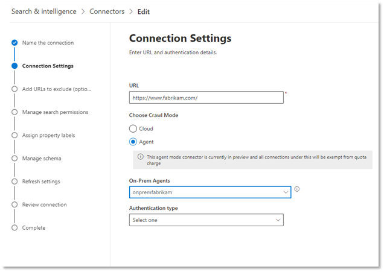

<!---Previous ms.author: monaray --->

<!-- markdownlint-disable no-inline-html -->

# Conector gráfico de sites corporativosEnterprise websites Graph connector

O conector do Graph de sites corporativos permite que sua organização indexe artigos e **conteúdo de seus sites voltados para internamente.**The Enterprise websites Graph connector allows your organization to index articles and **content from its internal-facing websites**. Depois de configurar o conector e sincronizar o conteúdo do site, os usuários finais poderão pesquisar esse conteúdo de qualquer cliente de Pesquisa da Microsoft.After you configure the connector and sync content from the website, end users can search for that content from any Microsoft Search client.

> [!NOTE]
> Leia o [**artigo Configurar seu conector do Graph**](configure-connector.md) para entender as instruções gerais de configuração dos conectores do Graph.Read the [**Setup your Graph connector**](configure-connector.md) article to understand the general Graph connectors setup instructions.

Este artigo é para qualquer pessoa que configure, executa e monitore um conector de sites enterprise.This article is for anyone who configures, runs, and monitors an Enterprise websites connector. Ele complementa o processo de instalação geral e mostra instruções que se aplicam somente ao conector de sites da Empresa.It supplements the general setup process, and shows instructions that apply only for the Enterprise websites connector. Este artigo também inclui informações sobre Solução de [Problemas](#troubleshooting) e [Limitações.](#limitations)This article also includes information about [Troubleshooting](#troubleshooting) and [Limitations](#limitations).

<!---## Before you get started-->

<!---Insert "Before you get started" recommendations for this data source-->

## Etapa 1: Adicionar um conector graph no centro de administração do Microsoft 365Step 1: Add a Graph connector in the Microsoft 365 admin center

Siga as instruções [gerais de instalação](./configure-connector.md).Follow the general [setup instructions](./configure-connector.md).
<!---If the above phrase does not apply, delete it and insert specific details for your data source that are different from general setup instructions.-->

## Etapa 2: nomear a conexãoStep 2: Name the connection

Siga as instruções [gerais de instalação](./configure-connector.md).Follow the general [setup instructions](./configure-connector.md).
<!---If the above phrase does not apply, delete it and insert specific details for your data source that are different from general setup instructions.-->

## Etapa 3: Configurar as configurações de conexãoStep 3: Configure the connection settings

Para se conectar à sua fonte de dados, você precisa preencher a URL raiz do site, selecionar uma fonte de rastreamento e o tipo de autenticação que você gostaria de usar: None, Basic Authentication ou OAuth 2.0 com o [Azure Active Directory (Azure AD)](/azure/active-directory/).To connect to your data source, you need to fill in the root URL of the website, select a crawl source, and the type of authentication you'd like to use: None, Basic Authentication, or OAuth 2.0 with [Azure Active Directory (Azure AD)](/azure/active-directory/). Depois de concluir essas informações, selecione Conexão de Teste para verificar suas configurações.After you complete this information, select Test Connection to verify your settings.

### URLURL

Use o campo URL para especificar a raiz do site que você gostaria de rastrear.Use the URL field to specify the root of the website that you'd like to crawl. O conector de sites corporativos usará essa URL como ponto de partida e seguirá todos os links dessa URL para seu rastreamento.The enterprise websites connector will use this URL as the starting point and follow all the links from this URL for its crawl.

> [!NOTE]
> Se o site que você deseja rastrear tiver um mapa de site definido, o conector rastreará apenas as URLs listadas no sitemap.If the site you want to crawl has a sitemap defined, the connector will only crawl the URLs listed in the sitemap. Se nenhum sitemap for definido, o conector fará um rastreamento profundo de todos os links encontrados na URL raiz do site.If no sitemap is defined, the connector will do a deep crawl of all the links found on the root URL of the site.

### Modo de rastreamento: Nuvem ou Local (Visualização)Crawl mode: Cloud or On-premises (Preview)

O modo de rastreamento determina o tipo de sites que você deseja indexar, na nuvem ou no local.The crawl mode determines the type of websites you want to index, either cloud or on-premises. Para seus sites de nuvem, selecione **Nuvem** como o modo de rastreamento.For your cloud websites, select **Cloud** as the crawl mode.

Além disso, o conector agora dá suporte ao rastreamento de sites locais.Also, the connector now supports crawling of on-premises websites. Esse modo está na visualização.This mode is in preview. Para acessar seus dados locais, você deve primeiro instalar e configurar o agente conector do Graph.To access your on-premises data, you must first install and configure the Graph connector agent. Para saber mais, consulte [Graph connector agent](./on-prem-agent.md).To learn more, see [Graph connector agent](./on-prem-agent.md).

Para seus sites locais, selecione **Agente** como o  modo de rastreamento e, no campo Agente Local, escolha o agente de conector do Graph que você instalou e configurou anteriormente.For your on-premises websites, select **Agent** as the crawl mode and in the **On-Prem Agent** field, choose the Graph connector agent that you installed and configured earlier.  

> [!div class="mx-imgBorder"]
> 

### AutenticaçãoAuthentication

A Autenticação Básica requer um nome de usuário e senha.Basic Authentication requires a username and password. Crie essa conta de bot usando o centro de administração [do Microsoft 365.](https://admin.microsoft.com)Create this bot account by using the [Microsoft 365 admin center](https://admin.microsoft.com).

OAuth 2.0 com [o Azure AD](/azure/active-directory/) requer uma ID de recurso, ID do Cliente e Segredo do Cliente.OAuth 2.0 with [Azure AD](/azure/active-directory/) requires a resource ID, Client ID, and Client Secret. OAuth 2.0 só funciona com o modo Nuvem.OAuth 2.0 only works with Cloud mode.

Para obter mais informações, consulte Autorizar o acesso a aplicativos Web do Azure Active Directory usando o fluxo de concessão de [código OAuth 2.0.](/azure/active-directory/develop/v1-protocols-oauth-code)For more information, see [Authorize access to Azure Active Directory web applications using OAuth 2.0 code grant flow](/azure/active-directory/develop/v1-protocols-oauth-code). Registre-se com os seguintes valores:Register with the following values:

**Nome:** Pesquisa da Microsoft**Name:** Microsoft Search  
**Redirect_URI:**`https://gcs.office.com/v1.0/admin/oauth/callback`**Redirect_URI:** `https://gcs.office.com/v1.0/admin/oauth/callback`

Para obter os valores do recurso, client_id e client_secret, vá para Usar o código de autorização para solicitar um token de **acesso** na página da URL de redirecionamento.To get the values for the resource, client_id, and client_secret, go to **Use the authorization code to request an access token** on the redirect URL webpage.

Para saber mais, confira [Início rápido: Registrar um aplicativo com a plataforma de identidade da Microsoft.](/azure/active-directory/develop/quickstart-register-app)For even more information, see [Quickstart: Register an application with the Microsoft identity platform](/azure/active-directory/develop/quickstart-register-app).

## Etapa 3a: Adicionar URLs a excluir (restrições opcionais de rastreamento)Step 3a: Add URLs to exclude (Optional crawl restrictions)

Há duas maneiras de impedir que as páginas sejam rastreadas: não permitir que elas sejam rastreadas em seu arquivo robots.txt ou adicioná-las à lista De exclusão.There are two ways to prevent pages from being crawled: disallow them in your robots.txt file or add them to the Exclusion list.

### Suporte para robots.txtSupport for robots.txt

O conector verifica se há um arquivo robots.txt para seu site raiz e, se existir, ele seguirá e respeitará as instruções encontradas nesse arquivo.The connector checks to see if there is a robots.txt file for your root site and, if one exists, it will follow and respect the directions found within that file. Se você não quiser que o conector rastrear determinadas páginas ou diretórios em seu site, poderá chamar essas páginas ou diretórios nas declarações "Desaproteção" no arquivo robots.txt.If you do not want the connector to crawl certain pages or directories on your site, you can call out those pages or directories in the "Disallow" declarations in your robots.txt file.

### Adicionar URLs a excluirAdd URLs to exclude

Opcionalmente, você pode criar uma lista **de** exclusão para excluir algumas URLs de ser rastreada se esse conteúdo for sensível ou não valer a pena rastrear.You can optionally create an **Exclusion list** to exclude some URLs from getting crawled if that content is sensitive or not worth crawling. Para criar uma lista de exclusão, navegue pela URL raiz.To create an exclusion list, browse through the root URL. Você pode adicionar as URLs excluídas à lista durante o processo de configuração.You can add the excluded URLs to the list during the configuration process.

## Etapa 4: Atribuir rótulos de propriedadeStep 4: Assign property labels

Você pode atribuir uma propriedade de origem a cada rótulo escolhendo a partir de um menu de opções.You can assign a source property to each label by choosing from a menu of options. Embora essa etapa não seja obrigatória, ter alguns rótulos de propriedade melhorará a relevância da pesquisa e garantirá resultados de pesquisa mais precisos para usuários finais.While this step is not mandatory, having some property labels will improve the search relevance and ensure more accurate search results for end users.

## Etapa 5: Gerenciar esquemaStep 5: Manage schema

Na tela **Gerenciar Esquema,** você pode alterar os atributos de esquema (as opções são **Consulta,** **Pesquisa,** **Recuperar** e **Refinar**) associadas às propriedades, adicionar aliases opcionais e escolher a **propriedade Content.**On the **Manage Schema** screen, you can change the schema attributes (the options are **Query**, **Search**, **Retrieve**, and **Refine**) associated with the properties, add optional aliases, and choose the **Content** property.

## Etapa 6: Gerenciar permissões de pesquisaStep 6: Manage search permissions

O conector de sites corporativos só dá suporte a permissões de pesquisa visíveis para **Todos.**The Enterprise websites connector only supports search permissions visible to **Everyone**. Os dados indexados aparecem nos resultados da pesquisa e são visíveis para todos os usuários na organização.Indexed data appears in the search results and is visible to all users in the organization.

## Etapa 7: Definir o cronograma de atualizaçãoStep 7: Set the refresh schedule

O conector de sites corporativos só oferece suporte a uma atualização completa.The Enterprise websites connector only supports a full refresh. Isso significa que o conector recrawl todo o conteúdo do site durante cada atualização.This means that the connector will recrawl all the website's content during every refresh. Para garantir que o conector tenha tempo suficiente para rastrear o conteúdo, recomendamos definir um grande intervalo de agendamento de atualização.To make sure the connector gets enough time to crawl the content, we recommend that you set a large refresh schedule interval. Recomendamos uma atualização agendada entre uma e duas semanas.We recommend a scheduled refresh between one and two weeks.

## Etapa 8: Revisar conexãoStep 8: Review connection

Siga as instruções [gerais de instalação](./configure-connector.md).Follow the general [setup instructions](./configure-connector.md).
<!---If the above phrase does not apply, delete it and insert specific details for your data source that are different from general setup instructions.-->

## Solução de problemasTroubleshooting

Ao ler o conteúdo do site, o rastreamento pode encontrar alguns erros de origem, que são representados pelos códigos de erro detalhados abaixo.When reading the website's content, the crawl may encounter some source errors, which are represented by the detailed error codes below. Para obter mais informações sobre os tipos de erros, vá para a página de detalhes **de** erro após selecionar a conexão.To get more information on the types of errors, go to the **error details** page after selecting the connection. Selecione o **código de erro** para ver erros mais detalhados.Select the **error code** to see more detailed errors. Consulte Também Gerenciar [seu conector para](./manage-connector.md) saber mais.Also refer to [Manage your connector](./manage-connector.md) to learn more.

 Código de erro detalhadoDetailed Error code | Mensagem de erroError message
 --- | ---
 60016001 | O site que está sendo tentado indexar não é acessívelThe site that is being tried to index is not reachable
 60056005 | A página de origem que está sendo tentada indexar foi bloqueada de acordo com robots.txt configuração.The source page that is being tried to index has been blocked by as per robots.txt configuration.
 60086008 | Não é possível resolver o DNSUnable to resolve the DNS
 60096009 | Para todos os erros do lado do cliente (exceto HTTP 404, 408), consulte CÓDIGOS de erro HTTP 4xxx para obter detalhes.For all client-side errors (Except HTTP 404, 408), refer to HTTP 4xx error codes for details.
 60136013 | A página de origem que está sendo tentada indexar não foi encontrada.The source page that is being tried to index could not be found. (Erro HTTP 404)(HTTP 404 error)
 60186018 | A página de origem não está respondendo e a solicitação foi o tempo de saída. (Erro HTTP 408)The source page is not responding, and the request has timed out. (HTTP 408 error)
 60216021 | A página de origem que está sendo tentada indexar não tem conteúdo textual na página.The source page that is being tried to index has no textual content on the page.
 60236023 | A página de origem que está sendo tentada indexar não tem suporte (não é uma página HTML)The source page that is being tried to index is unsupported (not an HTML page)
 60246024 | A página de origem que está sendo tentada para indexar tem conteúdo sem suporte.The source page that is being tried to index has unsupported content.

* Os erros 6001-6013 ocorrem quando a fonte de dados não pode ser alcançada devido a um problema de rede ou quando a própria fonte de dados é excluída, movida ou renomeada.Errors 6001-6013 occur when the data source is not reachable due to a network issue or when the data source itself is deleted, moved, or renamed. Verifique se os detalhes da fonte de dados fornecidos ainda são válidos.Check if the data source details provided are still valid.
* Os erros 6021-6024 ocorrem quando a fonte de dados contém conteúdo não textual na página ou quando a página não é um HTML.Errors 6021-6024 occur when the data source contains non-textual content on the page or when the page is not an HTML. Verifique a fonte de dados e adicione esta página na lista de exclusão ou ignore o erro.Check the data source and add this page in exclusion list or ignore the error.

## LimitaçõesLimitations

O conector de sites corporativos não dá suporte à pesquisa de dados em **páginas da Web dinâmicas.**The Enterprise websites connector doesn't support searching data on **dynamic webpages**. Exemplos dessas páginas da Web vivem em sistemas de gerenciamento de conteúdo, como [Confluência](https://www.atlassian.com/software/confluence) e [Unily](https://www.unily.com/) ou bancos de dados que armazenam conteúdo do site.Examples of those webpages live in content management systems like [Confluence](https://www.atlassian.com/software/confluence) and [Unily](https://www.unily.com/) or databases that store website content.