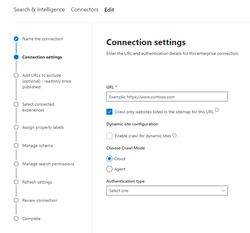

<!---Previous ms.author: monaray --->

<!-- markdownlint-disable no-inline-html -->

# Enterprise sites Graph conector

O Enterprise de sites Graph permite que sua organização indexe artigos e **conteúdo de seus sites internos.** Depois de configurar o conector e sincronizar o conteúdo do site, os usuários finais poderão pesquisar esse conteúdo de qualquer Pesquisa da Microsoft cliente.

> [!NOTE]
> Leia o [**artigo Configurar seu Graph conector para**](configure-connector.md) entender as instruções gerais Graph configuração de conectores.

Este artigo é para qualquer pessoa que configure, executa e monitore um conector Enterprise sites. Ele complementa o processo de instalação geral e mostra instruções que se aplicam somente ao conector Enterprise de sites. Este artigo também inclui informações sobre Solução de [Problemas](#troubleshooting) e [Limitações.](#limitations)

<!---## Before you get started-->

<!---Insert "Before you get started" recommendations for this data source-->

## Etapa 1: adicionar um conector Graph no Centro de administração do Microsoft 365

Siga as instruções [gerais de instalação](./configure-connector.md).
<!---If the above phrase does not apply, delete it and insert specific details for your data source that are different from general setup instructions.-->

## Etapa 2: nomear a conexão

Siga as instruções [gerais de instalação](./configure-connector.md).
<!---If the above phrase does not apply, delete it and insert specific details for your data source that are different from general setup instructions.-->

## Etapa 3: Configurar as configurações de conexão

Para se conectar à sua fonte de dados, preencha a URL raiz do site, selecione uma fonte de rastreamento e o tipo de autenticação que você gostaria de usar: None, Basic Authentication ou OAuth 2.0 com [Azure Active Directory (Azure AD)](/azure/active-directory/). Depois de concluir essas informações, selecione Conexão de Teste para verificar suas configurações.

### URL

Use o campo URL para especificar a raiz do site que você gostaria de rastrear. O conector de sites corporativos usará essa URL como ponto de partida e seguirá todos os links dessa URL para seu rastreamento.

### Rastrear sites listados no sitemap

Quando selecionado, o conector rastreará apenas as URLs listadas no sitemap. Se não for selecionado ou nenhum mapa de site for encontrado, o conector fará um rastreamento profundo de todos os links encontrados na URL raiz do site.

> [!div class="mx-imgBorder"]
> 

### Modo de rastreamento: nuvem ou local

O modo de rastreamento determina o tipo de sites que você deseja indexar, na nuvem ou no local. Para seus sites de nuvem, selecione **Nuvem** como o modo de rastreamento.

Além disso, o conector agora dá suporte ao rastreamento de sites locais. Para acessar seus dados locais, você deve primeiro instalar e configurar o Graph conector. Para saber mais, consulte [Graph conector](./on-prem-agent.md).

Para seus sites locais,  selecione Agente como o  modo de rastreamento e, no campo Agente Local, escolha o Graph conector que você instalou e configurou anteriormente.  

### Autenticação

A Autenticação Básica requer um nome de usuário e senha. Crie essa conta de bot usando o [Centro de administração do Microsoft 365](https://admin.microsoft.com).

OAuth 2.0 com [o Azure AD](/azure/active-directory/) requer uma ID de recurso, ID do Cliente e Segredo do Cliente. OAuth 2.0 só funciona com o modo Nuvem.

Para obter mais informações, consulte Autorizar o acesso Azure Active Directory aplicativos Web usando o fluxo de concessão de [código OAuth 2.0.](/azure/active-directory/develop/v1-protocols-oauth-code) Registre-se com os seguintes valores:

**Nome:** Pesquisa da Microsoft  
**Redirect_URI:**`https://gcs.office.com/v1.0/admin/oauth/callback`

Para obter os valores do recurso, client_id e client_secret, vá para Usar o código de autorização para solicitar um token de **acesso** na página da URL de redirecionamento.

Para obter mais informações, consulte [Início rápido: Registrar um aplicativo com](/azure/active-directory/develop/quickstart-register-app)o plataforma de identidade da Microsoft .

## Etapa 3a: Adicionar URLs a excluir (restrições opcionais de rastreamento)

Há duas maneiras de impedir que as páginas sejam rastreadas: não permitir que elas sejam rastreadas em seu arquivo robots.txt ou adicioná-las à lista De exclusão.

### Suporte para robots.txt

O conector verifica se há um arquivo robots.txt para seu site raiz e, se existir, ele seguirá e respeitará as instruções encontradas nesse arquivo. Se você não quiser que o conector rastrear determinadas páginas ou diretórios em seu site, poderá chamar essas páginas ou diretórios nas declarações "Desaproteção" no arquivo robots.txt.

### Adicionar URLs a excluir

Opcionalmente, você pode criar uma lista **de** exclusão para excluir algumas URLs de ser rastreada se esse conteúdo for sensível ou não valer a pena rastrear. Para criar uma lista de exclusão, navegue pela URL raiz. Você pode adicionar as URLs excluídas à lista durante o processo de configuração.

## Etapa 4: Atribuir rótulos de propriedade

Você pode atribuir uma propriedade de origem a cada rótulo escolhendo a partir de um menu de opções. Embora essa etapa não seja obrigatória, ter alguns rótulos de propriedade melhorará a relevância da pesquisa e garantirá resultados de pesquisa mais precisos para usuários finais.

## Etapa 5: Gerenciar esquema

Na tela **Gerenciar Esquema,** você pode alterar os atributos de esquema (as opções são **Consulta,** **Pesquisa,** **Recuperar** e **Refinar**) associadas às propriedades, adicionar aliases opcionais e escolher a **propriedade Content.**

## Etapa 6: Gerenciar permissões de pesquisa

O Enterprise de sites só dá suporte a permissões de pesquisa visíveis para **Todos.** Os dados indexados aparecem nos resultados da pesquisa e são visíveis para todos os usuários na organização.

## Etapa 7: Definir o cronograma de atualização

O Enterprise de sites só oferece suporte a uma atualização completa. Isso significa que o conector recrawl todo o conteúdo do site durante cada atualização. Para garantir que o conector tenha tempo suficiente para rastrear o conteúdo, recomendamos definir um grande intervalo de agendamento de atualização. Recomendamos uma atualização agendada entre uma e duas semanas.

## Etapa 8: Revisar conexão

Siga as instruções [gerais de instalação](./configure-connector.md).
<!---If the above phrase does not apply, delete it and insert specific details for your data source that are different from general setup instructions.-->

## Solução de problemas

Ao ler o conteúdo do site, o rastreamento pode encontrar alguns erros de origem, que são representados pelos códigos de erro detalhados abaixo. Para obter mais informações sobre os tipos de erros, vá para a página de detalhes **de** erro após selecionar a conexão. Selecione o **código de erro** para ver erros mais detalhados. Consulte Também Gerenciar [seu conector para](./manage-connector.md) saber mais.

 Código de erro detalhado | Mensagem de erro
 --- | ---
 6001 | O site que está sendo tentado indexar não é acessível
 6005 | A página de origem que está sendo tentada indexar foi bloqueada de acordo com robots.txt configuração.
 6008 | Não é possível resolver o DNS
 6009 | Para todos os erros do lado do cliente (exceto HTTP 404, 408), consulte CÓDIGOS de erro HTTP 4xxx para obter detalhes.
 6013 | A página de origem que está sendo tentada indexar não foi encontrada. (Erro HTTP 404)
 6018 | A página de origem não está respondendo e a solicitação foi o tempo de saída. (Erro HTTP 408)
 6021 | A página de origem que está sendo tentada indexar não tem conteúdo textual na página.
 6023 | A página de origem que está sendo tentada indexar não tem suporte (não é uma página HTML)
 6024 | A página de origem que está sendo tentada para indexar tem conteúdo sem suporte.

* Os erros 6001-6013 ocorrem quando a fonte de dados não pode ser alcançada devido a um problema de rede ou quando a própria fonte de dados é excluída, movida ou renomeada. Verifique se os detalhes da fonte de dados fornecidos ainda são válidos.
* Os erros 6021-6024 ocorrem quando a fonte de dados contém conteúdo não textual na página ou quando a página não é um HTML. Verifique a fonte de dados e adicione esta página na lista de exclusão ou ignore o erro.

## Limitações

O Enterprise de sites não dá suporte à pesquisa de dados em **páginas dinâmicas da Web.** Exemplos dessas páginas da Web vivem em sistemas de gerenciamento de conteúdo, como [Confluência](https://www.atlassian.com/software/confluence) e [Unily](https://www.unily.com/) ou bancos de dados que armazenam conteúdo do site.