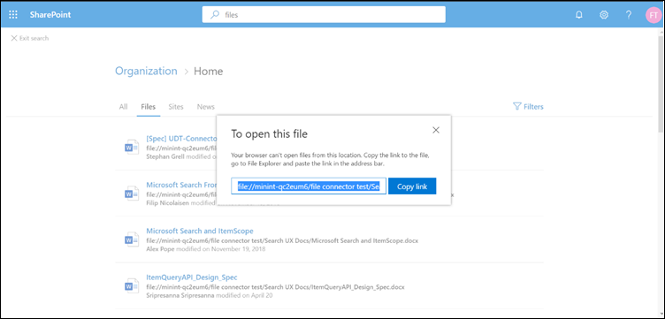

# <a name="file-share-connector"></a>Conector de compartilhamento de arquivos

Com o conector de compartilhamento de arquivos, os usuários da sua organização podem pesquisar em compartilhamentos de arquivos locais. Os resultados da pesquisa desses compartilhamentos são mesclados com os resultados do SharePoint e do Microsoft OneDrive for Business.

Este artigo é para os administradores do Microsoft 365 ou qualquer pessoa que configure, execute e monitore um conector de compartilhamento de arquivos. Ele explica como configurar seus recursos de conector e conector, limitações e técnicas de solução de problemas.

## <a name="install-a-data-gateway"></a>Instalar um data gateway
Para acessar seus dados de terceiros, você deve instalar e configurar um gateway do Microsoft Power BI. Consulte [Install and local gateway on-premises](https://docs.microsoft.com/data-integration/gateway/service-gateway-install) para saber mais.  

## <a name="connect-to-a-data-source"></a>Conectar-se a uma fonte de dados
Na página **conectar-se à fonte de dados** , crie uma pasta e forneça um caminho para o compartilhamento de arquivos. Em seguida, selecione o gateway instalado anteriormente. Insira as credenciais de uma conta de usuário do Windows com **acesso de leitura** para todos os arquivos no compartilhamento. Em seguida, você pode verificar os arquivos presentes no compartilhamento e ver todos os metadados buscados.

## <a name="manage-search-permissions"></a>Gerenciar permissões de pesquisa
O conector de compartilhamento de arquivos só oferece suporte a permissões de pesquisa visíveis para **todos**. Dados indexados aparecem nos resultados da pesquisa e são visíveis para todos os usuários da organização.

## <a name="set-the-refresh-schedule"></a>Definir o agendamento de atualização
O intervalo de agendamento de atualização padrão recomendado é de 15 minutos, mas você pode alterá-lo para outro intervalo de sua preferência.

## <a name="set-up-your-search-results-page"></a>Configurar a página de resultados de pesquisa
Para exibir os resultados de conexão de arquivos diferentes nas guias **todos** e **arquivos** , você precisa configurar uma página de resultados do mecanismo de pesquisa do SharePoint:
- A tabela **All** mostra os resultados combinados de suas conexões de arquivo, arquivos do SharePoint, arquivos do onedrive e sites do SharePoint. 
- O arquivo vertical mostra todos os resultados **de arquivos de** suas conexões, do SharePoint e do onedrive.
Os resultados das conexões de arquivo são adicionados aos resultados já existentes em **todos** os **arquivos** verticais.

Para configurar a página de resultados da pesquisa, siga estas etapas:
1. Crie um conjunto de sites do SharePoint com uma página de pesquisa moderna.

2. Instale um [Shell de gerenciamento do SharePoint Online](https://www.microsoft.com/download/details.aspx?id=35588).

3. Abra o Shell de gerenciamento do SharePoint Online como administrador e importe o módulo **Microsoft. SharePoint. Client. dll** presente em `C:\Windows\Microsoft.NET\assembly\GAC_MSIL\Microsoft.SharePoint.Client\v4.0_16.0.0.0__71e9bce111e9429c\Microsoft.SharePoint.Client.dll`.

> [!NOTE]
> Esse caminho pode não ser o mesmo para todos os usuários.

Para importar o módulo, execute este comando no Shell de gerenciamento do SharePoint Online:
```bash
Import-Module "C:\Windows\Microsoft.NET\assembly\GAC_MSIL\Microsoft.SharePoint.Client\v4.0_16.0.0.0__71e9bce111e9429c\Microsoft.SharePoint.Client.dll" 
```

4. Agora, execute este script:
```bash
$orgName = Read-Host -prompt 'Please enter your org name'
$userName = Read-Host -prompt 'Enter user name'
$userCreds = Get-Credential -UserName $userName -Message "Type the password"
Connect-SPOService -Url https://$orgName-admin.sharepoint.com -Credential $userCreds

$url = Read-Host -Prompt 'Please enter the site url'
$site = Get-SPOSite -Identity $url
Set-SPOSite $url -DenyAddAndCustomizePages 0

$pwd = Read-Host -AsSecureString 'type the password'
$context = New-Object Microsoft.SharePoint.Client.ClientContext($url)
$credential = New-Object Microsoft.SharePoint.Client.SharePointOnlineCredentials($userName, $pwd)
$context.Credentials = $credential
$web = $context.Web
$context.Load($web)
$web.AllProperties["AllVerticalContent"] = "Combined"
$web.Update()
$context.ExecuteQuery()
$web.AllProperties["FilesVerticalContent"] = "ConnectorsOnly"
$web.Update()
$context.ExecuteQuery()
Set-SPOSite $url -DenyAddAndCustomizePages 1

Write-Host "Success" -ForegroundColor Cyan
Read-Host -Prompt 'Press enter to exit'
```

5. Insira os valores necessários no PowerShell, como nome da organização, nome de usuário, senha e URL do site. Por **exemplo**, se suas credenciais de administrador são `admin@a830edad9050849823J19081300.onmicrosoft.com`, o nome da sua organização é **a830edad9050849823J19081300**e a URL do site `https:// a830edad9050849823J19081300.sharepoint.com`é.

> [!NOTE]
> A configuração de **propriedadeproperties** só pode ser feita em um nível de conjunto de sites (site de equipe/comms).

6. Agora você pode pesquisar arquivos indexados e ver resultados nas guias **todos** e **arquivos** .

## <a name="search-for-file-share-content-in-the-search-results-page"></a>Pesquisar conteúdo de compartilhamento de arquivo na página de resultados de pesquisa
Para pesquisar conteúdo indexado, vá para a página inicial do SharePoint do seu locatário de teste. Os resultados serão exibidos nas guias **todos** e **arquivos** .

Devido às restrições do navegador, não é possível selecionar um resultado de arquivo para exibir ou abrir arquivos de pesquisas de compartilhamento de arquivos local. Para abrir esses arquivos, copie o link do resultado do arquivo e cole-o na barra de endereços do navegador do seu sistema. Para o Windows, use o Windows Explorer. Em seguida, você pode abrir o arquivo no sistema.



## <a name="troubleshooting"></a>Solução de problemas
Se algo estiver muito errado com uma conexão, seu status será exibido como **falha**. Para obter mais informações sobre os três tipos de erros, vá para a página de **detalhes do erro** e selecione a conexão com falha. Confira [gerenciar seu conector](manage-connector.md) para saber mais.
1. **Gateway não acessível (código de erro: 11)**. A máquina gateway para a conexão está inativa. Verifique se o processo do Microsoft Power BI é executado no computador do gateway.
2. **Erro de autenticação (código de erro: 12)**. As credenciais que foram usadas para criar a conexão expiraram ou não são mais válidas. Para resolver esse erro, insira as credenciais válidas.
3. **Erro interno (código de erro: qualquer coisa diferente de 11 ou 12)**. Há um erro na infraestrutura do conector. Confira o artigo de [feedback](connectors-feedback.md) para saber como relatar esses erros.

## <a name="limitations"></a>Limitações
O conector de compartilhamento de arquivos tem estas limitações na versão prévia:
* Você só pode indexar arquivos com propriedades fixas, não arquivos com propriedades personalizadas.
* As listas de controle de acesso (ACLs) do compartilhamento de arquivos não são suportadas atualmente.
* Identidades externas não são suportadas. Eles devem ser mapeados para identidades do Azure Active Directory.