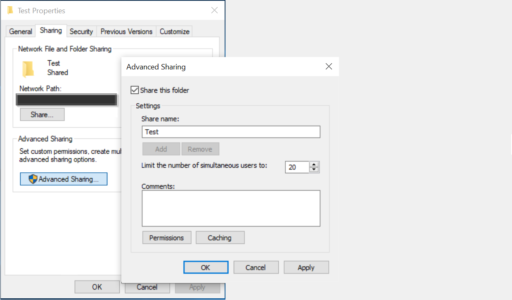

<!---Previous ms.author: rusamai --->

# Conector de compartilhamento Graph arquivo

O conector de compartilhamento de arquivos Graph permite que os usuários em sua organização pesquisem Windows compartilhamentos de arquivos locais.

> [!NOTE]
> Leia o [**artigo Instalação do conector Graph para**](configure-connector.md) entender o processo de instalação geral Graph conectores.

## Antes de começar

### Instalar o Graph conector

Para indexar seus Windows de arquivos, você deve instalar e registrar o Graph conector. Consulte [Instalar o Graph conector de dados](graph-connector-agent.md) para saber mais.  

### Requisitos de conteúdo

### Tipos de arquivo

O conteúdo dos seguintes formatos pode ser indexado e pesquisado: DOC, DOCM, DOCX, DOT, DOTX, EML, GIF, HTML, JPEG, MHT, MHTML, MSG, NWS, OBD, OBT, ODP, ODS, ODT, ONE, PDF, POT, PPS, PPT, PPTM, PPTX, TXT, XLB, XLC, XLSB, XLS, XLSX, XLT, XLXM, XML, XPS e ZIP. Somente o conteúdo textual desses formatos é indexado. Todo o conteúdo multimídia é ignorado. Para qualquer arquivo que não pertença a esse formato, os metadados são indexados.

### Limites de tamanho de arquivo

O tamanho máximo do arquivo com suporte é de 100 MB. Os arquivos que excedem 100 MB não são indexados. O limite máximo de tamanho pós-processado é 4 MB. O processamento é interrompido quando o tamanho de um arquivo atinge 4 MB. Portanto, algumas frases presentes no arquivo podem não funcionar para pesquisa.

## Etapa 1: adicionar um conector Graph no Centro de administração do Microsoft 365

Siga as instruções [gerais de instalação](./configure-connector.md).
<!---If the above phrase does not apply, delete it and insert specific details for your data source that are different from general setup instructions.-->

## Etapa 2: nomear a conexão

Siga as instruções [gerais de instalação](./configure-connector.md).
<!---If the above phrase does not apply, delete it and insert specific details for your data source that are different from general setup instructions.-->

## Etapa 3: Configurar as configurações de conexão

Na página **Conexão para fonte de** dados, selecione **Compartilhamento** de arquivos e forneça o nome, a ID da conexão e a descrição. Na próxima página, forneça o caminho para o compartilhamento de arquivos e selecione o agente de conector Graph instalado anteriormente. Insira as credenciais de uma [conta de usuário do Microsoft Windows](https://microsoft.com/windows) com acesso de leitura a todos os arquivos no compartilhamento de arquivos.

### Preservar a última hora de acesso

Quando o conector tenta rastrear um arquivo, o campo "última hora de acesso" em seus metadados é atualizado. Se você depender desse campo para qualquer solução de arquivamento e backup e não quiser atualizá-lo quando o conector acessá-lo, você poderá configurar essa opção na página Configurações **Avançadas.**

## Etapa 4: Limites para indexação de arquivos

Ao configurar uma conexão de Compartilhamento de Arquivos, o administrador teria a capacidade de limitar arquivos e pastas da indexação. Haveria várias maneiras de fazer isso:

#### Com base nos tipos de arquivo

Somente o conteúdo textual desses formatos é indexado: DOC, DOCM, DOCX, DOT, DOTX, EML, HTML, MHT, MHTML, MSG, NWS, OBD, OBT, ODP, ODS, ODT, ONE, PDF, POT, PPS, PPT, PPTM, PPTX, TXT, XLB, XLC, XLSB, XLS, XLSX, XLT, XLXM, XML, XPS. Para arquivos multimídia e arquivos que não pertencem a esse formato, os únicos metadados são indexados.

#### Com base na última data ou número de dias modificados desde a última modificação

#### Caminho completo da rede de arquivo/pasta ou expressão regular para limitar a indexação 

No caminho da rede, use o caractere de escape ( \\ ) antes de caracteres especiais como \\ . Exemplo: para o caminho \\ \\ CONTOSO \\ FILE \\ SHAREDFOLDER, a maneira correta de entrada é \\ \\ \\ \\ CONTOSO \\ \\ FILE \\ \\ SHAREDFOLDER

As regras para escrever expressão regular podem ser encontradas [aqui](https://docs.microsoft.com/dotnet/standard/base-types/regular-expression-language-quick-reference)

O administrador também estaria tendo a capacidade de dar uma exceção à regra de limite. A prioridade da regra de exceção irá sobressuar as regras de Limite. Da mesma forma, a exceção pode ser definida dando caminho de pasta/arquivo para os itens que desejamos incluir na indexação.

## Etapa 5: Gerenciar permissões de pesquisa

Você pode restringir a permissão para pesquisar qualquer arquivo com base em Listas de Controle do Share Access ou Listas de Controle de Acesso do Sistema de Arquivos de Nova Tecnologia (NTFS), selecionando a opção desejada na página Gerenciar permissões **de** pesquisa. As contas de usuário e os grupos fornecidos nessas Listas de Controle de Acesso devem ser gerenciados pelo Active Directory (AD). Se você estiver usando qualquer outro sistema para gerenciamento de contas de usuário, poderá selecionar a opção "todos", que permite que os usuários pesquisem todos os arquivos sem restrições de acesso. No entanto, quando os usuários tentam abrir o arquivo, os controles de acesso definidos na origem se aplicam.

Observe que as janelas por padrão fornece permissão 'Ler' para 'Todos' em AcLs do Share quando uma pasta é compartilhada na rede. Por extensão, se você estiver escolhendo Compartilhar ACLs em **Gerenciar** permissões de pesquisa, os usuários poderão pesquisar todos os arquivos. Se você quiser restringir o acesso, remova o acesso 'Leitura' para 'Todos' em compartilhamentos de arquivos e forneça acesso somente aos usuários e grupos desejados. Em seguida, o conector lê essas restrições de acesso e as aplica à pesquisa.

Você pode escolher Compartilhar ACLs somente se o caminho de compartilhamento fornecido seguir o formato de caminho UNC. Você pode criar um caminho no formato UNC indo para 'Compartilhamento Avançado' na opção 'Compartilhamento'.

## Etapa 6: Atribuir rótulos de propriedade

Siga as instruções [gerais de instalação](./configure-connector.md).
<!---If the above phrase does not apply, delete it and insert specific details for your data source that are different from general setup instructions.-->

## Etapa 7: Gerenciar esquema

Siga as instruções [gerais de instalação](./configure-connector.md).
<!---If the above phrase does not apply, delete it and insert specific details for your data source that are different from general setup instructions.-->

## Etapa 8: Escolher configurações de atualização

Siga as instruções [gerais de instalação](./configure-connector.md).
<!---If the above phrase does not apply, delete it and insert specific details for your data source that are different from general setup instructions.-->

## Etapa 9: Analisar conexão

Siga as instruções [gerais de instalação](./configure-connector.md).
<!---If the above phrase does not apply, delete it and insert specific details for your data source that are different from general setup 
instructions.-->

<!---## Troubleshooting-->
<!---Insert troubleshooting recommendations for this data source-->

<!---## Limitations-->
<!---Insert limitations for this data source-->
