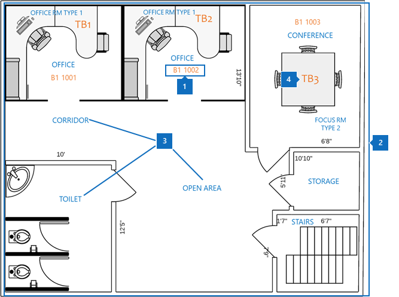
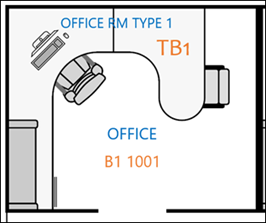
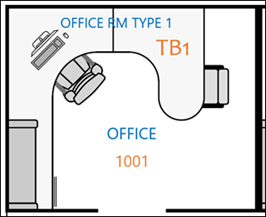
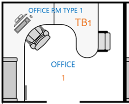

# Práticas recomendadas

Para implementar com êxito os planos do Microsoft Search Floor, você precisa coordenar três partes de dados:

- **Criando dados de local**: qual formato e como adicionar?
- **Mapa de planta baixa no formato DWG**: como exibir e quais dados devem conter para o máximo de sucesso?
- **Local do escritório do funcionário no [Azure Active Directory (Azure AD)](https://azure.microsoft.com/services/active-directory/)**: qual formato usar e como adicionar?  

As práticas recomendadas para a implantação de planos do Microsoft Search Floor também são descritas nas seções a seguir.

## Criação de dados de local
Antes de adicionar planos de piso, você precisa adicionar seus prédios aos locais de pesquisa da Microsoft. Forneça os seguintes dados de criação necessários:

|Dados de construção necessários  |Exemplo  |
|---------|---------|
|Nome     |    Prédio 1, Nova York     |
|Endereço     |     123 qualquer avenida, Nova York, NY 10118  |
|Latitude-Longitude (opcional)   |    40,760539,-73,975341      |
|Palavras-chave     |    Escritório de Nova York, prédio 1, escritório principal, sede     |

Você pode adicionar vários edifícios por vez usando o recurso **importar** na guia **locais** , em vez de adicionar locais um de cada vez. Com o recurso de **importação** , você pode especificar o latitude-longitude. Para obter mais informações, consulte [Manage Locations](manage-locations.md).

## Mapa de planta baixa no formato DWG
Para criar mapas no Microsoft Search, você precisa carregar planos de piso no formato DWG com informações específicas. Para saber como criar e exibir arquivos em formato DWG, confira [visualizadores do DWG](https://www.autodesk.in/products/dwg). 

Os mapas de planta baixa exibem quatro elementos:

1. **Números de sala**: no exemplo a seguir, os números de sala são definidos como **B1 1001** e **B1 1002**. **B1** é o código de construção e 1001 contém o número **1** de piso e o número do escritório **001**.
1. **Layouts de sala.**: para ajudar a esclarecer detalhes quando vários usuários compartilham um Office, você pode definir layouts como cadeiras e escrivaninha.
1. **Tipos de sala**: alguns exemplos incluem Office, Corridor, área aberta e vaso sanitário.
1. **Informações sobre o ativo**: se os usuários estiverem em um espaço aberto, você pode indicar em qual escrivaninha eles estão sentado. Neste exemplo, as mesas são indicadas por **TB1** e **TB2**.

Neste diagrama, os números de sala são o item mais importante. Eles são mapeados para o local do escritório de uma pessoa em sua conta de usuário, conforme mostrado na imagem a seguir.

Essas informações são armazenadas no Azure AD na propriedade **PhysicalDeliveryOfficeName** . No [centro de administração](https://admin.microsoft.com)do Microsoft 365, ele é chamado de Propriedade do **Office** e pode ser adicionado a **usuários ativos**.

### Arquivos DWG
O Microsoft Search requer arquivos de planta baixa no DWG, que é formatar um formato de desenho do AutoCAD. Os arquivos devem conter dados de **layout** e **rótulo** . Os **números de sala** são os rótulos mais importantes para os planos de piso.

Recomendamos que você crie seu sistema de numeração do Office com o método de correspondência exato mostrado na tabela a seguir. Mas você não está limitado a esse rótulo. Por exemplo, se o local do escritório do usuário no Azure AD for **B1 1001**, você poderá rotular o número da sala no arquivo DWG com qualquer uma das opções a seguir.

|Match  |Layout  |
|---------|---------|
|Correspondência exata com o local do Office (recomendado)   **B1 1001**   Código de construção: B1 Piso: 1  Número da sala: 001    |         |
|Correspondência de piso e número de sala   **1001** Piso: 1  Número da sala: 001    |      |
|Apenas o número de sala de correspondência   **1** Número da sala: 1        |         |

## Local do escritório da conta de usuário
Para mapear o local de um funcionário, os números de sala nos arquivos DWG são mapeados para locais do Office na conta do usuário no Azure AD. A propriedade **Location do Office** precisa corresponder às informações de local do Office no arquivo DWG.

A tabela a seguir explica as práticas recomendadas para o mapeamento de dados de local:

|Prática recomendada  |Explicação |
|---------|---------|
|Inclua o código de construção, o andar e o número de sala.     |   Esses dados oferecem a melhor chance de fazer correspondências exatas.     |
|Inclua um separador após códigos e andares de construção.     |  Separe os códigos de construção de piso e números de sala com um separador ou um espaço, como nos seguintes exemplos:  B1 1001  B1/1001   B1-1001   |
|O número de sala sempre acompanha as informações de código, asa e piso de construção.     |  Se o número da sala for **1001**, defina o local do escritório como **B1 1001**, **B1/1001**ou **B1-1001**.   Se o número da sala for **F1-001**, defina o local do Office como **B1 F1-001** ou **B1/F1-001**.   Se o número da sala for **1**, defina o local do Azure ad como **B1 1001**, **B1/1001**ou **B1-F1-001**.       |
|

## Próximas etapas
[Gerenciar locais](manage-locations.md) 
[Gerenciar plantas baixas](manage-floorplans.md)