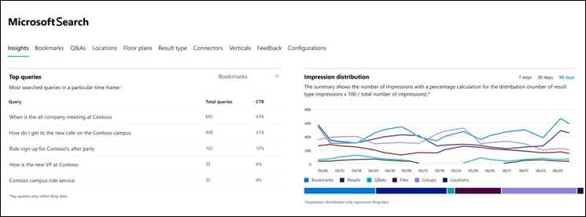
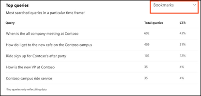
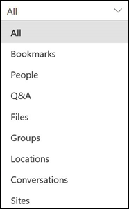
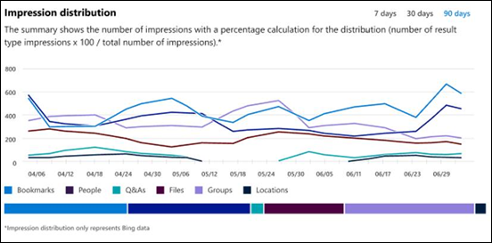

# Relatórios do painel do insights do Microsoft SearchMicrosoft Search Insights dashboard reports

Você pode usar o painel do Microsoft Search insights para gerenciar dados do [Bing](https://Bing.com) para suas respostas publicadas.You can use the Microsoft Search Insights dashboard to manage [Bing](https://Bing.com) data for your published answers. Essa é apenas uma das etapas necessárias para facilitar [a localização de conteúdo](make-content-easy-to-find.md) para seus usuários.This is just one of the steps needed to [make content easy to find](make-content-easy-to-find.md) for your users.

Quando você acessa pela primeira vez o Microsoft Search no [centro de administração](https://admin.microsoft.com)do Microsoft 365, você insere no painel do insights.When you first go to Microsoft Search in the Microsoft 365 [admin center](https://admin.microsoft.com), you enter on the Insights dashboard.

Os seguintes relatórios estão disponíveis no painel do insights.The following reports are available on the Insights dashboard.

> [!NOTE]
> Os dados nos relatórios representam apenas os dados do [Bing](https://Bing.com) .The data in the reports only represents [Bing](https://Bing.com) data.

## Principais consultasTop queries

Este relatório fornece detalhes sobre as principais consultas de pesquisa de 2000 [Bing](https://Bing.com) que os usuários executam.This report gives details about the top 2000 [Bing](https://Bing.com) search queries that users run. Para que uma consulta apareça nas **principais consultas**, a consulta deve ter pelo menos três cliques.For a query to appear in **Top queries**, the query must get at least three clicks.

Uma taxa de clique baixo (CTR) significa que os usuários não estão encontrando o que estão procurando.A low click-through rate (CTR) means that users aren’t finding what they’re looking for.

Você pode escolher modos de exibição diferentes do relatório filtrando o tipo de resposta.You can choose different views of the report by filtering on the type of answer. Por exemplo, se você quiser apenas exibir as principais consultas de indicadores, selecione o menu suspenso no canto superior direito do relatório e, em seguida, selecione **marcadores**.For example, if you just want to view the top queries for Bookmarks, select the drop-down in the upper-right corner of the report, and then select **Bookmarks**. Por padrão, **todos os** tipos de resposta são exibidos.By default, **All** answer types are shown.

## Distribuição de impressãoImpression distribution

Este relatório mostra a distribuição de impressão no [Bing](https://Bing.com) ao longo do tempo para várias respostas.This report shows impression distribution in [Bing](https://Bing.com) over time for various answers. Os exemplos são indicadores, pessoas, Q&A, arquivos, locais, sites de arquivos, grupos e conversas.Examples are bookmarks, people, Q&A, files, locations, file sites, groups, and conversations.

A distribuição de impressão pode ajudar os administradores a entender o que os usuários procuram durante um período específico.Impression distribution can help admins understand what users look for during a specified period.
