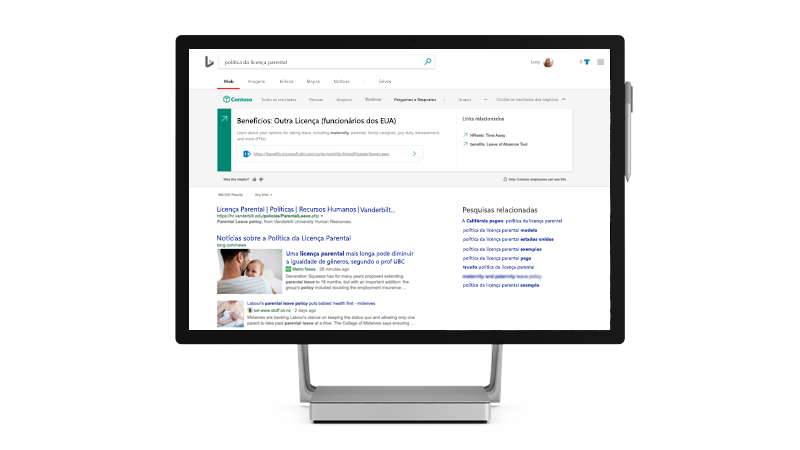

<!-- markdownlint-disable no-inline-html -->
# Pesquisa da Microsoft

<ul class="panelContent cardsW cols cols2">
    <li>
        

            

                

                    

                        

                            
                        

                    

                    

                    

                

            

        

    </li>
    <li>
        

            

                

                    

                        <h2>O que é a Pesquisa da Microsoft?</h2>
                        
Tenha uma experiência de pesquisa corporativa que aumenta a produtividade e poupa tempo, fornecendo os resultados de pesquisa mais relevantes para sua organização

                        
<a href="overview-microsoft-search.md">Descubra como</a>

                    

                

            

        

    </li>
</ul>

<h2>Tópicos em destaque</h2>

<ul class="panelContent cardsW">
    <li>
        

            

                

                    

                        

                            
                        

                    

                    

                        <h3>Tornar o conteúdo pesquisável</h3>
                        
Veja quais recursos estão disponíveis para os administradores e usuários, incluindo o que você vai encontrar ao pesquisar

                        
<a href="make-content-easy-to-find.md">Saiba mais</a>

                    

                

            

        

    </li>
    <li>
        

            

                

                    

                        

                            
                        

                    

                    

                        <h3>Introdução</h3>
                        
Veja uma introdução à Pesquisa da Microsoft e configure-a para sua organização

                        
<a href="setup-microsoft-search.md">Comece agora</a>

                    

                

            

        

    </li>
    <li>
        

            

                

                    

                        

                            
                        

                    

                    

                        <h3>Pesquisa no SharePoint</h3>
                        
Quer saber como o SharePoint e a Pesquisa da Microsoft funcionam juntos?

                        
<a href="get-started-search-in-sharepoint-online.md">Saiba mais</a>

                    

                

            

        

    </li>
</ul>

<ul class="panelContent cardsW cols cols2">
    <li>
        

            

                

                    

                        <h2>Usar a Pesquisa da Microsoft</h2>
                        
Ver vídeos e artigos para treinar seus usuários a serem mais produtivos com a Pesquisa da Microsoft 

                        
<a href="https://go.microsoft.com/fwlink/?linkid=2090946">Confira!</a>

                    

                

            

        

    </li>
    <li>
        

            

                

                    

                        

                            
                        

                    

                    

                    

                

            

        

    </li>
</ul>
