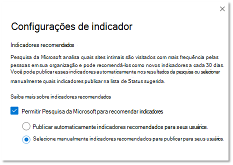

# Gerenciar indicadores

Os indicadores ajudam as pessoas a encontrar rapidamente sites e ferramentas importantes com apenas uma pesquisa. Cada indicador inclui um título, uma URL, um conjunto de palavras-chave amigáveis para disparar o indicador e uma categoria.

## O que faz um bom indicador

Um bom indicador tem quatro elementos principais:

1. Um **título** forte e informativo. O objetivo não tem mais de 8 palavras ou cerca de 60 caracteres no máximo. Você quer que os usuários cliquem no título e visualizem o conteúdo, mas evite o clickbait óbvio:
    - Boa: Experimente os favoritos do Tasty da semana no menu lanchonete. O título é claro, conciso e interessante, mas pode ser muito promissor.
    - Melhor: o menu lanchonete da semana. Não é uma promessa ou som como um anúncio.
    - Evite: você não acreditará o que está chegando ao menu lanchonete desta semana. Usa clickbait clichés que parecem um anúncio.
2. Uma **Descrição** sucinta, cerca de 300 caracteres, que resume a finalidade ou a funcionalidade do recurso vinculado.
3. Uma coleção de **palavras-chave** que ajudarão as pessoas a encontrar o indicador ao pesquisar. Sugerimos um mínimo de pelo menos cinco palavras-chave. Além disso, inclua variações que as pessoas em sua organização podem usar, por exemplo, menu de jantar, menus de almoço e menu de café podem ser variações para o menu lanchonete.
4. Um conjunto útil de **categorias** que facilita a classificação e o filtro de indicadores no centro de administração. Os usuários nunca veem as categorias atribuídas.

## Criar respostas de indicador

No [centro de administração do Microsoft 365](https://admin.microsoft.com/), vá até [indicadores](https://admin.microsoft.com/Adminportal/Home#/MicrosoftSearch/bookmarks) e escolha como você deseja criar novos marcadores:

- Adicionar indicadores
- Importar resultados do SharePoint
- Adicionar indicadores padrão e indicadores sugeridos
- Importar indicadores
- Publicar ou revisar indicadores recomendados

### Adicionar indicadores

Os administradores e editores de pesquisa podem adicionar indicadores no centro de administração do Microsoft 365. Os indicadores podem ser publicados ou salvos no rascunho. A publicação de um indicador atualiza imediatamente o índice de pesquisa para que os usuários possam começar a descobri-lo e usá-lo imediatamente. Você também pode agendar um indicador especificando a data e hora em que ele será publicado.

- **Publicado**: indicadores estão disponíveis para os usuários da organização através da pesquisa da Microsoft.
- **Rascunho**: indicadores salvos como rascunhos não estão disponíveis para seus usuários. Use este status se você ou outros participantes quiserem revisar ou atualizar os indicadores antes de publicá-los.
- **Agendado**: indicadores que serão publicados na data e hora especificadas.

Você pode usar a extensão de navegador criador de conteúdo do Microsoft Search para adicionar facilmente marcadores. Para instalar a extensão do navegador, vá para o site que você deseja adicionar como um indicador e clique em Adicionar na extensão.
Instale a extensão para Edge e Chrome:

- Para o Chromium Edge ou Chrome: Vá para o [Chrome Web Store](https://chrome.google.com/webstore/detail/microsoft-search-content/nocnablpaoeecfmfnjoheefkogmleipm) e adicione a extensão.
- Para a borda herdada: Vá para a [Microsoft Store](https://www.microsoft.com/p/microsoft-search-content-creator/9nrqdbcbwq55?activetab=pivot:overviewtab) e adicione a extensão.

### Importar resultados do SharePoint

Se sua organização configurou resultados promovidos no SharePoint, você pode importar os títulos, URLs e descrições dos resultados promovidos para o locatário para o Microsoft Search e disponibilizar o conteúdo importado para os usuários. Na maioria dos casos, a importação dos resultados do SharePoint leva apenas alguns minutos. Se você estiver importando um grande número de resultados, pode levar até 48 horas. Essa é uma maneira fácil de preencher rapidamente os resultados da pesquisa e torná-lo mais eficaz para seus usuários. Recomendamos o uso de resultados promovidos do SharePoint como referência para entender como nomear e criar resultados de pesquisa relevantes.

### Adicionar indicadores padrão e sugeridos

Incluímos alguns indicadores sugeridos padrão que seus usuários podem achar úteis, incluindo indicadores de RH, benefícios, suporte de ti, gerenciamento de senhas e muito mais. Revise, atualize e publique esses marcadores sugeridos para fornecer resultados de alta qualidade aos usuários imediatamente.

Os usuários também podem sugerir marcadores que gostariam de ver adicionado usando links de comentários no Microsoft Search. Suas recomendações serão exibidas como indicadores sugeridos.

### Importar indicadores

Use o recurso de importação para tornar a adição ou a edição de um grande número de indicadores mais rápido e fácil. Use-o para:

- Adicionar indicadores em massa: Adicione detalhes no arquivo de modelo de indicador e importe-o.
- Editar em massa marcadores: exportar indicadores para um arquivo. csv, editar os detalhes do indicador no arquivo exportado e, em seguida, importar o arquivo editado.

Alguns pontos importantes sobre o arquivo de modelo:

- Nunca edite dados nestes campos: *ID*, *última modificação* e *última modificação por*
- Se você incluir a *ID* de um indicador existente, ele será substituído pelas informações no arquivo de importação.
- Para indicadores existentes com o mesmo título ou URL, o indicador será atualizado com informações no arquivo de importação.
- Nem todos os campos no arquivo de modelo são obrigatórios, e os campos obrigatórios variam dependendo do estado do indicador.
- Com base no campo *estado* , os indicadores serão salvos como rascunho, sugerido, agendado, excluído ou serão publicados automaticamente.
- Para parceiros que gerenciam várias organizações, você pode exportar seus indicadores de uma organização e importá-los para outro. Mas você deve remover os dados na coluna *ID* antes de importar.

### Evite erros de importação

Você receberá um erro se algum dado necessário estiver faltando ou for inválido, e um arquivo de log será gerado com mais informações sobre as linhas e colunas a serem corrigidas. Faça as edições necessárias e tente importar o arquivo novamente. Você não pode importar ou salvar nenhum indicador até que todos os erros sejam resolvidos.

Para evitar erros, certifique-se de que o arquivo de importação esteja formatado corretamente e:

- Que ele inclua a linha de cabeçalho e todas as colunas que estavam no modelo de importação
- Que a ordem das colunas seja igual ao modelo de importação
- Todas as colunas têm valores, exceto os três que podem estar vazios: *ID*, *última modificação* e *última modificação por*
- A coluna de *estado* não está vazia, as informações são necessárias
- Ao importar indicadores publicados, sugeridos, agendados ou de rascunho, as colunas *título*, *URL* e *palavras-chave* são necessárias
- Ao importar indicadores excluídos, a coluna de *URL* é necessária

Para evitar erros de duplicação de indicador para indicador:

- Não use URLS duplicadas para indicadores diferentes. Se uma URL for atribuída a outro indicador e você tentar adicioná-la novamente a partir de um arquivo de importação, receberá um erro. Isso também se aplica a URLs duplicadas para outros tipos de respostas.
- Ao atualizar indicadores existentes, use a coluna *ID do indicador* . Você pode atualizar qualquer outra propriedade de um indicador existente, como palavra-chave ou descrição, mas você deve certificar-se de que a *ID do indicador* está na coluna apropriada do arquivo de importação. Se a *ID do indicador* estiver presente, ela não será tratada como nova adição e não será processada como um erro.

### Publicar ou revisar indicadores recomendados

Para reduzir o esforço manual necessário para adicionar indicadores, o Microsoft Search pode avaliar os links do SharePoint em sua organização e recomendar indicadores, e você pode examiná-los antes de publicá-los ou defini-los para publicação automática. Nenhuma configuração é necessária para indicadores recomendados, elas estão habilitadas e definidas como publicação automática por padrão. Para alterar essas configurações a qualquer momento, selecione **gerenciar indicadores** para abrir o painel configurações de marcador.

Se os indicadores recomendados estiverem habilitados, o mecanismo de recomendação avaliará os sites do SharePoint em sua organização para identificar links de alto tráfego. Após um período de avaliação inicial, os indicadores recomendados serão publicados automaticamente ou adicionados à lista de indicadores sugeridos. O próximo ciclo — um período de avaliação de 30 dias, seguido pela publicação automática ou pela adição de marcadores sugeridos, será iniciado.

Sugerimos que os administradores de pesquisa ou editores analisem esses indicadores automaticamente publicados ou sugeridos regularmente. Além disso, os indicadores recomendados nunca incluirão URLs encontradas em indicadores publicados, sugeridos, agendados ou excluídos existentes.

Para garantir que somente os usuários com acesso vejam um indicador recomendado em seus resultados de trabalho, um recurso de verificação de acesso está incluído para todos os indicadores recomendados. Os usuários que não têm permissões para acessar um site do SharePoint nunca verão o indicador recomendado para esse site. Essa verificação de acesso é controlada pela opção **apenas pessoas com acesso a esse link** na configuração de grupos para cada indicador recomendado.

A verificação de acesso será interrompida se a URL no indicador recomendado ou na configuração de grupos for alterada.

Para impedir que o mecanismo de recomendação publique ou sugerisse um indicador para um site específico, você pode adicionar a URL a uma lista excluída. O mecanismo de recomendação nunca irá publicar ou sugerir um indicador para um site excluído ou uma página em um site excluído.

## Sobre palavras-chave e palavras-chave reservadas

Um indicador pode ter várias palavras-chave e os indicadores podem compartilhar a mesma palavra-chave, mas a palavra-chave reservada não pode ser compartilhada. Uma palavra-chave reservada é um termo ou frase exclusiva que dispara um indicador específico. Uma palavra-chave reservada pode ser associada somente a uma resposta. Use palavras-chave reservadas com moderação.

## Perguntas frequentes

**P: quanto tempo leva para um indicador ser visível na pesquisa da Microsoft após ser publicado?**

**A:**  Um indicador está disponível no Microsoft Search imediatamente após a publicação.

**P: quanto tempo leva para que um indicador recomendado seja exibido?**

**A:**  Os indicadores recomendados só aparecerão na pesquisa da Microsoft se tanto indicadores recomendados quanto publicação automática estiverem habilitados. Durante o período inicial de avaliação, o mecanismo de recomendação avaliará o tráfego do SharePoint para identificar indicadores adequados e, em seguida, publicá-los automaticamente. Após a publicação, elas serão disponibilizadas imediatamente no Microsoft Search.

**P: a pesquisa da Microsoft recomendará indicadores de sites em todos os idiomas?**

**A**: Sim, o Microsoft Search pode recomendar indicadores de qualquer site do SharePoint interno, independentemente do idioma.

**P: posso parar de mostrar os indicadores recomendados nos resultados da pesquisa?**

**A:** Para parar de mostrar os indicadores recomendados, desative a configuração de publicação automática em seu centro de administração. Os indicadores recomendados serão adicionados à lista de indicadores sugeridos.

**P: como identificar um indicador recomendado nos resultados de pesquisa ou no centro de administração?**

**A:** Nos resultados da pesquisa, os indicadores recomendados incluem a frase "sugerida para você" antes da URL. No centro de administração, os indicadores minados terão um valor de proprietário "sistema".

**P: como o acesso a um marcador recomendado é gerenciado?**

**A**: um mecanismo de acesso com engenharia da Microsoft determina se a URL do indicador pode ser acessada por um usuário específico e só exibirá o indicador recomendado para a audiência correta. No entanto, se a URL for editada ou a configuração de grupos for alterada, o mecanismo de acesso com engenharia será desabilitado.

**P: o que acontece se nenhuma ação for tomada em indicadores recomendados adicionados à lista sugerida?**

**A**: para evitar um alto volume de indicadores na lista sugerida, um indicador recomendado (proprietário = sistema) será limpo após 180 dias.

**P: onde posso encontrar a ID do aplicativo para um aplicativo avançado?**

**A**: Vá para o site de aplicativos de energia e exiba o painel de detalhes para o aplicativo. Saiba mais sobre como [obter uma ID de aplicativo](https://docs.microsoft.com/powerapps/maker/canvas-apps/get-sessionid#get-an-app-id).
