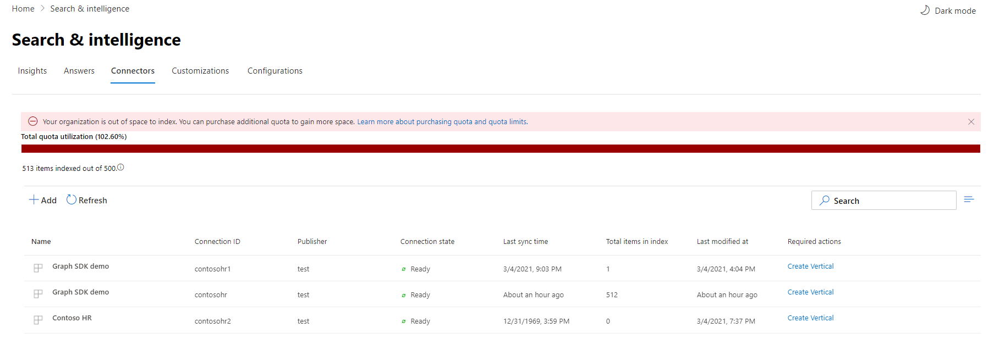

<!-- markdownlint-disable no-inline-html -->

# Monitorar as suas conexõesMonitor your connections

Para acessar e gerenciar seus conectores, você deve ser designado como administrador de pesquisa para seu locatário.To access and manage your connectors, you must be designated as a search administrator for your tenant. Entre em contato com o administrador do locatário para provisioná-lo para a função de administrador de pesquisa.Contact your tenant administrator to provision you for the search administrator role.

## Operações de conexãoConnection Operations

Navegue até [a guia Conectores](https://admin.microsoft.com/Adminportal/Home#/MicrosoftSearch/Connectors) no centro de administração [do Microsoft 365.](https://admin.microsoft.com)Navigate to the [Connectors tab](https://admin.microsoft.com/Adminportal/Home#/MicrosoftSearch/Connectors) in the [Microsoft 365 admin center](https://admin.microsoft.com).

Para cada tipo de conector, o Centro de administração do [Microsoft 365](https://admin.microsoft.com) dá suporte às operações mostradas na tabela a seguir:For each connector type, the [Microsoft 365 admin center](https://admin.microsoft.com) supports the operations shown in the following table:

OperaçãoOperation | Conectores de gráfico da MicrosoftGraph connectors by Microsoft | Conectores de parceiros ou gráficosPartner or Graph connectors
--- | --- | ---
Adicionar uma conexãoAdd a connection | :heavy_check_mark: (Consulte Visão [geral da Instalação](configure-connector.md))(See [Setup overview](configure-connector.md)) | :x: (Consulte seu parceiro ou UX de administrador de conector personalizado)(Refer to your partner or custom-built connector admin UX)
Excluir uma conexãoDelete a connection | :heavy_check_mark: | :heavy_check_mark:
Editar uma conexão publicadaEdit a published connection | :heavy_check_mark: Nome e DescriçãoName and Description   :heavy_check_mark: Configurações de conexãoConnection settings   :heavy_check_mark: Rótulos de propriedadesProperty labels   :heavy_check_mark: EsquemaSchema   :heavy_check_mark: Agenda de atualizaçãoRefresh schedule   | :heavy_check_mark: NomeName   :heavy_check_mark: DescriçãoDescription
Editar uma conexão de rascunhoEdit a draft connection | :heavy_check_mark: | :x:

## Monitorar o status da conexãoMonitor your connection status

Depois de criar uma conexão, o número de itens **processados** aparece na guia Conectores na **página Pesquisa da Microsoft.**After you create a connection, the number of processed items shows on the **Connectors** tab on the **Microsoft Search** page. Depois que o rastreamento completo inicial for concluído com êxito, o progresso de rastreamentos incrementais periódicos será exibido.After the initial full crawl completes successfully, the progress for periodic incremental crawls displays. Esta página fornece informações sobre as operações diárias do conector e uma visão geral dos logs e do histórico de erros.This page provides information about the connector's day-to-day operations and an overview of the logs and error history.

Quatro estados aparecem na coluna **Status** em cada conexão:Four states show up in the **Status** column against each connection:

* **Sincronizando**.**Syncing**. O conector está rastreando os dados da fonte para indexar os itens existentes e fazer qualquer atualização.The connector is crawling the data from the source to index the existing items and make any updates.

* **Habilitado**: a conexão está habilitada e não há rastreamento ativo em execução contra ela.**Enabled**: The connection is enabled, and there's no active crawl running against it. **O último tempo de** sincronização indica quando ocorreu o último rastreamento bem-sucedido.**Last sync time** indicates when the last successful crawl happened. A conexão é tão recente quanto a última hora de sincronização.The connection is as fresh as the last sync time.

* **Pausado**.**Paused**. Os rastreamentos são pausados pelos administradores por meio da opção de pausa.The crawls are paused by the admins through the pause option. O próximo rastreamento é executado somente quando é retomado manualmente.The next crawl runs only when it's manually resumed. No entanto, os dados dessa conexão continuam a ser pesquisáveis.However, the data from this connection continues to be searchable.

* **Falha**.**Failed**. A conexão teve uma falha crítica.The connection had a critical failure. Esse erro requer intervenção manual.This error requires manual intervention. O administrador precisa tomar a ação apropriada com base na mensagem de erro mostrada.The admin needs to take appropriate action based on the error message shown. Os dados indexados até o erro ocorrer são pesquisáveis.Data that was indexed until the error occurred is searchable.

## Monitorar a utilização da cota de índiceMonitor your index quota utilization

A cota de índice disponível e o consumo são exibidos na página inicial dos conectores.The available index quota and consumption is displayed on the connectors landing page.

>[!NOTE]
>Durante o período de visualização, todas as organizações que estavam tentando os conectores do Graph foram fornecidas uma cota fixa gratuita de até 2 milhões de itens em todas as conexões.During the preview period, every organization trying out Graph connectors was provided a free fixed quota of up to 2 million items across all connections. Com os conectores do Graph geralmente disponíveis, a cota gratuita expirará em 1º de abril de 2021 para as organizações que têm usado conectores graph na visualização.With Graph connectors being generally available, the free quota will expire on April 1st, 2021 for those organizations who have been using Graph connectors in preview.
>Os conectores do Graph criado pela Microsoft rotulados como ["Visualização"](connectors-preview.md) não serão incluídos na cota de índice total cobrada para sua organização.Microsoft-built Graph connectors labeled as ["Preview"](connectors-preview.md) will not be included in the total charged index quota for your organization. No entanto, ele contará para o número máximo de 10 conexões que você pode configurar para sua organização e o número máximo de 7 milhões de itens que sua organização pode indexar entre conexões; cada conexão é limitada a 700.000 itens.However, it will count towards the max number of 10 connections you can configure for your organization and the max number of 7 million items your organization can index across connections; each connection is limited 700,000 items. 

A barra de utilização de cota indicará vários estados com base no consumo de cota pela sua organização:The quota utilization bar will indicate various states based on consumption of quota by your organization:

EstadoState | Consumo de cotasQuota consumption
--- | ---
NormalNormal | 1-69%1-69%
AltoHigh | 70-89%70-89%
CríticoCritical | 90%-99%90%-99%
CompletoFull | 100%100%

O número de itens indexados também será exibido com cada conexão.The number of items indexed will also be displayed with each connection. O número de itens indexados por cada conexão contribui para a cota total disponível para sua organização.The number of items indexed by each connection contributes to the total quota available for your organization.

Quando a cota de índice é excedida para sua organização, todas as conexões ativas serão impactadas e essas conexões operarão **no estado limite excedido.**When index quota is exceeded for your organization, all active connections will be impacted, and those connections will operate in **limit exceeded** state. Nesse estado, suas conexões ativasIn this state, your active connections  

* Não será possível adicionar novos itens.Will not be able to add new items.

* Será possível atualizar ou excluir itens existentes.Will be able to update or delete existing items.

Para corrigir isso, você pode fazer qualquer um dos seguintes:To fix this, you can do any of the following:

* Saiba como comprar cota de índice para sua organização em [Requisitos de licenciamento e preços.](licensing.md)Learn how to purchase index quota for your organization at [Licensing requirements and pricing](licensing.md).

* Identifique conexões que tenham muito conteúdo sendo ingerido e atualize-as para indexar menos itens para dar espaço para cota.Identify connections which have too much content being ingested and update them to index fewer items to make room for quota. Para atualizar a conexão, você deve excluir e criar uma nova conexão com um novo filtro de ingestão que traz menos itens.To update the connection, you must delete and create a new connection with a new ingestion filter which brings in fewer items.

* Excluir permanentemente uma ou mais conexõesPermanently delete one or more connections
