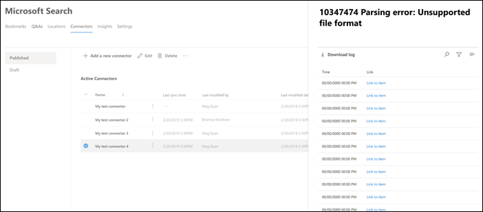

# Gerenciar seu conector para a pesquisa da Microsoft

Para acessar e gerenciar seus conectores, você deve ser designado como um administrador de pesquisa para o seu locatário. Entre em contato com o administrador de locatários para provisionar a função de administrador de pesquisa.

## Introdução

1. Entre no [Centro de administração do Microsoft 365](https://admin.microsoft.com).
2. Vá até **configurações**  >  **Microsoft Search**  >  **conectores**de pesquisa da Microsoft.

Para cada tipo de conector, o [centro de administração do Microsoft 365](https://admin.microsoft.com) suporta as operações mostradas na tabela a seguir:

**Operação** | **Conector integrado da Microsoft** | **Parceiro ou conector criado de forma personalizada**
--- | --- | ---
Adicionar uma conexão | : heavy_check_mark: (consulte [Configurar o conector integrado da Microsoft](configure-connector.md)) | : x: (consulte seu parceiro ou UX de administração de conector criado para personalizar)
Excluir uma conexão | : heavy_check_mark: | : heavy_check_mark:
Editar uma conexão publicada | : heavy_check_mark: nome   : heavy_check_mark: Descrição   : heavy_check_mark: credenciais de autenticação para sua fonte de dados externa   : heavy_check_mark: credenciais de gateway para sua fonte de dados local   : heavy_check_mark: Agenda de atualização   | : heavy_check_mark: nome   : heavy_check_mark: Descrição
Editar uma conexão de rascunho | : heavy_check_mark: | x

## Monitorar o status da conexão
Após criar uma conexão, o número de itens processados é exibido na guia **conectores** da página de **pesquisa da Microsoft** . Depois que o rastreamento completo inicial for concluído com êxito, o progresso dos rastreamentos incrementais periódicos é exibido. Esta página fornece informações sobre as operações diárias do conector e uma visão geral dos logs e histórico de erros.

Quatro Estados aparecem na coluna **status** em cada conexão:
* **Sincronização**. O conector está rastreando os dados da fonte para indexar os itens existentes e fazer qualquer atualização.
* **Habilitado**: a conexão está habilitada e não há nenhum rastreamento ativo em execução nela. **Hora da última sincronização** indica quando ocorreu o último rastreamento bem-sucedido. A conexão é tão recente quanto o horário da última sincronização.
* Em **pausa**. Os rastreamentos são pausados pelos administradores por meio da opção PAUSE. O próximo rastreamento é executado somente quando ele é reiniciado manualmente. No entanto, os dados dessa conexão continuam a ser pesquisados.
* **Falhou**. A conexão teve uma falha crítica. Este erro requer intervenção manual. O administrador precisa tomar a ação apropriada com base na mensagem de erro mostrada. Os dados que foram indexados até que o erro ocorreu é pesquisável.

### Monitorar erros
Para cada **conector ativo** na guia **conectores** , qualquer erro de rastreamento existente aparecerá na guia **erro** . A guia lista os códigos de erro, a contagem de cada um e as opções de download de log de erros. Confira o exemplo na imagem a seguir. Selecione um **código de erro** para exibir os detalhes do erro.

Para exibir os detalhes específicos de um erro, selecione seu código de erro. Uma tela aparece com detalhes do erro e um link. Os erros mais recentes aparecem na parte superior. Confira o exemplo na tabela a seguir.

Veja a seguir a lista de erros diferentes que podem aparecer em qualquer conexão. Se essas soluções não funcionarem, entre em contato com o suporte ou envie-nos (comentários) [Connectors-feedback.md]. 

**Código de erro** | **Mensagem de erro** | **Solução**
--- | --- | ---
1000 | A fonte de dados não está disponível. Verifique a conexão com a Internet ou certifique-se de que a fonte de dados ainda seja acessível pelo conector. | Esse erro ocorre quando a fonte de dados não está acessível devido a um problema de rede ou quando a própria fonte de dados é excluída, movida ou renomeada. Verifique se os detalhes da fonte de dados fornecidos ainda são válidos.
1001 | O não pode atualizar os dados, pois a fonte de dados está limitando o conector. | Para desacelerar a fonte de dados, verifique se seus limites de escala podem ser aumentados ou espere até um tráfego menos pesado do dia.
1002 | Não é possível autenticar com a fonte de dados. Verifique se as credenciais associadas a essa fonte de dados estão corretas. | Clique em **Editar** para atualizar as credenciais de autenticação.
1003 | A conta associada ao conector não tem permissão para acessar o item. |  Verifique se a conta adequada tem acesso ao item que você deseja indexar.
1004 | Não é possível acessar o gateway de dados local. Verifique se o serviço de gateway está em execução e se os detalhes do gateway estão atualizados na configuração de conexão. | Verifique o computador com o gateway, abra o aplicativo de gateway do Power BI e verifique se o gateway está em execução. Verifique se o gateway está usando a mesma conta de administrador do Microsoft Search e, em seguida, certifique-se de que todos os detalhes de gateway estejam atualizados na configuração de conexão. 
1005 | As credenciais associadas a essa fonte de dados expiraram. Renovar as credenciais e atualizar a conexão. | Clique em **Editar** para atualizar as credenciais de autenticação. 
1006 | Sua versão de gateway está desatualizada e não dá mais suporte a esse conector. Será necessário atualizar o gateway. | Visite [instalar um gateway de dados local](https://docs.microsoft.com/data-integration/gateway/service-gateway-install) para baixar e instalar a versão mais recente do gateway do Power bi no computador que contém o gateway.
1007 | Nenhuma licença válida do Power BI detectada. Você precisa de uma licença válida do Power BI para executar este rastreamento. | Você precisa de uma licença válida do Power BI para executar este rastreamento. Verifique se a sua organização tem uma licença válida. Se isso acontecer, tente novamente. Caso contrário, obtenha uma licença e tente novamente.
1008 | A utilização de cota total do seu locatário atingiu seu limite. Tente excluir uma conexão para liberar algumas da sua cota ou ajustar seus filtros de inclusão para obter menos dados. | Tente excluir uma conexão para liberar algumas da sua cota ou ajustar seus filtros de inclusão para obter menos dados. Se isso não resolver o problema, entre em contato com o suporte da Microsoft.
2001 | A indexação é limitada por causa de um grande número de atualizações na fila. Dependendo da fila, pode levar algum tempo para que as atualizações sejam concluídas. | Aguarde até que a fila seja limpa.
2002 | Falha na indexação devido à formatação de item sem suporte. | Consulte a documentação específica do conector para obter mais informações.
2003 | Falha na indexação devido a conteúdo do item não suportado. | Consulte a documentação específica do conector para obter mais informações. 
2004 | O [tamanho do arquivo](https://docs.microsoft.com/microsoftsearch/file-share-connector#content-requirements) é muito grande para ser indexado. Ele deve ter 100 MB ou menos antes do processamento e não mais de 4 MB após o processamento. O arquivo é indexado parcialmente neste caso. Algumas frases presentes no arquivo podem não retornar um resultado de pesquisa. | Consulte [documentação específica do compartilhamento de arquivos](https://docs.microsoft.com/MicrosoftSearch/file-share-connector#content-requirements) para obter mais informações.
5000 | Algo deu errado. Se isso persistir, entre em contato com o suporte. | 

## Limitações de visualização
* Quando você **publica** um conector criado pela Microsoft, pode levar alguns minutos até que a conexão seja criada. Durante esse tempo, a conexão mostrará seu status como pendente. Além disso, não há atualização automática, portanto, você precisa atualizar manualmente.
* O [centro de administração do Microsoft 365](https://admin.microsoft.com) não dá suporte à exibição e edição do **esquema de pesquisa** após a publicação de uma conexão. Para editar o esquema de pesquisa, exclua sua conexão e crie uma nova.
* Quando você gerencia a agenda de **atualização**da sua conexão, o número de itens que sincroniza durante cada sessão é exibido. No entanto, o histórico de sincronização não está disponível.
