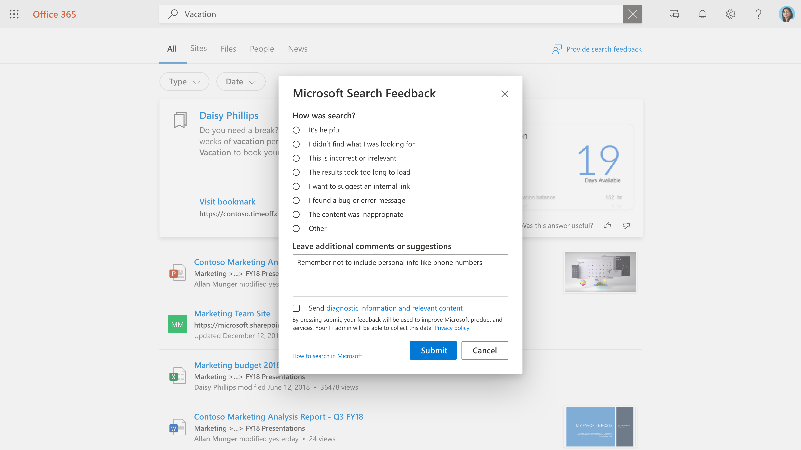

# Gerenciando comentários do usuário

Criar uma ótima experiência de pesquisa para seus usuários é uma parceria entre a Microsoft e o administrador de pesquisa. Comentários de seus usuários nos permite avaliar continuamente o produto e afina-lo para a melhor experiência. Alguns comentários, no entanto, são melhor abordados por você.

Agora, estamos oferecendo ferramentas que permitirão que você revise e gerencie os comentários que seus usuários estão fornecendo sobre a experiência de pesquisa.

## Como os usuários enviam comentários

À medida que as pessoas em sua organização usam Pesquisa da Microsoft, elas podem ter comentários sobre a experiência. Quando clicam em um link de comentários na página de resultados, eles podem categorizar seus comentários e incluir comentários adicionais.

Os usuários também têm a opção de enviar suas consultas e outras informações de diagnóstico, juntamente com a categoria e comentários, para a Microsoft. [Saiba mais](https://privacy.microsoft.com/en-US/privacystatement) sobre privacidade e como protegemos esses dados. Os dados de diagnóstico contêm as informações mais críticas que a Microsoft precisa para usar o item de feedback para melhoria do produto.

A maioria dos envios de comentários aparece na seção [Comentários](https://admin.microsoft.com/Adminportal/Home#/MicrosoftSearch/feedback) do centro Pesquisa da Microsoft administrador. Comentários enviados com a categoria Eu quero sugerir um **link**  interno aparecem como um indicador sugerido na seção Indicadores e podem ser vistos filtrando o status **sugerido.**

## Comentários de revisão

Na página [Comentários,](https://admin.microsoft.com/Adminportal/Home#/MicrosoftSearch/feedback) você pode revisar e exportar comentários que as pessoas em sua organização enviaram durante os últimos 30 dias. Depois que um usuário enviar comentários, ele aparecerá nesta lista dentro de 20 minutos. Você pode usar o botão de atualização para garantir que você está olhando para os dados mais atuais

Usando um filtro, você pode ver comentários para tipos de resposta específicos. Você também pode filtrar por intervalo de origem e data.

Você pode usar a caixa de pesquisa acima da lista de comentários para procurar comentários em uma consulta específica.

Na lista de comentários, a coluna Verbatim indica quais comentários do usuário também incluem um comentário ou sugestão. Para lê-lo, clique na consulta para abrir o **painel Detalhes.**

>[!NOTE]
>Durante a lançamento inicial entre as experiências de pesquisa do administrador e do usuário final, pode levar até duas semanas para que os itens de feedback apareçam no portal de administração.

## Atualizar estado de feedback

À medida que o feedback chegar, ele estará em um *estado Novo* e permanecerá lá até que você altere para *Resolvido* ou *Duplicado.*

Para alterar esse estado:

1. Ao lado da consulta, selecione **Mais Opções** (três pontos verticais).
1. No menu, selecione **Marcar como resolvido** ou Marcar como **duplicado.**
1. A lista atualizará e mostrará o estado atualizado.

Você também pode atualizar o estado para vários itens, basta selecioná-los e, em seguida, selecione Mais Opções ao lado de qualquer um desses itens.

## Exportar comentários

Se você quiser compartilhar comentários de pesquisa com outras pessoas ou retê-los por mais de 30 dias, clique em **Exportar.** Um .csv arquivo chamado Feedbacks com a data, como "Feedbacks_10_31_2020.csv", será baixado automaticamente.

## Enviar comentários do usuário para a Microsoft

Por padrão, todos os comentários do usuário são enviados para a Microsoft e além de você. Para parar de enviar comentários para a Microsoft, clique em Gerenciar configurações e **desempurar** a caixa de seleção Enviar comentários do usuário automaticamente **para a Microsoft.** Pode levar até 24 horas para que essa alteração entre em vigor.

Se você decidiu não enviar comentários para a Microsoft automaticamente, ainda poderá enviar comentários individuais para a Microsoft.

1. Selecione os comentários que você deseja compartilhar.
1. Na barra de ações, selecione Mais (três pontos) e clique em **Enviar comentários para a Microsoft**.

1. O status na coluna Enviado para a Microsoft será altere para Pendente. Quando os comentários são enviados, ele mudará para Sim.

Se você compartilhar comentários automaticamente ou manualmente, ele nunca incluirá consultas e outras informações de diagnóstico para os usuários que optaram por não incluir essas informações.

## Sugestões sobre como usar comentários

Como administrador de pesquisa, você deve entender as principais personas em sua organização e quais tipos de conteúdo essas pessoas normalmente interagem e pesquisam. Com esse entendimento, você pode usar comentários para fazer melhorias direcionadas à experiência de pesquisa de seus usuários.

1. "Não achei o que estava procurando" e comentários semelhantes podem ser usados para identificar o conteúdo que os usuários querem, mas não estão incluídos no índice de pesquisa. Determinar isso geralmente requer investigação e inferência com base no entendimento de seus usuários. Depois de encontrado, decida quais métodos de inclusão desse conteúdo seriam mais apropriados:
    1. Indicadores são úteis para fontes de conteúdo que têm uma página de aterrissagem de alta qualidade e uma variedade limitada de termos de pesquisa, para que a comunidade de usuários tenha um resultado de alta qualidade do indicador e possa encontrar com eficiência o que está procurando.
    1. P&A são úteis para respostas individuais que são bastante frequentes, mas não mudam.
    1. Os conectores são úteis para fontes de conteúdo com uma ampla variedade de conteúdo e uma ampla variedade de termos de pesquisa.
1. "Os resultados demoraram muito para serem carregados" & "eu descobri um problema" pode ser indicadores de um problema mais amplo. Procurar esses comentários diariamente pode ajudar e, se vários casos aparecerem, você pode verificar a experiência de pesquisa por si mesmo e abrir um caso de suporte com a Microsoft, se necessário. Esse tipo de comentários também é importante para a Microsoft e é um excelente motivo para fluir todos os comentários para nós.
1. "Quero sugerir um link interno" pode ser avaliado por ser adicionado como indicadores ou conteúdo conectado. Seu primeiro pensamento deve ser um indicador; se o indicador tiver alto uso, você poderá considerar trazer conteúdo por meio de um conector para habilitar uma experiência de pesquisa ainda mais rica.
