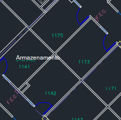
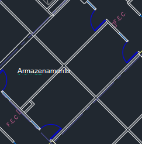
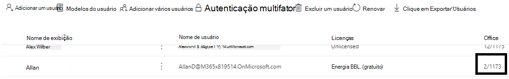
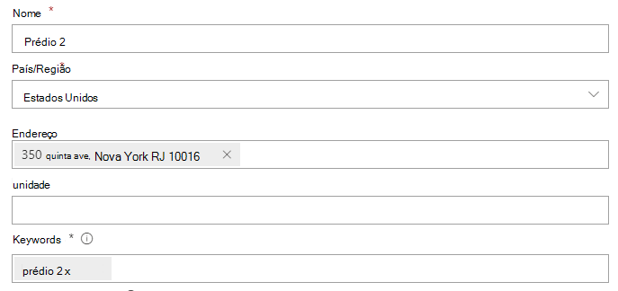
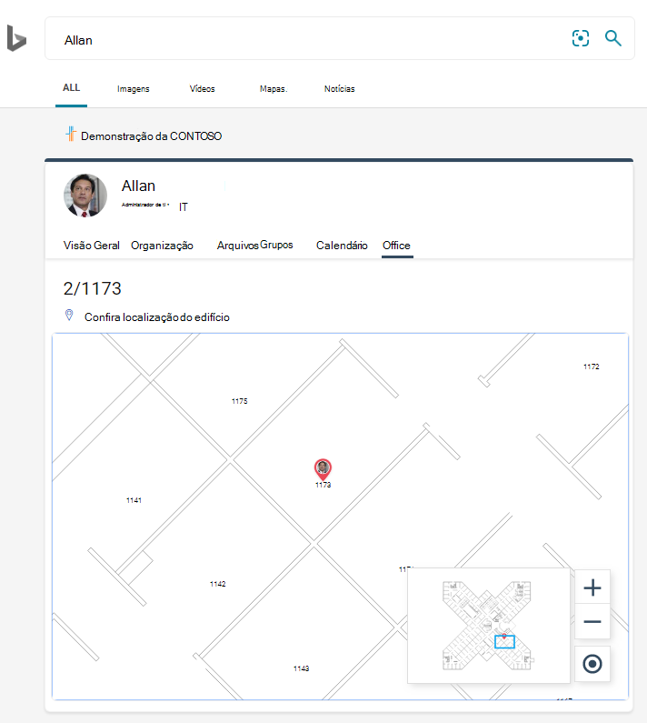
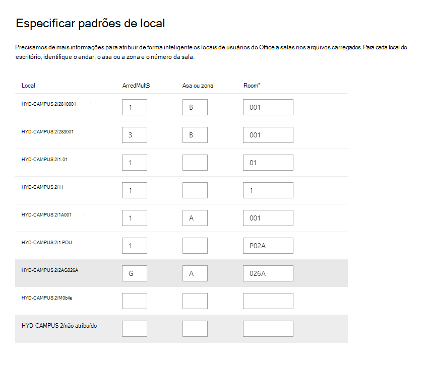
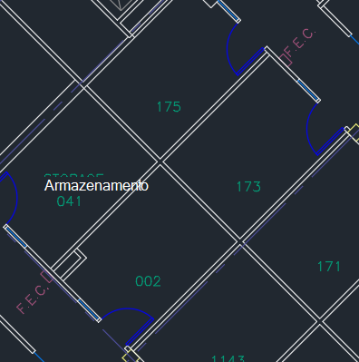

# Gerenciar plantas baixas

Os planos de piso no **Microsoft Search** ajudam os usuários a encontrar pessoas e salas de reunião dentro de um edifício. Os planos de piso respondem às seguintes perguntas:

- Onde está o Office do Allan?
- Edifício 2 andar 3
- Localizar 2/11173

## Adicionar plantas baixas

Siga estas etapas para configurar as respostas de plantas baixas no **Microsoft Search**.

### Etapa 1: determinar seus códigos de construção

Os códigos de construção são usados como parte do local do escritório de um usuário. Você usará esses códigos ao atualizar os perfis de usuário. Digamos que sua organização tenha um edifício neste local: *prédio 2, 350 quinta Avenida, Nova York City, NY 10016*

Aqui estão alguns exemplos bons para o código desse edifício: 2, B2, Building2, prédio 2 ou NYCB2. Cada edifício deve ter um código exclusivo.

### Etapa 2: revisar seus planos de piso

Os arquivos de plantas baixas devem estar no formato DWG; Os arquivos DWG podem conter rótulos de texto. Quando um rótulo de texto marca uma sala, ele é chamado de rótulo de sala. O arquivo DWG deve ter **pelo menos 10 salas** marcadas com rótulos. Estes são alguns exemplos de arquivos DWG com tipos de rótulo diferentes:

|**Rótulos de texto incluindo rótulos de sala**|**Rótulos de texto, mas sem rótulos de sala**|**Nenhum rótulo de texto**|
|:-----:|:-----:|:-----:|
||||

Consulte a seção [perguntas frequentes](#frequently-asked-questions) para obter informações sobre como exibir e atualizar arquivos DWG.

### Etapa 3: atualizar os locais do Office em perfis de usuário

O local do escritório de um usuário é uma combinação de um código de construção e um rótulo de sala. Por exemplo, se o código de construção for *2* e o rótulo de sala for *1173*, o local do escritório será *2/1173*.

Adicione ou atualize os locais do Office para cada usuário em sua organização. Você pode alterar o local do Office no perfil de usuário no [centro de administração](https://admin.microsoft.com) do Microsoft 365 ou pode alterar o seu Active Directory local para sincronizar com o Azure Active Directory. *PhysicalDeliveryOfficeName* é o campo usado para o local do escritório. Se os rótulos de sala não incluírem números de piso, Confira as dicas sobre perguntas frequentes.

Neste exemplo, o Office da Allan está na sala 1173 no piso 1 da construção 2.

> [!NOTE]
> Para ver os locais atualizados do Office durante a pesquisa de plantas baixas, você deve atualizar os locais do Office para **pelo menos 10 pessoas** em cada andar.

### Etapa 4: verificar o local do Office

Use **o Microsoft Search** para localizar um usuário e verificar se o local do escritório está aparecendo corretamente. Se você acabou de atualizar os locais, talvez seja necessário aguardar até **72 horas** para que as atualizações apareçam nos resultados da pesquisa.

### Etapa 5: Adicionar locais de construção

Plantas baixas usa [locais](manage-locations.md) para definir seus prédios. No [centro de administração](https://admin.microsoft.com)do Microsoft 365, vá para **configurações**  >  locais de**pesquisa da Microsoft**  >  **Locations**e selecione **Adicionar**. Insira o nome, o endereço e as palavras-chave para o edifício. Adicione quantos edifícios forem necessários.

Para obter mais detalhes sobre locais, consulte [Manage Locations](manage-locations.md)

### Etapa 6: reunir e organizar locais do Office

Para que você possa usar os planos de piso, os locais do Office devem ser indexados. Esta é uma operação única que pode levar até 48 horas para ser concluída. O tempo total dependerá do tamanho da sua organização.

No [centro de administração](https://admin.microsoft.com), vá para **configurações**  >  **do Microsoft Search**  >  **Floor Plans**e selecione **introdução**. Se você não vir este aviso, esta etapa já foi concluída para sua organização

### Etapa 7: carregar planos de piso

1. No [centro de administração](https://admin.microsoft.com), vá para **configurações**  >  planos de piso de**pesquisa da Microsoft**  >  **Floor plans**e selecione **Adicionar**.
2. Selecione um edifício na lista suspensa e selecione **Avançar**. Se o edifício não estiver listado, volte e [adicione locais de construção](#step-5-add-building-locations).
3. Selecione **carregar arquivos**e, em seguida, escolha a planta baixa que você está carregando.
4. Quando o upload estiver concluído, você deve inserir o número de chão que é representado no arquivo de planta baixa. Em seguida, selecione **Avançar**.
5. Opcion Se seu piso tiver asas ou zonas, insira esses detalhes.
6. Você verá uma tela de revisão, listando quantos locais de escritório foram mapeados para os planos de piso. Selecione **detalhes** para garantir que o mapeamento esteja correto.
    - Se nenhum usuário estiver mapeado ou se você não estiver satisfeito com o mapeamento, selecione **continuar mapeamento**. Para publicar, selecione **ignorar e publicar**.
7. Insira o código de construção para esta planta baixa. O código de construção pode ser encontrado na propriedade local do Office dos usuários. Por exemplo, se o local do escritório de um usuário for **2/1173**, o código de construção será **2**.
8. Na tela revisar, repita a etapa 6 para garantir que o mapeamento esteja correto.
9. Opcion Revise e identifique os padrões de local para todos os planos de piso carregados e selecione **Avançar**.
10. Na tela revisar, repita a etapa 6 para garantir que o mapeamento esteja correto.
11. Quando estiver pronto, selecione **publicar** para tornar o plano de planta disponível na **pesquisa da Microsoft**.

> [!NOTE]
> **Leva 48 horas para que os planos de piso sejam publicados.** Depois que seus usuários verão os resultados da planta baixa, semelhante ao que é mostrado abaixo, quando pesquisarem o escritório de um colega de trabalho.

### Etapa 8: (opcional) especificar padrões de local

Após carregar uma planta baixa, os rótulos de texto serão comparados aos locais do Office nos perfis dos seus usuários. Se houver menos de 10 correspondências, a tela **especificar padrões de localização** será exibida. Os padrões de local são usados para extrair informações de piso, de asa e de sala dos locais do Office.

Somente a sala é necessária, piso e asa são opcionais, e você pode ignorar locais conforme necessário.

## Editar plantas baixas

Para atualizar um plano de planta baixa existente, selecione o plano de piso que você deseja alterar e, em seguida, selecione **Editar**. Faça suas alterações e salve-as.

## Solução de problemas

|**Etapa**|**Mensagem de erro**|**Tipo**|**Action**|
|:-----|:-----|:-----|:-----|
|Carregar planos de piso|Não é possível ler CC_1. dwg. Carregue novamente ou exclua a planta baixa.|Erro|Tente carregar o arquivo novamente. Se isso não funcionar, exclua o arquivo e tente novamente.|
|Carregar planos de piso|Há dois arquivos chamados CC_1. dwg. Exclua um deles ou recarregue com outro nome.|Erro|Se o nome do arquivo estiver incorreto, torne o nome do arquivo exclusivo adicionando informações de chão ou asa e, em seguida, carregue o arquivo novamente. Se você tiver adicionado acidentalmente o mesmo arquivo duas vezes, exclua-o.|
|Carregar planos de piso|Nenhum dado encontrado.|Erro|Verifique o arquivo para se certificar de que ele está correto e, em seguida, carregue-o novamente ou exclua-o.|
|Carregar planos de piso|As referências externas estão ausentes neste arquivo. Carregue o CC_1_furniture. DWG ou exclua este arquivo.|Aviso|Carregar arquivos de referência externa ou excluir.|
|Carregar planos de piso|Não foi possível ler números ou marcas de sala no arquivo DWG. Exclua esse arquivo.|Aviso|Verifique o arquivo DWG para certificar-se de que os dados estão incluídos e exclua o arquivo e tente novamente.|
|Vincular locais do Office|Nenhum local do Office encontrado no Azure Active Directory. Adicione dados de local ao Azure Active Directory antes de configurar planos de piso.|Erro|[Atualizar locais do Office em perfis de usuário](#step-3-update-office-locations-on-user-profiles) |

## Perguntas frequentes

**P:** Como exibir e editar arquivos DWG?

**A:** Use qualquer uma destas opções para exibir arquivos DWG:

- Carregue o arquivo no SharePoint e abra-o.
- Abra o arquivo no [Microsoft Visio](https://support.office.com/article/Open-insert-convert-and-save-DWG-and-DXF-AutoCAD-drawings-60cab691-0f4c-4fc9-b775-583273c8dac5) ou [Autodesk DWG TrueView](https://www.autodesk.com/products/dwg).
- Carregue o arquivo no [Visualizador online do Autodesk](https://viewer.autodesk.com/).

**P:** Como adiciono rótulos de texto a salas desmarcadas?

**A:** Abra o arquivo DWG em um editor e [adicione rótulos de sala](https://knowledge.autodesk.com/support/autocad-map-3d/learn-explore/caas/CloudHelp/cloudhelp/2019/ENU/MAP3D-Learn/files/GUID-4854F184-6279-4E0C-9487-34A4759017F6-htm.html).

**P:** Como criar ou editar arquivos DWG para fins de teste?

**A:** Criar um arquivo DWG no Microsoft Visio, Autodesk AutoCAD ou qualquer outro editor DWG. Certifique-se de que 10 ou mais salas estejam rotuladas no arquivo.

**P:** * * qual é o melhor formato para rótulos de texto nos arquivos DWG?

**A:** Para obter os melhores resultados, os rótulos de texto devem conter números de piso e de sala. Os exemplos abaixo usam 2 ou SC para o código de construção.
<!-- markdownlint-disable no-inline-html -->
|Tipos de rótulo de sala|ArredMultB|Room|Rótulo de texto de exemplo|Local do Office (código de construção/rótulo de texto)|
|:-----|:-----|:-----|:-----|:-----|
|Tem piso e número de sala|1 |173|1173|2/1173|
|| 21 |45|21045|2/21045|
||23|100|23 mil|2/23-100.000|
||1 |G06-07|1G06-07|2/1G06-07|
||2 |1.024|02.1024 a|2/02.1024 a|
||2 |1.024|02.1024 a|2/02.1024 a|
||2 |105, 1|2105, 1|2/2105.01|
|Tem código de compilação, base e número de sala|,0|X-11-M-12|2-0-X-11-M-12|2/2 -0-X-11-M-12 2-0-X-11-M-12|
||2 |128A|22128A|2/22128A 22128A|
||1 |B2-11|21-B2-11|2/21-B2-11 21-B2-11|
||2 |45|SC2045|SC/SC2045 SC2045|

**P:** Posso usar um arquivo DWG que não inclui os números de piso?

**A:** Sim, você pode. Quando você atualiza os locais do Office no perfil do Azure Active Directory do usuário, inclua o número do andar como parte do número da sala, mesmo que ele esteja ausente no arquivo DWG. Depois que você carregar o arquivo, a tela especificar padrões de local aparecerá e você poderá indicar ambos os valores.

Por exemplo, um arquivo DWG que inclui números de sala, mas sem números de piso, pode ser semelhante a este:

O local do escritório no perfil do usuário deve ser 2/1175 em que ' 2 ' é o código de construção, ' 1 ' é o número do andar e ' 175 ' é o número da sala.
