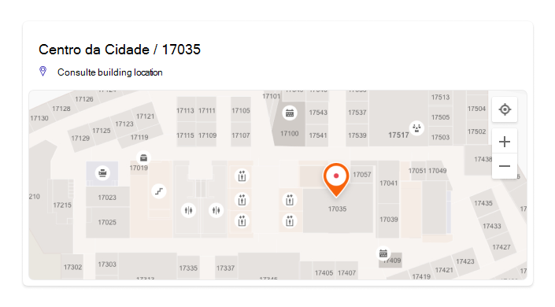

# Gerenciar planos de piso

Os planos de Pesquisa da Microsoft ajudam os usuários a encontrar pessoas, salas e espaços em um edifício. Padrões de consulta que incluem o nome completo de uma pessoa, nome, nome da sala ou local da sala, como esses exemplos, retornarão um plano de piso:

- Onde é o escritório de Allan Deyoung?
- Onde é o escritório de Margarida?
- Construção do 2º andar 3
- Workspace-1
- B1/1.20

## O que os usuários experimentam

Os usuários podem ver respostas do plano de [base em Bing,](https://bing.com) [SharePoint](http://sharepoint.com/)e [Office 365](https://office.com). Outros pontos de entrada que retornam Bing resultados, incluindo Windows Pesquisa e Microsoft Edge de endereços, também são suportados. Quando os usuários pesquisam um nome de sala ou local, eles verão o ponto de interesse marcado na resposta do plano de piso.

> [!div class="mx-imgBorder"]
> 

Quando elas pesquisam o escritório de uma pessoa, elas verão uma resposta semelhante, com a imagem de perfil da pessoa no marcador.

> [!div class="mx-imgBorder"]
> 

## Adicionar planos de piso

Siga estas etapas para configurar respostas de planos de piso em Pesquisa da Microsoft.

### Etapa 1: Determinar seus códigos de construção

Os códigos de construção são usados como parte do local do escritório de um usuário. Você usará esses códigos ao atualizar perfis de usuário. Digamos que sua organização tenha um edifício neste endereço: *Edifício 2,350 5th Avenue, Cidade de Nova York, NY 10016*

Aqui estão alguns bons exemplos para o código do edifício: 2, B2, Building2, Building 2 ou NYCB2. Cada edifício deve ter um código exclusivo.

### Etapa 2: revisar seus planos de piso

Os arquivos de planos de piso devem estar no formato DWG, que dá suporte a rótulos de texto. Quando um rótulo de texto marca uma sala, ele é chamado de rótulo de sala. Aqui estão alguns exemplos de arquivos DWG com diferentes tipos de rótulos:

| Rótulos de texto, incluindo rótulos de sala | Rótulos de texto, mas nenhum rótulo de sala | Sem rótulos de texto |
|:-----:|:-----:|:-----:|
||||

Como prática prática, os rótulos de texto DWG devem conter números de piso, números de asa (se relevante) e números de sala, nessa ordem. Consulte as [Perguntas Frequentes](#frequently-asked-questions) para obter mais exemplos de formatos de rótulo de texto e informações sobre como exibir e atualizar arquivos DWG.

### Etapa 3: Atualizar locais do office em perfis de usuário

O local do escritório de um usuário é uma combinação de um código de construção e um rótulo de sala. Por exemplo, se o código de construção for *2* e o rótulo da sala for *1173*, o local do escritório será *2/1173*.

Adicionar ou atualizar locais do office para usuários com um local de trabalho atribuído. Você pode fazer isso a  partir do perfil de usuário deles nos centros de administração Microsoft 365 ou [Azure Active Directory](https://portal.azure.com/) ou no Active Directory local (será sincronizado com Azure Active Directory). *PhysicalDeliveryOfficeName* é o campo usado para o local do office. Se os rótulos de sala não incluirem números de piso, consulte as [perguntas frequentes](#frequently-asked-questions) sobre dicas.

Neste exemplo, o escritório de Henrique está na sala 1173 no piso 1 do edifício 2.

> [!div class="mx-imgBorder"]
> 

Para configurar planos de piso para salas de reunião, adicione locais de escritório para eles na seção Salas & [equipamento](https://admin.microsoft.com/Adminportal/Home#/ResourceMailbox) do Centro de administração do Microsoft 365. Para obter mais informações, consulte [Configurar caixas de correio de sala e equipamento.](/microsoft-365/admin/manage/room-and-equipment-mailboxes#set-up-room-and-equipment-mailboxes) Se as pessoas em sua organização puderem agendar [a](/Exchange/recipients/room-mailboxes#change-how-a-room-mailbox-handles-meeting-requests)sala ou o recurso para uma reunião ou evento, consulte Alterar como uma caixa de correio de sala lida com solicitações de reunião . Para obter informações sobre como configurar espaços de trabalho, incluindo a configuração de caixas de correio de sala, consulte a postagem sobre [Book a workspace in Outlook](https://techcommunity.microsoft.com/t5/exchange-team-blog/book-a-workspace-in-outlook/ba-p/1524560).

### Etapa 4: Verificar o local do office

Use Pesquisa da Microsoft para localizar um usuário e verificar se o local do escritório está aparecendo corretamente. Talvez seja necessário aguardar até **72** horas para que as atualizações apareçam nos resultados da pesquisa.

> [!div class="mx-imgBorder"]
> 

### Etapa 5: Adicionar locais de construção

Os planos de piso [usam Locais](manage-locations.md) para definir seus edifícios. Na [Centro de administração do Microsoft 365,](https://admin.microsoft.com)vá para [**Locais**](https://admin.microsoft.com/Adminportal/Home#/MicrosoftSearch/locations)e selecione **Adicionar**. Insira o nome, o endereço e as palavras-chave do edifício. Adicione quantos edifícios você precisar.

> [!div class="mx-imgBorder"]
> 

Para obter mais informações sobre locais, consulte [Manage Locations](manage-locations.md)

### Etapa 6: Reunir e organizar locais do office

Antes de carregar planos de piso, os locais do office devem ser indexados. Essa operação única que pode levar até 48 horas para ser concluída. O tempo total dependerá do tamanho da sua organização.

No [centro de administração,](https://admin.microsoft.com)vá para [**Planos de piso**](https://admin.microsoft.com/Adminportal/Home#/MicrosoftSearch/floorplans)e selecione **Iniciar indexação**. Se você não vir esse aviso, essa etapa já foi concluída para sua organização

### Etapa 7: Upload de piso

1. No centro [de administração,](https://admin.microsoft.com)vá para [**Planos de piso.**](https://admin.microsoft.com/Adminportal/Home#/MicrosoftSearch/floorplans)

2. Selecione um edifício na listada e selecione **Próximo**. Se o edifício não estiver listado, volte e adicione [locais de construção.](#step-5-add-building-locations)

3. Selecione **Upload arquivos** e escolha o plano de piso que deseja carregar.

4. Quando o carregamento for concluído, você deverá inserir o número de piso representado no arquivo de plano de piso. Em seguida, selecione **Avançar**.

5. (Opcional) Se o piso tiver asas ou zonas, insira esse detalhe.

6. Você verá uma tela de revisão listando quantos locais de escritório foram mapeados para os planos de piso. Selecione **Detalhes** para garantir que o mapeamento está correto.
    - Se nenhum usuário for mapeado ou você não estiver satisfeito com o mapeamento, selecione **Continuar mapeamento**.
    - Para publicar, selecione **Ignorar e publicar**.

1. Insira o código de construção para este plano de piso. O código de construção pode ser encontrado na propriedade de local do escritório dos usuários. Por exemplo, se o local do escritório de um usuário for **2/1173**, o código de construção **será 2**.

1. Na tela de revisão, repita a etapa 6 para garantir que o mapeamento está correto. Se você estiver satisfeito com o mapeamento, selecione **Continuar** mapeamento e **Ignorar e publicar**. Caso não seja, selecione **Continuar o mapeamento** e vá para a tela Especificar padrões de local.

1. (Opcional) Revise e identifique a lógica de nomen por todos os padrões de localização exclusivos para esse edifício no diretório do Azure e selecione **Próximo**.

1. Na tela de revisão, repita a etapa 6 para garantir que o mapeamento está correto.

1. Quando estiver pronto, selecione **Publicar para** disponibilizar o plano de piso no Pesquisa da Microsoft.

> [!NOTE]
> **Leva 48 horas para que os planos de piso sejam publicados.** Depois disso, os usuários verão resultados de um plano de piso semelhante ao abaixo quando procurarem o escritório de um colega de trabalho.

> [!div class="mx-imgBorder"]
> 

### Etapa 8: (Opcional) Especificar padrões de local

Depois de carregar um plano de piso, os rótulos de texto da sala são comparados aos locais do office nos perfis dos usuários. Se os locais do office ou os rótulos de texto não seguirem consistentemente  os padrões de nomenpulso recomendados na Etapa [2](#step-2-review-your-floor-plans) e etapa [3,](#step-3-update-office-locations-on-user-profiles)use a tela Especificar padrões de local para adicionar mais informações para concluir o mapeamento. Padrões de local são usados para extrair informações de piso, asa e sala de locais de escritório do AAD.

> [!div class="mx-imgBorder"]
> 

Piso e asa são opcionais, somente a sala é necessária e você pode ignorar locais conforme necessário.

## Atualizar planos de piso

Antes de atualizar um plano de piso existente, certifique-se de que seus locais de escritório do AAD sejam atuais e que você tenha esperado 48 horas para que qualquer atualização do AAD seja processda. Para atualizar um plano de piso, vá para Planos de piso, selecione o edifício para o plano de piso e selecione **Editar**. Se o plano de piso tiver sido alterado estruturalmente, por causa da remodelagem, por exemplo, remova o arquivo antigo e carregue e publique o novo arquivo DWG.

> [!NOTE]
> Você não precisa atualizar planos de piso quando os usuários se movem para um piso que já foi mapeado. Basta atualizar seu perfil de usuário para refletir o novo local do office:
>
> - No Centro de administração do Microsoft 365 (Usuários ativos > Conta > Gerenciar informações de contato)
> - No Centro de administração do Azure Active Director (Usuários > Perfil > Editar informações de contato)
> - No Active Directory local (será sincronizado com Azure Active Directory)

## Excluir planos de piso

Para excluir um plano de piso único, vá para [Planos de piso](https://admin.microsoft.com/Adminportal/Home#/MicrosoftSearch/floorplans) e selecione o edifício. Em seguida, selecione o plano de piso e selecione **Remover**. Para excluir todos os planos de piso de um edifício, vá para [Locais,](https://admin.microsoft.com/Adminportal/Home#/MicrosoftSearch/locations)selecione o edifício e selecione **Excluir**.  

## Solução de problemas

| Etapa | Mensagem de erro | Digitar | Ação |
|:-----|:-----|:-----|:-----|
|Upload de piso|Não é possível ler CC_1.dwg. Carregue ou exclua o plano de piso.|Error|Tente carregar o arquivo novamente. Se isso não funcionar, exclua o arquivo e tente novamente.|
|Upload de piso|Há dois arquivos chamados CC_1.dwg. Exclua um deles ou carregue-o com outro nome.|Error|Se o nome do arquivo estiver incorreto, adicione o número de piso ou asa para criar um nome de arquivo exclusivo e carregue-o novamente. Se você adicionou acidentalmente o mesmo arquivo duas vezes, exclua um deles.|
|Upload de piso|Nenhum dado encontrado.|Error|Verifique seu arquivo para certificar-se de que ele é o correto e, em seguida, carregue-o novamente ou exclua-o.|
|Upload de piso|Referências externas estão ausentes neste arquivo. Carregue CC_1_furniture.dwg ou exclua esse arquivo.|Aviso|Upload ou excluir arquivos de referência externos.|
|Upload de piso|Não foi possível ler números de sala ou marcas no arquivo DWG. Exclua esse arquivo.|Aviso|Verifique seu arquivo DWG para verificar se os dados estão incluídos e, em seguida, exclua o arquivo e tente novamente.|
|Vincular locais do office|Nenhum local de escritório encontrado no Azure Active Directory. Adicione dados de localização Azure Active Directory antes de configurar planos de piso.|Error|[Atualizar locais do office em perfis de usuário](#step-3-update-office-locations-on-user-profiles) |

## Perguntas frequentes

**P:** Como posso exibir e editar arquivos DWG?

**R:** Use qualquer uma dessas opções para exibir arquivos DWG:

- Upload o arquivo para SharePoint e abri-lo.
- Abra o arquivo no [Microsoft Visio](https://support.office.com/article/Open-insert-convert-and-save-DWG-and-DXF-AutoCAD-drawings-60cab691-0f4c-4fc9-b775-583273c8dac5) [autodesk DWG TrueView](https://www.autodesk.com/products/dwg).
- Upload o arquivo para [o Visualizador Online do Autodesk.](https://viewer.autodesk.com/)

Você pode criar ou editar um arquivo DWG em qualquer editor DWG, incluindo Visio autodesk autoCAD. Para usar Visio, consulte [Create a floor plan](https://support.microsoft.com/office/create-a-floor-plan-ec17da08-64aa-4ead-9b9b-35e821645791). O tamanho máximo de arquivo para um único arquivo DWG é de 16 MB.

**P:** Como adicionar rótulos de texto a salas não marcadas?

**R:** Abra o arquivo DWG em um editor e [adicione rótulos de sala.](https://knowledge.autodesk.com/support/autocad-map-3d/learn-explore/caas/CloudHelp/cloudhelp/2019/ENU/MAP3D-Learn/files/GUID-4854F184-6279-4E0C-9487-34A4759017F6-htm.html)

**P:** Qual é o melhor formato para rótulos de texto em arquivos DWG?

**R:** Para obter os melhores resultados, os rótulos de texto DWG devem ser uma única linha que contenha números de piso, números de asa (se relevantes) e números de sala, nessa ordem. Os exemplos abaixo usam 2 ou CITY CENTER para o código de construção.
<!-- markdownlint-disable no-inline-html -->
|Tipos de rótulo de sala|ArredMultB|Wing/Zone|Room|Rótulo de texto de exemplo|Office local (criação de código/rótulo de texto)|
|:-----|:-----|:-----|:-----|:-----|:-----|
|Tem o número do piso e da sala|1| |173|1173|2/1173|
|| 21 | |45|21045|2/21045|
||23| |100K|23-100K|23/02-100K|
||1| |G06-07|1G06-07|CENTRO DA CIDADE/1G06-07|
||2| |1024A|02.1024A|CENTRO DA CIDADE/02.1024A|
|Tem número de piso, asa e sala|1|A|173|1A173|2/1A173
||2|Z1|128b|2Z1128b|2/2Z1128b

Além disso, no arquivo DWG não incluem nenhum rótulo de texto extra, como dimensões de sala ou nome do arquiteto.

**P:** Há limites de caracteres para rótulos de texto?

**R:** Os rótulos de texto devem ser uma única linha. Caracteres especiais podem ser usados para criar códigos ou rótulos de sala, mas não valores de piso ou asa.

**P:** Posso usar um arquivo DWG que não inclui números de piso?

**R:** Recomendamos que os rótulos de texto DWG incluam números de piso, mas não são necessários, consulte padrões de nomenutros [na Etapa 2](#step-2-review-your-floor-plans). Além disso, você ainda deve incluir o número do piso como parte do local do escritório nas informações de contato do usuário. Depois de carregar o arquivo DWG, você  precisará usar a tela opcional Especificar padrões de local para concluir o processo de mapeamento desses rótulos não padrão.

Por exemplo, um arquivo DWG que inclui números de sala, mas nenhum número de piso, pode ser semelhante a este:

> [!div class="mx-imgBorder"]
> 

O local do escritório no perfil do usuário seria 2/1175 onde '2' é o código de construção, '1' é o número do piso e '175' é o número da sala.

**P:** Adicionei um local de construção, por que não vê a opção de adicionar um plano de piso?

**R:** Os locais de construção recentemente adicionados ou atualizados podem ainda não estar no índice de pesquisa. Pode levar várias horas para que locais novos ou alterados apareçam nos resultados da pesquisa. Além disso, se o edifício tiver um rascunho ou um plano de piso publicado, selecione o nome do edifício e adicione mais planos.

**P:** Por que a lista Selecionar uma construção não mostra minha lista completa de locais?

**R:** Somente os edifícios sem planos de piso aparecem na lista Selecionar um edifício. Para edifícios com pelo menos um rascunho ou planos de piso publicados, adicione mais planos de piso selecionando o edifício na lista e carregando.

**P:** Há limites para o número de planos de piso que posso carregar?

**R:** Não. Não há máximo, por construção ou por organização.

**P:** Posso usar um arquivo DWG que contém planos para várias asas/zonas em um único andar?

**R:** Desde que todos os planos sejam para o mesmo andar, você pode carregar um arquivo DWG que contém planos de piso para várias asas/zonas. Certifique-se de que os rótulos de texto e os locais de escritório seguem as práticas recomendadas de nomenlamento [na Etapa 2](#step-2-review-your-floor-plans) e [etapa 3](#step-3-update-office-locations-on-user-profiles).

Se o arquivo DWG contiver dados para várias asas, deixe o campo de asa em branco ao carregar.

**P:** Posso carregar dois arquivos DWG para o mesmo andar, um com apenas o piso definido e o outro com piso e asa definidos?

**R:** Você pode carregar mais de um arquivo DWG para o mesmo andar, mas precisará indicar uma asa ou zona para cada arquivo. No exemplo abaixo, você precisaria inserir um valor wing ou zone para o arquivo FloorPlan1.dwg antes de poder ir para a próxima tela. Se o arquivo de plano de piso não tiver uma asa ou tiver várias asas, insira um valor como 0 ou X no campo Wing ou zone para continuar.

> [!div class="mx-imgBorder"]
> 

**P:** Posso carregar e atualizar vários planos de piso ao mesmo tempo?

**R:** Você pode carregar vários planos de piso para um único edifício ao mesmo tempo. Operações em massa, como importar planos de piso para vários edifícios, não estão disponíveis.

**P:** Minha organização tem centenas de usuários. Preciso especificar padrões de locais para cada um deles?

**R:** Não. Se você seguiu as recomendações de formatação para rótulos e locais de escritório na Etapa [2](#step-2-review-your-floor-plans) e Etapa [3](#step-3-update-office-locations-on-user-profiles)e concluiu os itens 1-8 na Etapa [7](#step-7-upload-floor-plans), não será necessário especificar padrões de locais.

Mas, se os usuários ainda não estão mapeados ou você não está satisfeito com o mapeamento, conclua a [Etapa 8](#step-8-optional-specify-location-patterns)opcional. Na Etapa 8, você precisa definir cada padrão de *local* exclusivo encontrado no Azure AD para esse código de construção. Por exemplo, você está carregando um plano de piso para a construção de A, que tem 1.000 escritórios. Cinco padrões de localização diferentes são usados para os escritórios no Edifício A. Ao especificar padrões de local, você precisará definir os cinco padrões que aparecem no Azure AD para o edifício.

**P:** Posso criar respostas de plano de piso para salas de conferência, salas de reunião ou espaços que não tenham uma pessoa atribuída a elas?

**R:** Sim, você pode. Basta adicionar a sala de reunião à sua lista de salas e equipamentos. Para obter mais informações, consulte [Configurar caixas de correio de sala e equipamento.](/microsoft-365/admin/manage/room-and-equipment-mailboxes#set-up-room-and-equipment-mailboxes) Se as pessoas em sua organização puderem agendar [a](/Exchange/recipients/room-mailboxes#change-how-a-room-mailbox-handles-meeting-requests)sala ou o recurso para uma reunião ou evento, consulte Alterar como uma caixa de correio de sala lida com solicitações de reunião . Para configurar espaços de trabalho, incluindo a configuração de caixas de correio de sala, consulte a postagem sobre [Reservar um espaço de trabalho em Outlook](https://techcommunity.microsoft.com/t5/exchange-team-blog/book-a-workspace-in-outlook/ba-p/1524560). Para planos de piso, siga as recomendações para os rótulos de sala DWG na [Etapa 2](#step-2-review-your-floor-plans) e local do perfil [na Etapa 3](#step-3-update-office-locations-on-user-profiles). Depois de adicionar uma sala ou espaço de trabalho, você precisará aguardar 72 horas para que o índice seja atualizado antes de carregar o plano de piso.

**P:** Concluí todas as etapas para adicionar um plano de piso. Por que eles não aparecem em Pesquisa da Microsoft resultados?

**R:** Um link para a resposta do plano de piso pode estar aparecendo no meio da página de resultados da pesquisa. Esse tipo de classificação pode acontecer quando há menor confiança de que a resposta corresponde à intenção de pesquisa. Se nenhuma informação estiver aparecendo na página de resultados, verifique se as pesquisas seguem um padrão de consulta com suporte: um nome de escritório, um nome de usuário ou um local de escritório, como aparece no AAD. As combinações de palavras parciais ou difusas não são suportadas para pesquisas de plano de piso.

**P:** Adicionei planos de piso para os espaços de trabalho da minha organização. Por que eles não aparecem ao reservar um espaço de trabalho no Outlook?

**R:** Atualmente, apenas o Outlook Mobile oferece suporte a planos de piso de espaço de trabalho. Eles não estão disponíveis na área de trabalho ou no aplicativo Web. Para obter mais informações, consulte a postagem sobre [Reservar um espaço de trabalho em Outlook](https://techcommunity.microsoft.com/t5/exchange-team-blog/book-a-workspace-in-outlook/ba-p/1524560).

**P:** Meus usuários podem reservar uma sala de reunião a partir de uma resposta de plano de piso?

**R:** As respostas do plano de piso não incluem a capacidade de reservar ou reservar uma sala. Use o [assistente de agendamento ou o local](https://support.microsoft.com/office/use-the-scheduling-assistant-and-room-finder-for-meetings-in-outlook-2e00ac07-cef1-47c8-9b99-77372434d3fa) de Outlook para reservar uma sala de reunião.

**P:** Você pode descrever um cenário em que eu precisaria especificar padrões de localização?

**R:** Digamos que você tenha um edifício com o código "Design B" e esteja tentando adicionar um plano para o primeiro andar, 'F1'. Os locais de escritório nos perfis dos usuários têm esses valores indicando seus números de cubo no chão:

- Usuário 1: DesignB/F121
- Usuário 2: DesignB/F122
- Usuário 3: DesignB/F123
- Usuário 4: DesignB/F124
- Usuário 5: DesignB/F1-25
- Usuário 6: DesignB/F1-26

O arquivo DWG para o piso tem esses rótulos de texto para os mesmos cubos:

-  21 
- 22
- 23
- 24
- 25
- 26

Devido às diferenças entre os locais de escritório que aparecem nos perfis dos usuários e os rótulos de texto correspondentes (DesignB/F121 e 21, DesignB/F1-25 e 25), Pesquisa da Microsoft não pode correspondi-los. Depois de carregar o arquivo, a revisão inicial mostra que zero locais foram mapeados. Continue o mapeamento e, no estágio Link office locations, insira o código de construção, DesignB.

No segundo estágio de revisão, Pesquisa da Microsoft ignora o valor do código de construção nos locais do escritório dos usuários e tenta novamente corresponder aos locais de escritório e rótulos de texto (F121 e 21, F1-25 e 25). A segunda revisão mostra que zero locais foram mapeados. Você precisará continuar o mapeamento novamente. Neste ponto, você será solicitado a especificar padrões de local.

Quando você especifica padrões de local, não precisa adicionar informações  para cada escritório, apenas para os padrões exclusivos que aparecem no Azure AD. Neste estágio, Pesquisa da Microsoft determina todos os padrões de localização exclusivos para o edifício, ele não se limita ao plano de piso que você carregou. Para os usuários nesse cenário, há dois padrões de localização exclusivos. Você verá um local escolhido aleatoriamente para cada padrão. Insira os valores de piso e sala correspondentes:

|Location|&nbsp;|ArredMultB|Asa ou zona|Room|
|:-----|:-----|:-----|:-----|:-----|
|DesignB/F123| |F1 | |23|
|DesignB/F1-26| |F1| |-26|

Em seguida, Pesquisa da Microsoft aplica a lógica correspondente a todos os locais no edifício que usam esses padrões e faz duas verificações:

1. Para Salas, os valores corresponderão a qualquer um dos rótulos de texto no arquivo DWG?
1. Quando concatenado, os valores Floor, Wing e Room corresponderão a qualquer um dos rótulos de texto no arquivo DWG?

Se uma das verificações retornar uma combinação, o mapeamento de localização desse padrão será bem-sucedido e você se move para o estágio final. No estágio Pronto para ir, você verá o número de usuários mapeados para os locais do plano de piso. Para verificar, vá para o painel Detalhes. Nesse cenário, apenas usuários de 1 a 4 seriam mapeados. O método preferencial para mapear usuários 5 e 6 é atualizar seu perfil de usuário para seguir o padrão especificado, DesignB/F125. Você também pode editar os rótulos de texto no arquivo DWG para corresponder ao padrão exclusivo, -25 em vez de 25.
