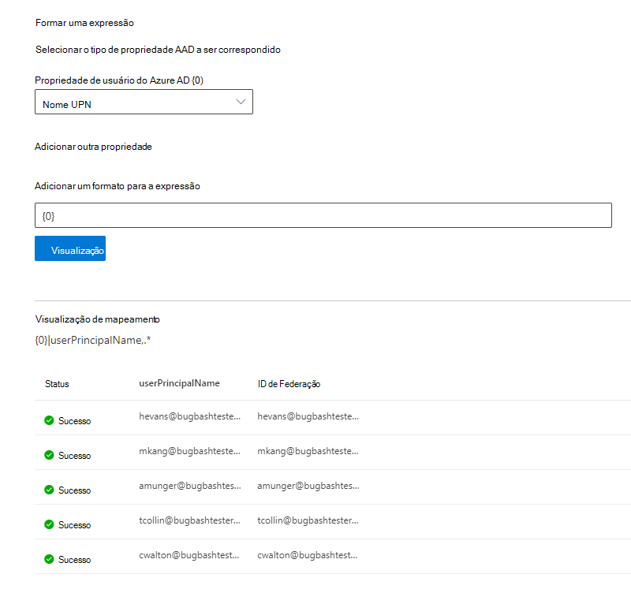

# Mapear as Identidades do Azure AD   

Este artigo orienta você pelas etapas de mapeamento de suas identidades do Azure AD para um identificador exclusivo para sua fonte de dados (identidade não-Azure AD) para que as pessoas em sua Lista de Controle de Acesso (ACL) com identidades não-Azure AD possam ver resultados de pesquisa de conector com escopo para elas.

Essas etapas são relevantes apenas para administradores de pesquisa que estão configurando um conector do [Salesforce](salesforce-connector.md) pela Microsoft com permissões de pesquisa para "Somente pessoas com acesso a essa fonte de dados" e tipo de identidade "AAD". As etapas a seguir explicam como mapear suas propriedades de usuário do Azure AD para as **IDs** de Federação dos usuários.

>[!NOTE]
>Se você estiver configurando um  conector do [Salesforce](salesforce-connector.md) e selecionar Somente pessoas com acesso a essa fonte de dados e tipo de identidade **não-AAD** na tela de permissões de pesquisa, consulte o artigo Mapear suas Identidades não [Azure AD](map-non-aad.md) para ver as etapas sobre como mapear identidades que não sejam do Azure AD.  

## Etapas para mapear suas propriedades do Azure AD

### 1. Selecione propriedades de usuário do Azure AD para mapear

Você pode selecionar as propriedades do Azure AD que você precisa mapear para a ID de Federação.

Você pode selecionar uma propriedade de usuário do Azure AD no menu suspenso. Você também pode adicionar quantas propriedades de usuário do Azure AD quiser se essas propriedades são necessárias para criar o mapeamento de ID de Federação para sua organização.

### 2. Criar fórmula para concluir o mapeamento

Você pode combinar os valores das propriedades de usuário do Azure AD para formar a ID de Federação exclusiva.

Na caixa de fórmula, {0} "  " corresponde à primeira propriedade do Azure AD selecionada. " {1} " corresponde à segunda *propriedade* do Azure AD selecionada. " {2} " corresponde à terceira *propriedade* do Azure AD e assim por diante.  

A seguir estão alguns exemplos de fórmulas com saídas de expressão regular de exemplo e saídas de fórmula:

| Fórmula de exemplo                  | Valor da propriedade {0} para um usuário de exemplo                 | Valor da propriedade {1} para um usuário de exemplo           | Saída da fórmula                  |
| :------------------- | :------------------- |:---------------|:---------------|
| {0}.{1} @contoso.com  | firstname | lastname |firstname.lastname@contoso.com
| {0}@domain.com                 | userid                 |             |userid@domain.com

Depois de fornecer sua fórmula, você pode, opcionalmente, clicar em **Visualizar** para ver uma visualização de cinco usuários aleatórios de sua fonte de dados com seus respectivos mapeamentos de usuário aplicados. A saída da visualização inclui o valor das propriedades de usuário do Azure AD selecionadas na etapa 1 para esses usuários e a saída da fórmula final fornecida na etapa 2 para esse usuário. Ele também indica se a saída da fórmula poderia ser resolvida para um usuário do Azure AD em seu locatário por meio de um ícone "Sucesso" ou "Falha".  

>[!NOTE]
>Você ainda pode prosseguir com a criação de sua conexão se um ou mais mapeamentos de usuário tiver um status "Falha" depois de clicar em **Visualizar**. A visualização mostra 5 usuários aleatórios e seus mapeamentos de sua fonte de dados. Se o mapeamento que você fornece não mapear todos os usuários, você poderá experimentar esse caso.

## Exemplo de mapeamento do Azure AD

Consulte o instantâneo abaixo para um exemplo de mapeamento do Azure AD.

## Limitações  

- Há suporte para apenas um mapeamento para todos os usuários. Não há suporte para mapeamentos condicionais.  

- Não é possível alterar o mapeamento depois que a conexão for publicada.  

- Expressões baseadas em Regex nas propriedades do usuário do Azure AD não são suportadas para a transformação da ID de Federação do Azure AD.