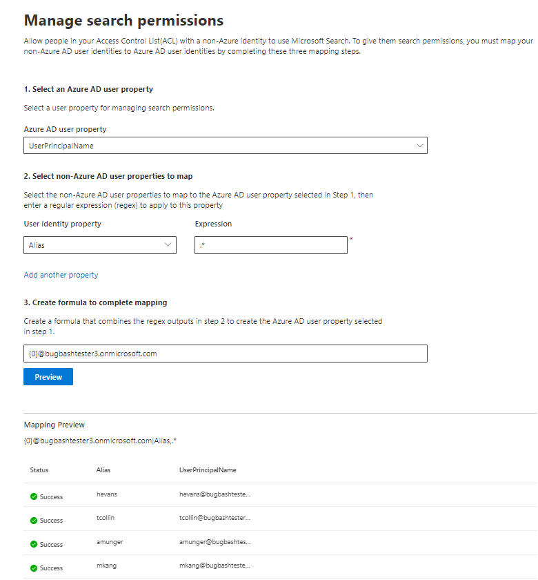

# Mapear suas identidades não pertencentes ao Azure ADMap your non-Azure AD Identities  

Este artigo apresenta as etapas de mapeamento de suas identidades não do Azure AD para suas identidades do Azure AD para que as pessoas na sua lista de controle de acesso (ACL) com identidades não Azure AD possam ver os resultados de pesquisa do conector com o escopo.This article walks you through the steps of mapping your non-Azure AD identities to your Azure AD identities so that people in your Access Control List (ACL) with non-Azure AD identities can see connector search results scoped to them.

Essas etapas só são relevantes para os administradores de pesquisa que estão Configurando os conectores do [ServiceNow](servicenow-connector.md) ou do [Salesforce](salesforce-connector.md) pela Microsoft com permissões de pesquisa para "apenas pessoas com acesso a esta fonte de dados" e tipo de identidade "não AAD".These steps are only relevant to search administrators who are setting up a [ServiceNow](servicenow-connector.md) or [Salesforce](salesforce-connector.md) connectors by Microsoft with search permissions for "Only people with access to this data source" and identity type "Non-AAD."

>[!NOTE]
>Se você estiver configurando um conector do Salesforce e selecionar **apenas pessoas com acesso a essa fonte de dados** e tipo de identidade do **AAD** na tela de permissões de pesquisa, consulte o artigo [map your Azure ad Identities](map-aad.md) para obter etapas sobre como mapear identidades do Azure AD.If you are setting up a Salesforce connector and select **Only people with access to this data source** and identity type **AAD** on the search permissions screen, refer to the [Map your Azure AD Identities](map-aad.md) article for steps on how to map Azure AD identities.  

## Etapas para mapeamento de suas propriedades não do Azure ADSteps for mapping your non-Azure AD properties

### 1. Selecione uma propriedade de usuário do Azure AD1. Select an Azure AD user property  

Você pode selecionar a propriedade de usuário do Azure AD para a qual você está criando o mapeamento.You can select the Azure AD user property you are creating the mapping for. Esta é a propriedade de destino para a qual você deseja mapear suas identidades não do Azure AD.This is the target property you are aiming to map your non-Azure AD identities to.  

Você pode selecionar uma das seguintes propriedades do Azure AD:You can select one of the following Azure AD properties:

| Propriedade do Azure ADAzure AD property    | DefiniçãoDefinition           | ExemploExample         |
| :------------------- | :------------------- |:--------------- |
| Nome UPNUser Principal Name (UPN)  | Um UPN consiste em um prefixo UPN (o nome da conta de usuário) e um sufixo UPN (um nome de domínio DNS).A UPN consists of a UPN prefix (the user account name) and a UPN suffix (a DNS domain name). O prefixo é Unido ao sufixo usando o símbolo "@".The prefix is joined with the suffix using the "@" symbol. | us1@contoso.onmicrosoft.comus1@contoso.onmicrosoft.com |
| ID do Azure ADAzure AD ID                 | Uma ID do Azure AD para um determinado usuário é o único GUID do usuário.An Azure AD ID for a given user is the unique GUID of the user.                 | 58006c96-9e6e-45ea-8c88-4a56851eefad58006c96-9e6e-45ea-8c88-4a56851eefad            |
| IDENTIFICAÇÃO de segurança (SID) do Active DirectoryActive Directory Security ID (SID)                  | SID (identificador de segurança) é um identificador exclusivo que o Active Directory usa para identificar objetos como entidade de segurança.SID (Security Identifier) is a unique identifier that Active Directory uses to identify objects as security principal.                  | S-1-5-21-453406510-812318184-4183662089S-1-5-21-453406510-812318184-4183662089             |

### 2. selecione Propriedades de usuário não do Azure AD para mapear2. Select non-Azure AD user properties to map

Você pode selecionar as propriedades não do Azure AD obtidas da fonte de dados para aplicar as expressões regulares.You can select non-Azure AD properties pulled from your data source to apply regular expressions on. Para saber mais sobre onde encontrar essas propriedades na sua fonte de dados, consulte as páginas do [ServiceNow](servicenow-connector.md) e do [Salesforce](salesforce-connector.md) .To learn more about where to find these properties in your data source, see the [ServiceNow](servicenow-connector.md) and [Salesforce](salesforce-connector.md) pages.  

Você pode selecionar uma propriedade de usuário não do Azure AD na lista suspensa e fornecer uma expressão regular a ser aplicada nesses valores de Propriedade do usuário.You can select a non-Azure AD user property from the dropdown and provide a regular expression to be applied on those user property values. Para saber mais sobre expressões regulares, confira [referência de expressões regulares]( https://docs.microsoft.com/dotnet/standard/base-types/regular-expression-language-quick-reference).To learn more about regular expressions, see [regular expression reference]( https://docs.microsoft.com/dotnet/standard/base-types/regular-expression-language-quick-reference).  

Veja a seguir alguns exemplos de expressões regulares e suas saídas aplicadas a uma cadeia de caracteres de amostra:Below are some examples of regular expressions and their outputs applied to a sample string: 

| Cadeia de caracteres de amostraSample String                  | Expressão regularRegular expression                 | Saída da expressão regular na cadeia de caracteres de amostraOutput of regular expression on sample string           |
| :------------------- | :------------------- |:---------------|
| Alexis VasquezAlexis Vasquez  | .\*.\* | Alexis VasquezAlexis Vasquez |
| Alexis VasquezAlexis Vasquez                 | ..$..$                 | ezez            |
| Alexis VasquezAlexis Vasquez                  | (\w +) $(\w+)$                  | VasquezVasquez             |

Você pode adicionar quantas Propriedades de usuário não pertencente ao Azure você quiser as expressões.You can add as many non-Azure AD user properties as you would like expressions for. Você pode aplicar diferentes expressões regulares à mesma propriedade de usuário se sua fórmula final garantir isso.You can apply different regular expressions to the same user property if your final formula warrants that.  

### 3. criar fórmula para concluir o mapeamento3. Create formula to complete mapping

Você pode combinar as saídas de expressões regulares aplicadas a cada uma das suas propriedades de usuário não do Azure AD para formar a propriedade do Azure AD selecionada na etapa 1.You can combine the outputs of the regular expressions applied to each of your non-Azure AD user properties to form the Azure AD property selected in step 1.

Na caixa Fórmula, " {0} " corresponde à saída da expressão regular aplicada à *primeira* propriedade não Azure AD que você selecionou.In the formula box, "{0}" corresponds to the output of the regular expression applied to the *first* non-Azure AD property you selected. " {1} " corresponde à saída da expressão regular aplicada à *segunda* propriedade não Azure AD que você selecionou."{1}" corresponds to the output of the regular expression applied to the *second* non-Azure AD property you selected. " {2} " corresponde à saída da expressão regular aplicada à *terceira* propriedade não do Azure AD e assim por diante."{2}" corresponds to the output of the regular expression applied to the *third* non-Azure AD property, and so on.  

Veja a seguir alguns exemplos de fórmulas com exemplos de resultados de expressões regulares e saídas de fórmulas:Below are some examples of formulas with sample regular expression outputs and formula outputs: 

| Fórmula de exemploSample formula                  | Valor de {0} no usuário de exemploValue of {0} on sample user                 | Valor de {1} no usuário de exemploValue of {1} on sample user           | Saída da fórmulaOutput of formula                  |
| :------------------- | :------------------- |:---------------|:---------------|
| {0}.{1} @contoso. com{0}.{1}@contoso.com  | FirstNamefirstname | LastNamelastname |firstname.lastname@contoso.comfirstname.lastname@contoso.com
| {0}@domain. com{0}@domain.com                 | IDuserid                 |             |userid@domain.comuserid@domain.com

Depois de fornecer sua fórmula, você pode, opcionalmente, clicar em **Visualizar** para ver uma visualização de cinco usuários aleatórios da fonte de dados com seus respectivos mapeamentos de usuários aplicados.After you provide your formula, you can optionally click **Preview** to see a preview of 5 random users from your data source with their respective user mappings applied. A saída da visualização inclui o valor das propriedades de usuário não do Azure AD selecionadas na etapa 2 para esses usuários e a saída da fórmula final fornecida na etapa 3 para esse usuário.The output of the preview includes the value of the non-Azure AD user properties selected in step 2 for those users and the output of the final formula provided in step 3 for that user. Também indica se a saída da fórmula pode ser resolvida para um usuário do Azure AD no locatário por meio de um ícone de "sucesso" ou "falha".It also indicates whether the output of the formula could be resolved to an Azure AD user in your tenant via a "Success" or "Failed" icon.  

>[!NOTE]
>Você ainda pode prosseguir com a criação de sua conexão se um ou mais mapeamentos de usuário tiverem um status de "falha" após você clicar em **Visualização**.You can still proceed with creating your connection if one or more user mappings have a "Failed" status after you click **Preview**. A visualização mostra 5 usuários aleatórios e seus mapeamentos da fonte de dados.The preview shows 5 random users and their mappings from your data source. Se o mapeamento fornecido não mapear todos os usuários, você pode experimentar esse caso.If the mapping you provide does not map all users, you may experience this case.

## Exemplo de mapeamento não Azure ADSample non-Azure AD mapping

Confira o instantâneo abaixo para obter um exemplo de mapeamento não Azure AD.See the snapshot below for a sample non-Azure AD mapping.

## LimitaçõesLimitations  

- Só há suporte para um mapeamento para todos os usuários.Only one mapping is supported for all users. Não há suporte para mapeamentos condicionais.Conditional mappings are not supported.  

- Não é possível alterar o mapeamento depois que a conexão é publicada.You cannot change your mapping once the connection is published.  

- Atualmente, somente as expressões baseadas em Regex em relação às propriedades do usuário não AAD têm suporte para a transformação.Only regex-based expressions against the non-AAD user properties are currently supported for the transformation.

- Há apenas 3 identidades do Azure AD que você pode escolher para mapear (UPN, ID do Azure AD e SID do AD).There are only 3 Azure AD identities you can choose to map to (UPN, Azure AD ID, and AD SID).