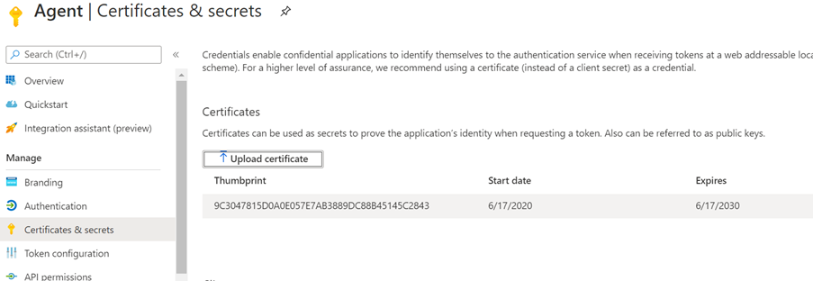

# Agente localOn-Prem Agent

## Agente do conector do GraphGraph connector agent

Os conectores do Graph local exigem que você instale o software de *agente do conector do Graph* .On-prem Graph connectors require you to install *Graph connector agent* software. Permite a transferência rápida e segura de dados entre os serviços de nuvem e dados locais.It allows quick and secure data transfer between on-premises data and cloud services. Este artigo orienta você pelas etapas de instalação e configuração do software.This article guides you through the steps of installing and configuring the software. Uma vez configurada, ela estará disponível para a criação de conexões com suas fontes de dados locais no [centro de administração do Microsoft 365](https://admin.microsoft.com).Once configured, it will be available for creating connections to your on-prem data sources from the [Microsoft 365 admin center](https://admin.microsoft.com).

## InstalaçãoInstallation

Baixe a versão mais recente do agente do conector do Graph usando [este link](https://download.microsoft.com/download/d/d/e/dde18236-9c67-437d-a864-894a0a888ef2/AgentPackage.msi) e instale o software usando o assistente de instalação.Download the latest version of Graph connector agent using [this link](https://download.microsoft.com/download/d/d/e/dde18236-9c67-437d-a864-894a0a888ef2/AgentPackage.msi) and install the software using the installation wizard. Com a configuração recomendada da máquina descrita abaixo, o software pode lidar perfeitamente com até três conexões.With the recommended configuration of the machine described below, the software can seamlessly handle up to three connections. Qualquer conexão além disso pode prejudicar o desempenho.Any connections beyond that might degrade the performance.

Configuração recomendada:Recommended configuration:

* Windows 10, Windows Server 2012 R2 e superiorWindows 10, Windows Server 2012 R2 and above
* 8 núcleos, 3GHz8 cores, 3GHz
* QLE2662 RAM, 1 GB de espaço em disco16GB RAM, 1GB Disk Space
* Acesso de rede à fonte de dados e à Internet por meio de 443Network access to data source and internet through 443

## Criando aplicativo para o agenteCreating App for the agent  

A instância do agente precisa ser alimentada por poucos parâmetros críticos antes da criação de conexões.The agent instance needs to be fed few critical parameters before you create connections. Esses parâmetros incluem detalhes de autenticação necessários para usar as APIs de inclusão de gráfico.These parameters include authentication details required for using Graph ingestion APIs.  

Etapas para criar o aplicativo para o agente.Steps for creating App for the agent.

1. Vá para o [portal do Azure](https://portal.azure.com) e entre com as credenciais de administrador do locatário.Go to the [Azure portal](https://portal.azure.com) and sign in with admin credentials for the tenant.
2. Navegue até registros de aplicativos do **Azure Active Directory**  ->  **App registrations** no painel de navegação e selecione **novo registro**.Navigate to **Azure Active Directory** -> **App registrations** from the navigation pane and select **New registration**.
3. Forneça um nome para o aplicativo e selecione **registrar**.Provide a name for the app and select **Register**.
4. Anote a ID do aplicativo (cliente).Make a note of the Application (client) ID.
5. Abra **permissões de API** do painel de navegação e selecione **Adicionar uma permissão**.Open **API permissions** from the navigation pane and select **Add a permission**.
6. Selecione **Microsoft Graph** e, em seguida, **permissões de aplicativo**.Select **Microsoft Graph** and then **Application permissions**.
7. Procure "ExternalItem. ReadWrite. All" e "Directory. Read. All" nas permissões e selecione **adicionar permissões**.Search for "ExternalItem.ReadWrite.All" and "Directory.Read.All" from the permissions and select **Add permissions**.
8. Selecione **conceder consentimento do administrador para [locatárioname]** e confirmar selecionando **Sim**.Select **Grant admin consent for [TenantName]** and confirm by selecting **Yes**.
9. Verifique se as permissões estão no Estado concedido.Check that the permissions are in the granted state.
     

## Configurando o agente do conector do GraphConfiguring Graph connector agent

Depois de criar o aplicativo para o agente do, você deve configurar o agente com os detalhes de autenticação apropriados.Once you have created the App for the agent, you must configure the agent with appropriate authentication details.

Os detalhes de autenticação podem ser fornecidos em um dos formatos a seguir.Authentication details can be provided in one of the following forms.

### Configurando o segredo do cliente para autenticaçãoConfiguring the client secret for authentication

1. Vá para o [portal do Azure](https://portal.azure.com) e entre com as credenciais de administrador do locatário.Go to the [Azure portal](https://portal.azure.com) and sign in with admin credentials for the tenant.
2. Abra o **registro de aplicativos** no painel de navegação e vá para o aplicativo apropriado.Open **App Registration** from the navigation pane and go to the appropriate App. Em **gerenciar**, selecione **certificados e segredos**.Under **Manage**, select **Certificates and secrets**.
3. Selecione **novo segredo do cliente** e selecione um período de expiração para o segredo.Select **New Client secret** and select an expiry period for the secret. Copie o segredo gerado e salve-o porque ele não será mostrado novamente.Copy the generated secret and save it because it will not be shown again.
4. Use este segredo do cliente junto com a ID do aplicativo para configurar o agente.Use this Client secret along with the Application ID to configure the agent. Não use espaços em branco no campo **nome** do agente.Do not use any blank spaces in the **Name** field of the agent. Caracteres numéricos Alfa são aceitos.Alpha numeric characters are accepted.

## Usando o certificado de impressão digital para autenticaçãoUsing thumbprint certificate for authentication

Se você já configurou os detalhes de autenticação seguindo [a configuração do segredo do cliente para autenticação](#configuring-the-client-secret-for-authentication) , poderá ir diretamente para a [visão geral da configuração](configure-connector.md).If you have already configured the authentication details by following [Configuring the client secret for authentication](#configuring-the-client-secret-for-authentication) , then you can jump directly to [Setup overview](configure-connector.md).

1. Abra o **registro do aplicativo** e selecione **certificados e segredos** no painel de navegação.Open **App registration** and select **Certificates and secrets** from the navigation pane. Copie a impressão digital do certificado.Copy the certificate thumbprint.

2. Use o segredo do cliente ou a impressão digital para registrar o agente do conector do Graph.Use either the client secret or thumbprint to register the Graph connector agent.

