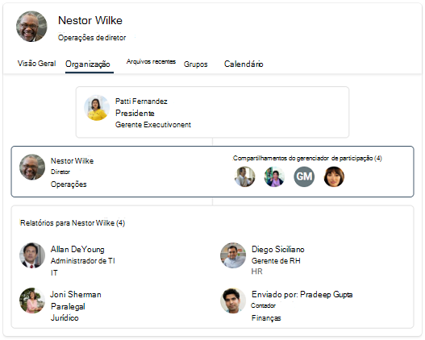
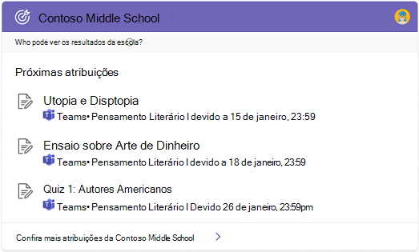

# Visão geral Pesquisa da Microsoft no Bing

Pesquisa da Microsoft em Bing reúne os recursos da pesquisa Pesquisa da Microsoft e Bing Web. Ele fornece uma experiência de pesquisa familiar que ajuda os usuários a encontrar resultados relevantes da sua organização e da Web. Para ajudar a manter seus usuários e seus dados privados e seguros, os usuários devem entrar em sua conta de trabalho ou de estudante Bing antes de encontrar resultados internos.

## O que os usuários visualizam

Quando as pessoas em sua organização usam Pesquisa da Microsoft em Bing, há dois locais em que eles podem ver resultados de trabalho ou escola:

- Página todos os resultados: se houver um resultado de trabalho ou escola relevante, ele aparecerá na parte superior da página de resultados da pesquisa, seguido por resultados da Web pública.
- Página de resultados DE TRABALHO ou ESCOLA: Somente os resultados de sua organização aparecem nesta página. Ele nunca inclui resultados da Web pública.

:::image type="content" alt-text="Todas as páginas de resultados do trabalho da Contoso e da página de resultados da escola para o ensino médio da Contoso." source="media/msb-overview/all-work-school-serps.gif" lightbox="media/msb-overview/all-work-school-serps.gif":::

Os usuários podem identificar facilmente os resultados do trabalho ou da escola procurando o logotipo, o nome ou a imagem de perfil da sua organização.

## Começar a Pesquisa da Microsoft no Bing

Pesquisa da Microsoft no Bing está habilitado por padrão para todos em sua organização. Se um usuário já tiver se inscredo em sua conta de trabalho ou de estudante em outro serviço, como Outlook, Microsoft Teams ou SharePoint, ele será automaticamente assinado na mesma conta quando Bing. Para saber mais, confira [Segurança e Privacidade da Pesquisa da Microsoft no Bing](security-for-search.md).

Se você não estiver familiarizado com o Pesquisa da Microsoft no Bing, sugerimos revisar o Pesquisa da Microsoft no Guia de Administração [do Bing](https://aka.ms/SearchAdminEssentials) para obter informações sobre configuração e implantação. Para ajudar a aumentar a conscientização do Pesquisa da Microsoft, nosso [kit](https://aka.ms/SearchAdoptionKit) de adoção inclui recursos de treinamento e comunicação.

## Experiências de pesquisa para trabalho e escola

Pesquisa da Microsoft no Bing fornece experiências de pesquisa adaptadas às necessidades dos usuários do trabalho e da escola. Em organizações com planos de serviço corporativos, os usuários terão uma experiência de pesquisa projetada para o trabalho, incluindo gráficos organizacionais e Power BI respostas.

Os usuários em organizações com planos de serviço educacional terão uma experiência projetada para pesquisar na escola, incluindo respostas sobre aulas e atribuições futuras.

Se sua organização tiver planos de serviço empresarial e educacional, você poderá selecionar um Pesquisa da Microsoft em Bing experiência para seus usuários, seja na escola ou no trabalho. Para obter mais informações, [consulte Select a school or work search experience](/microsoftsearch/select-work-school-search-experience).

## Adicionar Pesquisa da Microsoft em Bing à intranet

Pesquisa da Microsoft é projetado para facilitar o acesso de informações internas em todos os lugares em que os usuários estão pesquisando. Se as pessoas em sua organização usarem seu site de intranet para iniciar uma pesquisa corporativa ou de estudante, considere adicionar uma caixa de pesquisa incorporada ao seu site.

Com um script simples, você pode adicionar uma caixa de pesquisa personalizada e até mesmo direciona-la para uma vertical personalizada. Para saber mais, confira [Adicionar uma caixa de pesquisa ao site da intranet.](add-a-search-box-to-your-intranet-site.md)

## Definir padrões para facilitar a pesquisa ou a escola

Para ajudar a aumentar a adoção de Pesquisa da Microsoft no Bing, considere maneiras de torná-lo uma parte perfeita do dia do usuário definindo os padrões.

**Navegador padrão**: quando você Microsoft Edge seu navegador padrão, os usuários podem pesquisar em sua organização e obter sugestões de pesquisa relevantes, desde a barra de endereços. Pesquisar na barra de endereços é uma informação rápida e fácil de encontrar, e eles não precisam ir para o Bing iniciar uma pesquisa. Para obter mais informações, consulte [Definir Microsoft Edge como o navegador padrão](/deployedge/edge-default-browser).

**Mecanismo de pesquisa** padrão : se alterar seu navegador padrão não for uma opção, você poderá habilitar a pesquisa de trabalho ou de estudante na barra de endereços definindo Bing como seu mecanismo de pesquisa padrão. Para obter detalhes, [consulte Make Bing o mecanismo de pesquisa padrão](set-default-search-engine.md). Se sua organização tiver um plano de serviço Microsoft 365 Apps para Grandes Empresas (anteriormente Office 365 ProPlus), você poderá definir o Bing como o mecanismo de pesquisa padrão para o Google Chrome implantando o Pesquisa da Microsoft em uma extensão Bing. Para obter mais informações, [consulte Pesquisa da Microsoft em Bing e Microsoft 365 Apps para Grandes Empresas](/deployoffice/microsoft-search-bing).

**Página inicial** padrão : Bing configuração como a página inicial padrão da sua organização não habilitará o trabalho de pesquisa ou a escola na barra de endereços, mas oferece uma maneira fácil de acessar bing.com. Para obter mais informações, [consulte Make Bing.com the default home page](set-default-homepage.md).

## Segurança e privacidade

Pesquisa da Microsoft em Bing usa medidas aprimoradas de segurança e privacidade para ajudar a proteger os dados da sua organização e seus usuários. Para obter mais informações, consulte [Security and Privacy for Pesquisa da Microsoft in Bing](security-for-search.md) and How Pesquisa da Microsoft in Bing helps keep your info [secure](https://support.microsoft.com/office/how-microsoft-search-in-bing-helps-keep-your-info-secure-cbce46ae-bb1f-4d0e-86f1-5984f4589113).

## Confira também

- [Visão geral da Pesquisa da Microsoft](overview-microsoft-search.md)
- [Planejar o conteúdo](plan-your-content.md)
