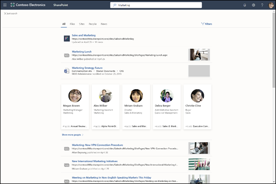
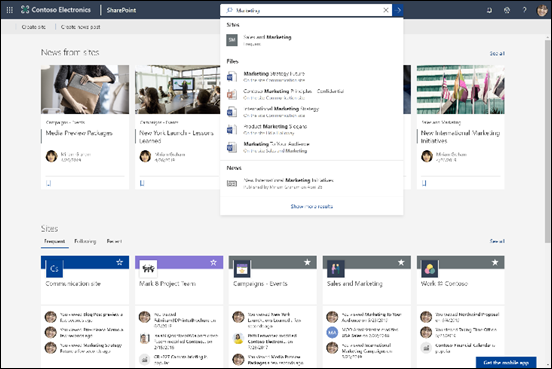

# Visão geral da Pesquisa da Microsoft

A Pesquisa da Microsoft é o recurso de pesquisa unificada nos aplicativos de produtividade do Microsoft 365 e no ecossistema mais amplo da Microsoft. Com o tempo, a Pesquisa da Microsoft estará disponível em mais e mais aplicativos no Microsoft 365.

A Pesquisa da Microsoft ajuda os usuários a encontrarem as respostas, pessoas e conteúdo certos para concluir suas tarefas no aplicativo em que já estão trabalhando.

- Os usuários obtêm resultados relevantes no **contexto** do aplicativo a partir do qual pesquisam. Por exemplo, quando a pesquisa é feita no Outlook, emails são encontrados, ao invés de sites no SharePoint. Quando a pesquisa é feita no SharePoint, sites, páginas e arquivos são encontrados.
- Seja qual for o aplicativo em que os usuários estejam trabalhando; A pesquisa da Microsoft é **pessoal**.  A Pesquisa da Microsoft usa informações do Microsoft Graph para mostrar os resultados relevantes para cada usuário. Cada usuário pode ver resultados diferentes, mesmo que eles pesquisem pelas mesmas palavras. Eles só veem resultados aos quais já têm acesso, a Pesquisa da Microsoft não altera as permissões.
- Os usuários não precisam se lembrar de onde as informações estão localizadas. Por exemplo, um usuário está trabalhando no Word e deseja reutilizar informações de uma apresentação que um colega compartilhou do seu OneDrive. Não é necessário alternar para o OneDrive e pesquisar por essa apresentação, eles podem simplesmente pesquisar no Word.  
- Quando estão no [Bing](https://bing.com), os usuários encontram resultados de dentro de sua organização, além dos resultados públicos da Web.

## O que os usuários visualizam

No Bing, os usuários usam a mesma caixa de pesquisa das pesquisas da web. Nos aplicativos do Microsoft 365, os usuários encontram a caixa do Microsoft Search na barra de cabeçalho. Esse recurso tem a seguinte aparência:

Quando os usuários clicam na caixa de pesquisa, a pesquisa sugere resultados com base em suas atividades anteriores no Office 365 e com base no conteúdo que é tendência em sua organização. Os arquivos nos quais eles estavam trabalhando recentemente, os comandos que eles usaram recentemente e as pessoas com quem colaboram são exemplos de atividades que a pesquisa considera. Quando os usuários começam a digitar na caixa de pesquisa, os resultados sugeridos são atualizados. Os usuários podem abrir os resultados da pesquisa diretamente na caixa de pesquisa. Veja um exemplo de pesquisa no SharePoint.

Se as sugestões na caixa de pesquisa não correspondem ao que está sendo pesquisado, clique em **Enter** para abrir a lista completa de resultados. Eles podem usar metadados, como quem modificou o item pela última vez e quando e onde os itens estão localizados, além de visualizá-los para determinar se é o que eles estão procurando.

## Benefícios do Microsoft Search

**Pesquise no Microsoft 365 a partir de qualquer caixa de Pesquisa da Microsoft** – Os usuários podem pesquisar em qualquer caixa da Pesquisa da Microsoft e voltar rapidamente ao que estavam fazendo. A Pesquisa da Microsoft reúne resultados de fontes de dados no Office 365, incluindo o SharePoint, o OneDrive for Business e o Exchange.

**Fácil de pesquisar** - a Pesquisa da Microsoft sugere resultados com base na atividade anterior dos usuários no Office 365, diretamente na caixa de pesquisa.

**Encontrar arquivos compartilhados** - a Pesquisa da Microsoft usa a compreensão avançada de consultas para facilitar a localização de arquivos compartilhados. Os usuários podem encontrar facilmente os arquivos com os quais estão colaborando.

**Mostrar conteúdo relevante** - Promova as informações e respostas que seus usuários precisam para concluir tarefas; por exemplo, políticas, benefícios, recursos, ferramentas e muito mais. Você pode também definir grupos específicos, como novos contratados ou funcionários remotos.

**A Pesquisa da Microsoft evolui** - o conjunto de tipos de conteúdo pelos quais os usuários podem pesquisar e a inteligência da caixa de pesquisa aumentará com o tempo.

**Administrar em todos os aplicativos** - a Pesquisa da Microsoft está **habilitada** por padrão, e qualquer ação de administração se aplica à Pesquisa da Microsoft em todos os aplicativos.

## Aplicativos que atualmente possuem a Pesquisa da Microsoft 

 A Pesquisa da Microsoft está habilitada por padrão em todos os aplicativos da Microsoft compatíveis. Tudo o que o usuário precisa fazer é entrar com uma conta de corporativa ou de estudante.

Os seguintes aplicativos atualmente oferecem a Pesquisa da Microsoft:
- SharePoint Online
- OneDrive for Business
- Outlook na Web
- Aplicativos do Office no Windows

Além disso, os usuários conectados encontram a Pesquisa da Microsoft em:

- Página inicial do Bing
- Office.com
- Páginas iniciais do Word, Excel e PowerPoint Online

Os usuários também podem iniciar uma pesquisa no Bing a partir da barra de endereços do Microsoft Edge, caso estejam usando o Bing como mecanismo de pesquisa padrão.

## Requisitos

É necessário ter uma das seguintes assinaturas do Office 365 ou do Microsoft 365:

- Office 365 Business Essentials e Business Premium
- Office 365 A1/A3/A5
- Office 365 Education E1/E3
- Office 365 Enterprise E1/E3/E3 developer/E5
- Office 365 F1
- Microsoft 365 Business
- Microsoft 365 A3/A5
- Microsoft 365 F1/E3/E5

Os usuários e os administradores de pesquisa devem ser atribuídos a essas licenças. Somente usuários com contas ativas podem usar a Pesquisa da Microsoft e devem estar **conectados**, porque a Pesquisa da Microsoft requer o Azure Active Directory

## Personalizar a pesquisa da Microsoft na sua organização

Como administrador, você pode facilitar que os usuários obtenham bons resultados específicos da organização quando eles pesquisarem a partir de sua página inicial do SharePoint, Office.com ou Bing. Para isso, defina as respostas que a Pesquisa da Microsoft deve exibir em resposta a determinadas palavras-chave nas consultas. Existem vários tipos de respostas que você pode escolher: 

**Mostrar conteúdo útil** - Ajude os usuários a encontrar ferramentas e recursos importantes em sua organização adicionando indicadores. Assim como você pode criar um indicador para uma página da Web pública, você pode criar um indicador para qualquer página da Web interna, pela qual os usuários podem pesquisar. Você também pode integrar um Power App no indicador para que os usuários possam concluir suas tarefas diretamente do indicador.

**Ofereça respostas a perguntas comuns** – Dê a melhor resposta às perguntas mais frequentes em sua organização. Quando os usuários inserem uma pergunta comum na caixa de pesquisa, a Pesquisa da Microsoft mostra a resposta como resultado, em vez de apenas fornecer um link para a página da Web.

**Mostrar locais úteis** - Mostre os resultados do mapa e as informações de endereço dos edifícios, escritórios e outros espaços de trabalho da sua organização em um mapa. Os usuários podem usar os mapas para ver rotas, ver o que está por perto e muito mais.

Você pode ver as estatísticas de uso que mostram como os usuários estão interagindo com suas respostas e se estão encontrando o que procuram. Com base nisso, você pode ajustar as respostas ou adicionar novas.

Para obter mais informações sobre as palavras-chave e as palavras-chave reservadas, confira [Tornar o conteúdo acessível](make-content-easy-to-find.md).

## Qual conteúdo é pesquisado?

A Pesquisa da Microsoft pesquisa conteúdo armazenado pela organização no SharePoint Online, no OneDrive for Business e no Exchange, incluindo a lista de endereços global e grupos do Office 365. O Pesquisa da Microsoft não pesquisa nos locatários ou mostra resultados de conteúdo compartilhados pelas organizações. Se a sua organização tiver configurado um ambiente híbrido do SharePoint usando a pesquisa híbrida na nuvem, a Pesquisa da Microsoft retornará resultados de pesquisa do conteúdo do SharePoint online e no local, incluindo qualquer conteúdo externo que você tenha conectado ao seu ambiente do SharePoint Server. [Saiba mais sobre os ambientes de pesquisa híbrida](https://docs.microsoft.com/sharepoint/hybrid/learn-about-cloud-hybrid-search-for-sharepoint).

Quando os usuários pesquisam na página inicial do SharePoint ou no Office.com, a Pesquisa da Microsoft procura todo o conteúdo da organização e apresenta os resultados que o usuário tem permissão de ver. Isso é conhecido como o **escopo de pesquisa global**.

Quando os usuários pesquisam do Bing, eles obtêm os resultados mais relevantes de todo o conteúdo na organização inserida na lista de resultados do **site**. Se for necessário ver **todos** os resultados organizacionais, o escopo da pesquisa global pode ser encontrado com um clique.

## Quais tipos de resultados os usuários podem encontrar?
Os usuários encontram os seguintes tipos de resultados ao pesquisar:

**SharePoint**: Arquivos, pastas, pessoas em sua organização, organogramas, sites, páginas de site, notícias, listas e itens de lista. Se definido, respostas a perguntas comuns, indicadores que levam a informações autoritativas, locais de mapa e ferramentas. [Saiba quais tipos de arquivos você pode encontrar](https://docs.microsoft.com/SharePoint/technical-reference/default-crawled-file-name-extensions-and-parsed-file-types).

**As páginas iniciais do Office.com e do Word, Excel e PowerPoint Online**: Aplicativos, arquivos, pastas, pessoas, organogramas, sites do SharePoint, páginas de site, listas e itens de lista. Se definido, respostas a perguntas comuns, indicadores que levam a informações autoritativas, locais de mapa e ferramentas. Arquivos do mesmo tipo que no SharePoint podem ser encontrados.

**Bing**: Conteúdo em site público, arquivos, grupos do Office 365, pessoas, conversas do Yammer e do Teams, organogramas, sites do SharePoint. Se definido, respostas a perguntas comuns, indicadores que levam a informações autoritativas, locais de mapa e ferramentas.  Podem ser encontrados arquivos do Word, Excel, PowerPoint, Visio, OneNote e PDF.

**Outlook**: Emails, anexos e pessoas em sua organização.

**Aplicativos do Office no Windows**: Ações no aplicativo, pessoas na sua organização e na web, arquivos, explicações de palavras, correspondências para a consulta dentro do arquivo ou em conteúdo de ajuda, conteúdo na web. Arquivos do Word, Excel, PowerPoint, Visio e OneNote podem ser encontrados.

**OneDrive**: arquivos do mesmo tipo que no SharePoint podem ser encontrados.

## Como o Microsoft Search funciona?

Quando um usuário efetua uma pesquisa, a Pesquisa da Microsoft processa a consulta e analisa a intenção de pesquisa de frases maiores, usando Inteligência Artificial (AI) para aprender frases supérfluas comuns que os usuários adicionam às consultas e que não afetam a intenção de pesquisa. Por exemplo, quando um usuário pesquisa "como alterar minha senha", as palavras menos importantes são extraídas da consulta, se baseando nas palavras relevantes, como "alterar senha".  

A Pesquisa da Microsoft não cria um novo índice, ela pesquisa os índices existentes do SharePoint Online, do OneDrive for Business e do conteúdo do Exchange.

Os resultados da pesquisa que o usuário tem **permissão** para ver são apresentados na página de resultados da pesquisa. A Pesquisa da Microsoft usa algoritmos de classificação inteligentes para ordenar resultados com base na relevância.

## Pesquisa da Microsoft no SharePoint

O Microsoft Search no Sharepoint é a experiência de pesquisa moderna no SharePoint Online. O SharePoint Online também oferece uma experiência de pesquisa clássica. As duas experiências estão ativadas por padrão e pesquisam o mesmo conteúdo. Como um administrador de pesquisa, não é possível ativar uma experiência no SharePoint Online. A experiência de pesquisa dos seus usuários depende de a partir de onde eles pesquisam:

- Os usuários obtêm a caixa Pesquisa da Microsoft na página inicial do SharePoint, nos sites de hub, nos sites de comunicação e nos sites de equipe modernos.
- Os usuários veem a caixa de pesquisa clássica em sites de publicação e sites de equipe clássicos, bem como no Centro de Pesquisa.

Você pode personalizar a experiência de pesquisa clássica, por exemplo, adicionando refinadores personalizados à página de resultados de pesquisa ou exibindo um determinado tipo de resultado de maneira diferente. Você não pode personalizar a experiência do Microsoft Search no SharePoint. Algumas das personalizações feitas para a pesquisa clássica podem afetar o Microsoft Search no SharePoint. Se a sua organização for usar os dois tipos de experiências de pesquisa no SharePoint, [saiba mais sobre as diferenças e como evitar que afetem o Microsoft Search no SharePoint](https://docs.microsoft.com/sharepoint/differences-classic-modern-search).

## O Microsoft Search no Bing protege as pesquisas empresariais 
Quando um usuários digita uma consulta de pesquisa empresarial no Microsoft Search, ocorrem duas solicitações simultâneas de pesquisa: (1) uma pesquisa dos recursos internos da empresa e (2) uma pesquisa separada de resultados públicos do Bing.com. Como as pesquisas da empresa podem ser confidenciais, o Microsoft Search implementou um conjunto de medidas de confiança que descrevem como a pesquisa separada de resultados públicos do Bing.com é tratada. 
-   **Registro em log**
    - Todos os logs de pesquisa relacionados ao tráfego do Microsoft Search são desassociados da sua identidade do local de trabalho.
    - Se um conjunto de restrições ou limites de frequência forem atingidos, o que nos concede a confiança de que a consulta não é específica para uma determinada organização, a consulta será tratada conforme descrito na seção serviços do Bing da [Declaração de Privacidade](https://privacy.microsoft.com/privacystatement). Por exemplo, essas consultas serão usadas para modelar e treinar recursos públicos, como sugestão automática ou pesquisas relacionadas. 
    - As consultas que não atenderem o conjunto de restrições ou limites de frequência serão armazenadas separadamente do tráfego público, não do Microsoft Search.
-   **Publicidade**
    - A publicidade exibida no Bing.com na conexão com as pesquisa empresariais só está relacionada ao conteúdo das consultas de pesquisa. Os anúncios nunca serão direcionados aos usuários com base na identidade do local de trabalho.

## Confira também

[Configurar a Pesquisa da Microsoft](setup-microsoft-search.md)

[Tornar o conteúdo fácil de encontrar](make-content-easy-to-find.md)
