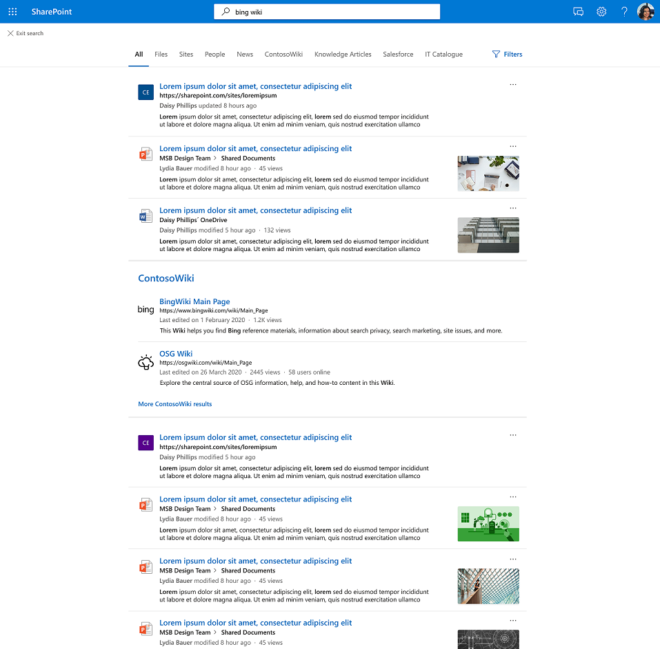

# Graph de resultados de conectores

## Visão geral do cluster de resultados Graph conectores  

Com clusters de resultados de conectores Graph, as empresas podem pesquisar conteúdo de fontes de dados de terceiros em seu modo de exibição padrão, a guia **Todos,** em SharePoint, Office.com e Pesquisa da Microsoft em Bing.

Os clusters de resultados ajudam os usuários a descobrir todo o conteúdo de terceiros em um só lugar. Os resultados mostrados em um cluster de resultados são agrupados com base na configuração vertical da pesquisa.

## Como os resultados do conector são selecionados e exibidos

Os resultados do conector fornecidos no cluster de resultados são derivados de verticais de pesquisa individuais com conteúdo de conector. Cada pesquisa vertical fornece um conjunto de resultados relevantes que se torna um cluster de resultados de candidato. Os resultados relevantes são escolhidos com base na propriedade "title" e na propriedade "content" de cada item. A propriedade content é marcada como *isContent=true* no esquema.

Para garantir a descoberta de conteúdo das verticais de pesquisa, recomendamos fornecer títulos significativos para seus itens. Isso afeta positivamente a arbitragem de candidatos a cluster de resultados e a probabilidade de seu conteúdo aparecer em um cluster de resultados. Por exemplo, evite o uso de IDs como valores para a propriedade "title" a menos que seus usuários usem IDs para procurar conteúdo.

A frequência com que um cluster de resultados é mostrado varia em fatores como o número de verticais de pesquisa que você configura e o tipo de conteúdo. Ao interagir ou ignorar um cluster de resultados, os usuários fornecerão implicitamente dicas que ajustarão seu gatilho ao longo do tempo.

A experiência de resultado da pesquisa para itens de conector mostrados em seu cluster de resultados usa [tipos de resultados](./customize-search-page.md#create-your-own-result-type) definidos por você. Se nenhum tipo de resultado for configurado, um [layout gerado pelo sistema](./customize-search-page.md#default-search-result-layout) será usado.

Recomendamos usar a propriedade "title" como o título do resultado da pesquisa e a propriedade "content" como a descrição da pesquisa. Isso fornecerá a melhor experiência para seus usuários por meio do acionamento preciso do cluster de resultados e dos resultados mais relevantes no cluster.

Clusters de resultados são exibidos no meio da página na vertical Todos. Por exemplo, um cluster de resultado de uma vertical 'MediaWiki' é exibido abaixo.

## Configurações padrão de clusters de resultados
  
Por padrão, a experiência de cluster de resultados é 2016.  

Se você quiser desabilitá-lo, siga estas etapas para desativar a experiência no nível da organização:

1. No [Centro de administração do Microsoft 365,](https://admin.microsoft.com)vá para [**Verticals**](https://admin.microsoft.com/Adminportal/Home#/MicrosoftSearch/verticals).
1. Selecione a **vertical Todos** e, em seguida, habilitar Ocultar resultados **do conector**.

Siga estas etapas para desativar a experiência no nível SharePoint site:

1. Vá para **Configurações** no site SharePoint site
2. Acesse Informações **do site** Exibir todas > **as configurações do site.**
3. Vá para a seção Pesquisa da Microsoft, em seguida, selecione **Configurar Pesquisa da Microsoft para este conjunto de sites**.
4. No painel de navegação, vá para **Experiência personalizada** e selecione **Verticals**.
5. Selecione a **vertical Todos** e, em seguida, habilitar Ocultar resultados **do conector**.
