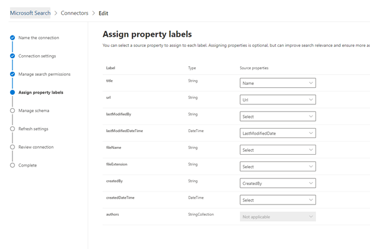

# Conector do Salesforce

Com o conector do Salesforce Graph, sua organização pode indexar os objetos contatos, oportunidades, clientes potenciais e contas em sua instância do Salesforce. Depois de configurar o conector e o conteúdo do índice a partir do Salesforce, os usuários finais podem pesquisar esses itens de qualquer cliente de pesquisa da Microsoft

Este artigo é para os administradores do [Microsoft 365](https://www.microsoft.com/microsoft-365) ou qualquer pessoa que configure, execute e monitore um conector do Salesforce. Ele explica como configurar seus recursos de conector e conector, limitações e técnicas de solução de problemas.

>[!IMPORTANT]
>No momento, o conector do Salesforce Graph é compatível com o verão de 20, Spring ' 20, o Winter ' 20 e o verão de 19.

## Configurações de conexão

Para se conectar à sua instância do Salesforce, você precisa da URL da instância do Salesforce, da ID do cliente e do segredo do cliente para autenticação OAuth. As etapas a seguir explicam como você ou seu administrador do Salesforce podem obter essas informações da sua conta do Salesforce:

- Faça logon na sua instância do Salesforce e vá para a instalação

- Navegue até aplicativos-> Gerenciador de aplicativos.

- Selecione **novo aplicativo conectado**.

- Conclua a seção API da seguinte maneira:

    - Marque a caixa de seleção para **habilitar as configurações do OAuth**.

    - Especifique a URL de retorno de chamada como: [https://gcs.office.com/v1.0/admin/oauth/callback](https://gcs.office.com/v1.0/admin/oauth/callback)

    - Selecione estes escopos OAuth necessários. 

        - Acessar e gerenciar seus dados (API) 

        - Executar solicitações em seu nome a qualquer momento (refresh_token offline_access) 

    - Marque a caixa de seleção para **exigir segredo para o fluxo do servidor Web**.

    - Salve o aplicativo.
    
      

- Copie a chave do consumidor e o segredo do consumidor. Eles serão usados como a ID do cliente e o segredo do cliente quando você definir as configurações de conexão para o seu conector de gráfico no portal de administração do Microsoft 365.

  
- Antes de fechar sua instância do Salesforce, execute as seguintes etapas para garantir que os tokens de atualização não expirem: 
    - Vá para o Gerenciador de aplicativos do > app
    - Localize o aplicativo que você acabou de criar e selecione o menu suspenso à direita. Selecionar **gerenciar**
    - Selecionar **Editar políticas**
    - Para política de token de atualização, selecione o **token de atualização é válido até ser revogado**

  

Agora você pode usar o [centro de administração do M365](https://admin.microsoft.com/) para concluir o restante do processo de configuração do seu conector do Graph.  

Defina as configurações de conexão para o seu conector de gráfico da seguinte maneira:

- Para a URL da instância, use https://[domínio]. My. Salesforce. com onde domínio seria o domínio Salesforce para sua organização. 
- Insira a ID do cliente e o segredo do cliente obtidos da sua instância do Salesforce e selecione entrar.
- Se esta é a primeira vez que você tentou entrar com essas configurações, receberá uma janela pop-up solicitando o login no Salesforce com seu nome de usuário e senha de administrador. A captura de tela abaixo mostra o pop-up. Insira suas credenciais e selecione fazer logon.

  

  >[!NOTE]
  >Se o pop up não aparecer, ele pode estar sendo bloqueado no navegador, portanto, você deve permitir pop-ups e redirecionamentos.

  >[!NOTE]
  >Se sua organização usa logon único (SSO), você pode selecionar **usar domínio personalizado** no canto inferior direito da interface de logon. Insira o domínio e selecione **continuar**. Ele vai para a página de login específica da sua organização, onde você terá a opção de fazer logon com SSO.

- Verifique se a conexão teve êxito procurando uma faixa verde que diga "conexão bem-sucedida", conforme mostrado na captura de tela abaixo.

  

## Gerenciar permissões de pesquisa
Você precisará escolher quais usuários verão os resultados da pesquisa dessa fonte de dados. Se você permitir que apenas alguns usuários do Azure Active Directory (AAD) ou não AAD vejam os resultados da pesquisa, será necessário mapear as identidades.

### Selecionar permissões
Você pode optar por incluir listas de controle de acesso (ACLs) em sua instância do Salesforce ou pode permitir que todas as pessoas em sua organização vejam os resultados da pesquisa dessa fonte de dados. As ACLs podem incluir identidades do Azure Active Directory (AAD), identidades não AAD ou ambas.

### Mapear identidades não-AAD 
Se você optar por incluir uma ACL de sua instância do Salesforce e selecionar "não AAD" para o tipo de identidade, confira [mapear suas identidades não do Azure ad ](map-non-aad.md) para obter instruções sobre como mapear as identidades.

### Mapear identidades do AAD
Se você optar por incluir uma ACL de sua instância do Salesforce e selecionar "AAD" para o tipo de identidade, confira [mapear suas identidades do Azure ad](map-aad.md) para obter instruções sobre como mapear as identidades.

## Atribuir rótulos de propriedade 
Você pode atribuir uma propriedade Source a cada rótulo escolhendo a partir de um menu de opções. Embora esta etapa não seja obrigatória, ter alguns rótulos de propriedade melhorará a relevância da pesquisa e garantirá resultados de pesquisa mais precisos para os usuários finais. Por padrão, alguns dos rótulos como "title", "URL" e "LastModifiedBy" já foram atribuídos a propriedades de origem.

## Gerenciar esquema
Você pode selecionar quais propriedades de fonte devem ser indexadas para que possam ser exibidas nos resultados da pesquisa. Por padrão, o assistente de conexão seleciona um esquema de pesquisa com base em um conjunto de propriedades de origem. Você pode modificá-lo marcando as caixas de seleção para cada propriedade e atributo na página de esquema de pesquisa. Os atributos de esquema de pesquisa incluem pesquisa, consulta, recuperação e refinamento. Refine permite que você defina as propriedades que podem ser usadas posteriormente como refinadores personalizados ou filtros na experiência de pesquisa.  

## Definir o agendamento de atualização

O conector Salesforce só suporta agendas de atualização para rastreamentos completos.

>[!IMPORTANT]
>Um rastreamento completo localiza objetos excluídos e usuários que foram previamente sincronizados com o índice de pesquisa da Microsoft.

O agendamento recomendado é uma semana para um rastreamento completo.

## Limitações

- No momento, o conector do Graph não suporta o compartilhamento baseado em território e o compartilhamento por meio de grupos pessoais do Salesforce.
- Há um bug conhecido na API do Salesforce que o conector do Graph usa onde os padrões de toda a organização privada para clientes potenciais não são honrados atualmente.  
- Se um campo tiver um conjunto de segurança de nível de campo (FLS) definido para um perfil, o conector do gráfico não inreceberá esse campo para qualquer perfil na organização do Salesforce. Portanto, os usuários não poderão pesquisar os valores desses campos, nem eles aparecerão nos resultados.  
- Qualquer configuração do FLS será atendida durante as sincronizações completas do conector.
- Na tela Gerenciar esquema, esses nomes de propriedade padrão comuns são listados uma vez e a seleção feita para torná-los consultáveis, pesquisáveis e recuperáveis se aplicam a todos ou nenhum.
    - Nome
    - Url 
    - Descrição
    - Fax
    - Telefone
    - MobilePhone
    - Email
    - Tipo
    - Título
    - AccountId
    - AccountName
    - AccountUrl
    - AccountOwner
    - AccountOwnerUrl
    - Proprietário
    - OwnerUrl
    - CreatedBy 
    - CreatedByUrl 
    - LastModifiedBy 
    - LastModifiedByUrl 
    - LastModifiedDate
    - ObjectName 
