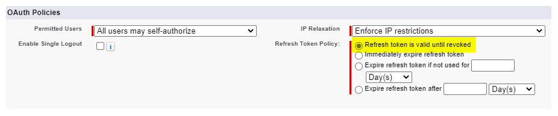
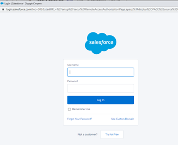
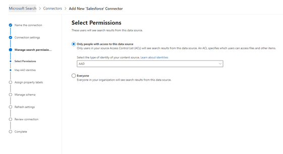

<!---Previous ms.author: rusamai --->

# Conector salesforce Graph (visualização)Salesforce Graph connector (preview)

O conector salesforce Graph permite que sua organização indexe contatos, oportunidades, clientes em geral e objetos de contas em sua instância da Salesforce.The Salesforce Graph connector, allows your organization to index Contacts, Opportunities, Leads, and Accounts objects in your Salesforce instance. Depois de configurar o conector e o conteúdo do índice do Salesforce, os usuários finais podem pesquisar esses itens em qualquer cliente da Pesquisa da Microsoft.After you configure the connector and index content from Salesforce, end users can search for those items from any Microsoft Search client.

> [!NOTE]
> Leia o [**artigo Configuração do seu conector do Graph**](configure-connector.md) para entender o processo geral de configuração de conectores do Graph.Read the [**Setup for your Graph connector**](configure-connector.md) article to understand the general Graph connectors setup process.

Este artigo é para qualquer pessoa que configure, executa e monitore um conector do ServiceNow Graph.This article is for anyone who configures, runs, and monitors a ServiceNow Graph connector. Ele complementa o processo de instalação geral e mostra instruções que se aplicam somente ao conector do Salesforce Graph.It supplements the general setup process, and shows instructions that apply only for the Salesforce Graph connector. Este artigo também inclui informações sobre [limitações.](#limitations)This article also includes information about [Limitations](#limitations).

>[!IMPORTANT]
>O conector do Salesforce Graph atualmente dá suporte a Verão '19 ou posterior.The Salesforce Graph connector currently supports Summer '19 or later.

## Antes de começarBefore you get started

Para se conectar à sua instância da Salesforce, você precisa da URL da instância da Salesforce, da ID do Cliente e do Segredo do Cliente para autenticação OAuth.To connect to your Salesforce instance, you need your Salesforce instance URL, the Client ID, and Client Secret for OAuth authentication. As etapas a seguir explicam como você ou seu administrador da Salesforce podem obter essas informações de sua conta da Salesforce:The following steps explain how you or your Salesforce administrator can get this information from your Salesforce account:

- Entre na instância da Salesforce e vá para a InstalaçãoLog in to your Salesforce instance and go to Setup

- Navegue até Apps -> App Manager.Navigate to Apps -> App Manager.

- Selecione **Novo aplicativo conectado.**Select **New connected app**.

- Conclua a seção da API da seguinte forma:Complete the API section as follows:

    - Marque a caixa de seleção para **Habilitar Configurações do Oauth.**Select the checkbox for **Enable Oauth Settings**.

    - Especifique a URL de retorno de chamada como: [https://gcs.office.com/v1.0/admin/oauth/callback](https://gcs.office.com/v1.0/admin/oauth/callback)Specify the Callback URL as: [https://gcs.office.com/v1.0/admin/oauth/callback](https://gcs.office.com/v1.0/admin/oauth/callback)

    - Selecione estes escopos OAuth necessários.Select these required OAuth scopes.

        - Acessar e gerenciar seus dados (api)Access and manage your data (api)

        - Executar solicitações em seu nome a qualquer momento (refresh_token, offline_access)Perform requests on your behalf at any time (refresh_token, offline_access)

    - Marque a caixa de seleção para **Exigir segredo para o fluxo do servidor Web.**Select the checkbox for **Require secret for web server flow**.

    - Salve o aplicativo.Save the app.
    
      > [!div class="mx-imgBorder"]
      > 

- Copie a chave do consumidor e o segredo do consumidor.Copy the consumer key and the consumer secret. Essas informações serão usadas como a ID do Cliente e o Segredo do Cliente quando você definir as Configurações de Conexão para seu Conector do Graph no portal de administração do Microsoft 365.This information will be used as the Client ID and the Client Secret when you configure the Connection Settings for your Graph Connector in the Microsoft 365 admin portal.

  > [!div class="mx-imgBorder"]
  > Consumer Key is at top of left column and Consumer Secret is at top of right column.](media/salesforce-connector/clientsecret.png)
  
- Antes de fechar a instância da Salesforce, siga estas etapas para garantir que os tokens de atualização não expirem:Before closing your Salesforce instance, follow these steps to ensure that refresh tokens don't expire:
    - Go to Apps -> App ManagerGo to Apps -> App Manager
    - Encontre o aplicativo que você criou e selecione o drop-down à direita.Find the app you created and select the drop-down on the right. Selecionar **Gerenciar**Select **Manage**
    - Selecionar **políticas de edição**Select **edit policies**
    - Para a política de token de atualização, selecionar **Token de atualização é válido até ser revogado**For refresh token policy, select **Refresh token is valid until revoked**

  > [!div class="mx-imgBorder"]
  > 

Agora você pode usar o Centro de Administração do [M365](https://admin.microsoft.com/) para concluir o restante do processo de instalação do conector do Graph.You can now use the [M365 Admin Center](https://admin.microsoft.com/) to complete the rest of the setup process for your Graph connector.

## Etapa 1: Adicionar um conector do Graph no centro de administração do Microsoft 365Step 1: Add a Graph connector in the Microsoft 365 admin center

Siga as instruções [gerais de configuração.](https://docs.microsoft.com/microsoftsearch/configure-connector)Follow the general [setup instructions](https://docs.microsoft.com/microsoftsearch/configure-connector).
<!---If the above phrase does not apply, delete it and insert specific details for your data source that are different from general setup instructions.-->

## Etapa 2: Nomear a conexãoStep 2: Name the connection

Siga as instruções [gerais de configuração.](https://docs.microsoft.com/microsoftsearch/configure-connector)Follow the general [setup instructions](https://docs.microsoft.com/microsoftsearch/configure-connector).
<!---If the above phrase does not apply, delete it and insert specific details for your data source that are different from general setup instructions.-->

## Etapa 3: Definir as configurações de conexãoStep 3: Configure the connection settings

Para a URL da Instância, use https://[domain].my.salesforce.com onde o domínio seria o domínio Salesforce da sua organização.For the Instance URL, use https://[domain].my.salesforce.com where domain would be the Salesforce domain for your organization.

Insira a ID do Cliente e o Segredo do Cliente obtidos da instância da Salesforce e selecione Entrar.Enter the Client ID and Client Secret you obtained from your Salesforce instance and select Sign in.

Na primeira vez que você tentar entrar com essas configurações, você verá um pop-up solicitando que você faça logoff no Salesforce com seu nome de usuário e senha de administrador.The first time you've attempted to sign in with these settings, you'll get a pop-up asking you to log in to Salesforce with your admin username and password. A captura de tela abaixo mostra o pop-up.The screenshot below shows the popup. Insira suas credenciais e selecione "Entrar".Enter your credentials and select "Log In".

  

  >[!NOTE]
  >Se o pop-up não aparecer, ele pode estar sendo bloqueado no navegador, portanto, você deve permitir pop-ups e redirecionamentos.If the pop up does not appear, it might be getting blocked in your browser, so you must allow pop-ups and redirects.

Verifique se a conexão foi bem-sucedida pesquisando uma faixa verde que diz "Conexão bem-sucedida", conforme mostra a captura de tela abaixo.Check that the connection was successful by searching for a green banner that says "Connection successful" as show in the screenshot below.

  > [!div class="mx-imgBorder"]
  > 

## Etapa 4: Gerenciar permissões de pesquisaStep 4: Manage search permissions

Você precisará escolher quais usuários verão os resultados da pesquisa dessa fonte de dados.You'll need to choose which users will see search results from this data source. Se você permitir que apenas determinados usuários do Azure Active Directory (Azure AD) ou do Azure AD vejam os resultados da pesquisa, mapeie as identidades.If you allow only certain Azure Active Directory (Azure AD) or Non-Azure AD users to see the search results, make sure you map the identities.

## Etapa 4a: Selecionar permissõesStep 4a: Select permissions

Você pode optar por ingerir listas de controle de acesso (ACLs) de sua instância da Salesforce ou permitir que todos em sua organização vejam os resultados de pesquisa dessa fonte de dados.You can choose to ingest Access Control Lists (ACLs) from your Salesforce instance, or allow everyone in your organization to see search results from this data source. As ACLs podem incluir identidades do Azure Active Directory (AAD) (usuários federados do Azure AD para a Salesforce), identidades não-Azure AD (usuários nativos do Salesforce que têm identidades correspondentes no Azure AD) ou ambas.ACLs can include Azure Active Directory (AAD) identities (users who are federated from Azure AD to Salesforce), non-Azure AD identities (native Salesforce users who have corresponding identities in Azure AD), or both.

>[!NOTE]
>Se você usar um Provedor de Identidade de terceiros, como a ID de Ping ou secureAuth, selecione "não-AAD" como o tipo de identidade.If you use a third-party Identity Provider like Ping ID or secureAuth, you should select "non-AAD" as the identity type.

> [!div class="mx-imgBorder"]
> 

Se você optou por ingerir uma ACL da sua instância do Salesforce e selecionou "não-AAD" para o tipo de identidade, confira Mapear suas identidades não [Azure AD](map-non-aad.md) para obter instruções sobre como mapear as identidades.If you chose to ingest an ACL from your Salesforce instance and selected "non-AAD" for the identity type, see [Map your non-Azure AD Identities](map-non-aad.md) for instructions on mapping the identities.

## Etapa 4b: Mapear identidades do AADStep 4b: Map AAD identities

Se você optou por ingerir uma ACL da sua instância do Salesforce e selecionou "AAD" para o tipo de identidade, confira Mapear as identidades do [Azure AD](map-aad.md) para obter instruções sobre como mapear as identidades.If you chose to ingest an ACL from your Salesforce instance and selected "AAD" for the identity type, see [Map your Azure AD Identities](map-aad.md) for instructions on mapping the identities. Para saber como configurar o SSO do Azure AD para Salesforce, confira este [tutorial.](https://docs.microsoft.com/azure/active-directory/saas-apps/salesforce-tutorial)To learn how to set up Azure AD SSO for Salesforce, see this [tutorial](https://docs.microsoft.com/azure/active-directory/saas-apps/salesforce-tutorial).

## Etapa 5: Atribuir rótulos de propriedadeStep 5: Assign property labels

Você pode atribuir uma propriedade de origem a cada rótulo escolhendo em um menu de opções.You can assign a source property to each label by choosing from a menu of options. Embora essa etapa não seja obrigatória, ter alguns rótulos de propriedade melhorará a relevância da pesquisa e garantirá melhores resultados de pesquisa para usuários finais.While this step is not mandatory, having some property labels will improve the search relevance and ensure better search results for end users. Por padrão, algumas das etiquetas como "Title", "URL", "CreatedBy" e "LastModifiedBy" já foram atribuídas a propriedades de origem.By default, some of the Labels like "Title," "URL," "CreatedBy," and  "LastModifiedBy" have already been assigned source properties.

## Etapa 6: Gerenciar esquemaStep 6: Manage schema

Você pode selecionar quais propriedades de origem devem ser indexadas para que elas sejam acionadas nos resultados da pesquisa.You can select what source properties should be indexed so that they show up in search results. Por padrão, o assistente de conexão seleciona um esquema de pesquisa com base em um conjunto de propriedades de origem.The connection wizard by default selects a search schema based on a set of source properties. Você pode modificá-lo selecionando as caixas de seleção de cada propriedade e atributo na página de esquema de pesquisa.You can modify it by selecting the check boxes for each property and attribute in the search schema page. Os atributos de esquema de pesquisa incluem Pesquisa, Consulta, Recuperação e Refinamento.Search schema attributes include Search, Query, Retrieve, and Refine.
Refinar permite definir as propriedades que podem ser usadas posteriormente como refinadores ou filtros personalizados na experiência de pesquisa.Refine allows you to define the properties that can be later used as custom refiners or filters in the search experience.  

> [!div class="mx-imgBorder"]
> The options are Query, Search, Retrieve, and Refine](media/salesforce-connector/sf9.png)

## Etapa 7: Definir o agendamento de atualizaçãoStep 7: Set the refresh schedule

O conector salesforce suporta apenas agendamentos de atualização para rastreamentos completos no momento.The Salesforce connector only supports refresh schedules for full crawls currently.

>[!IMPORTANT]
>Um rastreamento completo localiza objetos excluídos e usuários que foram sincronizados anteriormente com o índice da Pesquisa da Microsoft.A full crawl finds deleted objects and users that were previously synced to the Microsoft Search index.

O agendamento recomendado é de uma semana para um rastreamento completo.The recommended schedule is one week for a full crawl.

## Etapa 8: Analisar a conexãoStep 8: Review connection

Siga as instruções [gerais de configuração.](https://docs.microsoft.com/microsoftsearch/configure-connector)Follow the general [setup instructions](https://docs.microsoft.com/microsoftsearch/configure-connector).
<!---If the above phrase does not apply, delete it and insert specific details for your data source that are different from general setup instructions.-->

<!---## Troubleshooting-->
<!---Insert troubleshooting recommendations for this data source-->

## LimitaçõesLimitations

- No momento, o conector do Graph não dá suporte ao compartilhamento e compartilhamento baseado em território da Apex usando grupos pessoais da Salesforce.The Graph connector doesn't currently support Apex based, territory-based sharing and sharing using personal groups from Salesforce.
- Há um bug conhecido na API salesforce que o conector do Graph usa, onde os padrões de toda a organização privada para leads não são compatíveis no momento.There's a known bug in the Salesforce API the Graph connector uses, where the private org-wide defaults for leads aren't honored currently.  
- Se um campo tiver segurança de nível de campo (FLS) definida para um perfil, o conector do Graph não ingeri esse campo para nenhum perfil nessa organização salesforce. Como resultado, os usuários não poderão pesquisar os valores desses campos, nem aparecerão nos resultados.If a field has field level security (FLS) set for a profile, the Graph connector won't ingest that field for any profiles in that Salesforce org. As a result, users won't be able to search on values for those fields, nor will it show up in the results.  
- Na tela Gerenciar Esquema, esses nomes de propriedade padrão comuns são listados uma vez, as opções são **Consulta** **,** **Pesquisa,** Recuperar e **Refinar** e aplicar a todos ou a nenhum.In the Manage Schema screen these common standard property names are listed once, the options are **Query**, **Search**, **Retrieve**, and **Refine**, and apply to all or none.
    - NomeName
    - UrlUrl
    - DescriçãoDescription
    - FaxFax
    - TelefonePhone
    - MobilePhoneMobilePhone
    - EmailEmail
    - TipoType
    - TítuloTitle
    - AccountIdAccountId
    - AccountNameAccountName
    - AccountUrlAccountUrl
    - AccountOwnerAccountOwner
    - AccountOwnerUrlAccountOwnerUrl
    - ProprietárioOwner
    - OwnerUrlOwnerUrl
    - CreatedByCreatedBy
    - CreatedByUrlCreatedByUrl
    - LastModifiedByLastModifiedBy
    - LastModifiedByUrlLastModifiedByUrl
    - LastModifiedDateLastModifiedDate
    - ObjectNameObjectName
