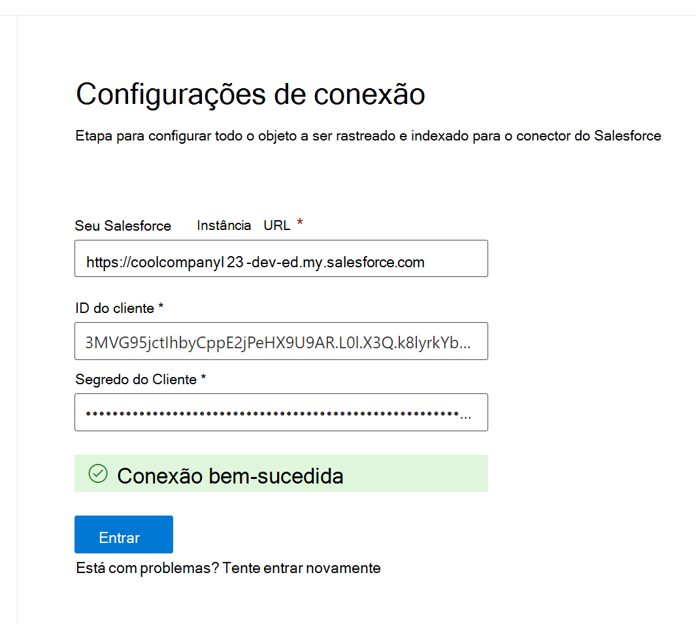

<!---Previous ms.author: rusamai --->

# Conector Graph Salesforce

O conector Graph Salesforce permite que sua organização indexe os objetos Contatos, Oportunidades, Leads, Casos e Contas em sua instância do Salesforce. Depois de configurar o conector e o conteúdo de índice do Salesforce, os usuários finais podem pesquisar esses itens de qualquer Pesquisa da Microsoft cliente.

> [!NOTE]
> Leia o [**artigo Instalação do conector Graph para**](configure-connector.md) entender as instruções gerais Graph configuração de conectores.

Este artigo é para qualquer pessoa que configure, executa e monitore um conector Graph Salesforce. Ele complementa o processo de instalação geral e mostra instruções que se aplicam somente ao conector Graph Salesforce. Este artigo também inclui informações sobre [Limitações.](#limitations)

>[!IMPORTANT]
>O conector Graph Salesforce atualmente dá suporte ao Verão 19 ou posterior.

## Antes de começar

Para se conectar à sua instância do Salesforce, você precisa da URL da instância do Salesforce, da ID do Cliente e do Segredo do Cliente para autenticação OAuth. As etapas a seguir explicam como você ou o administrador do Salesforce podem obter essas informações da sua conta do Salesforce:

- Faça logoff em sua instância do Salesforce e vá para a Instalação

- Navegue até Apps -> App Manager.

- Selecione **Novo aplicativo conectado**.

- Conclua a seção API da seguinte forma:

    - Marque a caixa de seleção **Habilitar o Oauth Configurações**.

    - Especifique a URL de retorno de chamada como: [https://gcs.office.com/v1.0/admin/oauth/callback](https://gcs.office.com/v1.0/admin/oauth/callback)

    - Selecione esses escopos OAuth necessários.

        - Acessar e gerenciar seus dados (api)

        - Execute solicitações em seu nome a qualquer momento (refresh_token, offline_access)

    - Selecione a caixa de seleção para **Exigir segredo para fluxo de servidor Web.**

    - Salve o aplicativo.
    
      > [!div class="mx-imgBorder"]
      > 

- Copie a chave do consumidor e o segredo do consumidor. Essas informações serão usadas como a ID do Cliente e o Segredo do Cliente quando você configurar a conexão Configurações para o conector Graph no portal de administração Microsoft 365.

  > [!div class="mx-imgBorder"]
  > 
  
- Antes de fechar sua instância do Salesforce, siga estas etapas para garantir que os tokens de atualização não expirem:
    - Acesse Apps -> App Manager
    - Encontre o aplicativo criado e selecione o drop-down à direita. Selecione **Gerenciar**
    - Selecionar **políticas de edição**
    - Para política de token de atualização, selecione **Atualizar token é válido até revogado**

  > [!div class="mx-imgBorder"]
  > 

Agora você pode usar a [central Administração Microsoft 365 para](https://admin.microsoft.com/) concluir o restante do processo de instalação do conector Graph.

## Etapa 1: adicionar um conector Graph no Centro de administração do Microsoft 365

Siga as instruções [gerais de instalação](./configure-connector.md).
<!---If the above phrase does not apply, delete it and insert specific details for your data source that are different from general setup instructions.-->

## Etapa 2: nomear a conexão

Siga as instruções [gerais de instalação](./configure-connector.md).
<!---If the above phrase does not apply, delete it and insert specific details for your data source that are different from general setup instructions.-->

## Etapa 3: Configurar as configurações de conexão

Para a URL de instância, use https://[domain].my.salesforce.com onde o domínio seria o domínio Salesforce para sua organização.

Insira a ID do Cliente e o Segredo do Cliente que você obteve da sua instância do Salesforce e selecione Entrar.

Na primeira vez que você tentar entrar com essas configurações, você obterá um pop-up solicitando que você faça logoff no Salesforce com seu nome de usuário e senha do administrador. A captura de tela abaixo mostra o pop-up. Insira suas credenciais e selecione "Entrar".

  

  >[!NOTE]
  >Se o pop-up não aparecer, ele pode estar sendo bloqueado no navegador, portanto, você deve permitir pop-ups e redirecionamentos.

Verifique se a conexão foi bem-sucedida pesquisando uma faixa verde que diz "Conexão bem-sucedida" como mostra a captura de tela abaixo.

  > [!div class="mx-imgBorder"]
  > 

## Etapa 4: Selecionar propriedades

Selecione os objetos Salesforce que você deseja que o conector pesquise e inclua nos resultados da pesquisa. Se o Contato estiver selecionado, Account também será selecionado automaticamente.

>[!NOTE]
>Se um campo tiver fls (segurança de nível de campo) definido para um perfil, o conector não ingerirá esse campo para nenhum perfil nessa organização do Salesforce. Como resultado, os usuários não poderão pesquisar os valores desses campos, nem aparecerão nos resultados.

## Etapa 5: Gerenciar permissões de pesquisa

Você precisará escolher quais usuários verão os resultados da pesquisa nesta fonte de dados. Se você permitir que Azure Active Directory apenas determinados usuários do Azure AD (Azure AD) ou não do Azure AD vejam os resultados da pesquisa, certifique-se de mapear as identidades.

### Etapa 5.a: Selecionar permissões

Você pode optar por ingerir listas de controle de acesso (ACLs) de sua instância do Salesforce ou permitir que todos em sua organização vejam os resultados da pesquisa a partir dessa fonte de dados. As ACLs podem incluir Azure Active Directory identidades (AAD) (usuários federados do Azure AD para o Salesforce), identidades não-Azure AD (usuários nativos do Salesforce que têm identidades correspondentes no Azure AD) ou ambos.

>[!NOTE]
>Se você usar um Provedor de Identidade de terceiros, como Ping ID ou secureAuth, selecione "não-AAD" como o tipo de identidade.

> [!div class="mx-imgBorder"]
> 

Se você optou por ingerir um ACL da sua instância do Salesforce e selecionou "não-AAD" para o tipo de identidade, consulte Mapear suas Identidades [não-Azure AD](map-non-aad.md) para obter instruções sobre como mapear as identidades.

### Etapa 5.b: Mapear identidades do AAD

Se você optou por ingerir um ACL da sua instância do Salesforce e selecionou "AAD" para o tipo de identidade, consulte Mapear suas Identidades do [Azure AD](map-aad.md) para obter instruções sobre como mapear as identidades. Para saber como configurar o SSO do Azure AD para Salesforce, consulte este [tutorial](/azure/active-directory/saas-apps/salesforce-tutorial).

### Aplicar mapeamento de usuário para sincronizar suas identidades do Salesforce às identidades do Azure AD

Neste vídeo, você pode ver o processo de autenticação à sua instância do Salesforce, sincronizar suas identidades não Azure Active Directory com suas identidades Azure Active Directory e aplicar os recortes de segurança apropriados aos itens do Salesforce.

> [!VIDEO https://www.youtube-nocookie.com/embed/SZYiFxZMKcM]

## Etapa 6: Atribuir rótulos de propriedade

Você pode atribuir uma propriedade de origem a cada rótulo escolhendo a partir de um menu de opções. Embora essa etapa não seja obrigatória, ter alguns rótulos de propriedade melhorará a relevância da pesquisa e garantirá melhores resultados de pesquisa para usuários finais. Por padrão, algumas das propriedades de origem "Title", "URL", "CreatedBy" e "LastModifiedBy" já foram atribuídas.

## Etapa 7: Gerenciar esquema

Você pode selecionar quais propriedades de origem devem ser indexadas para que elas sejam acionadas nos resultados da pesquisa. O assistente de conexão por padrão seleciona um esquema de pesquisa com base em um conjunto de propriedades de origem. Você pode modificá-lo selecionando as caixas de seleção para cada propriedade e atributo na página esquema de pesquisa. Os atributos de esquema de pesquisa incluem Pesquisa, Consulta, Recuperação e Refinamento.
Refinar permite definir as propriedades que podem ser usadas posteriormente como refinadores ou filtros personalizados na experiência de pesquisa.  

> [!div class="mx-imgBorder"]
> 

## Etapa 8: Definir o cronograma de atualização

O conector do Salesforce dá suporte apenas a agendas de atualização para rastreamentos completos no momento.

>[!IMPORTANT]
>Um rastreamento completo localiza objetos excluídos e usuários que foram sincronizados anteriormente com o índice Pesquisa da Microsoft de dados.

A agenda recomendada é de uma semana para um rastreamento completo.

## Etapa 9: Analisar conexão

Siga as instruções [gerais de instalação](./configure-connector.md).

>[!TIP]
>**Tipo de resultado padrão**
>* O conector salesforce registra automaticamente um [tipo de resultado](./customize-search-page.md#step-2-create-result-types) depois que o conector é publicado. O tipo de resultado usa um layout de [resultado](./customize-results-layout.md) gerado dinamicamente com base nos campos selecionados na etapa 3.
>* Você pode gerenciar o tipo de resultado navegando até [**Tipos de**](https://admin.microsoft.com/Adminportal/Home#/MicrosoftSearch/resulttypes) resultado no [Centro de administração do Microsoft 365](https://admin.microsoft.com). O tipo de resultado padrão será nomeado como " `ConnectionId` Padrão". Por exemplo, se sua id de conexão for `Salesforce` , seu layout de resultado será nomeado: "SalesforceDefault"
>* Além disso, você pode optar por criar seu próprio tipo de resultado, se necessário.
<!---If the above phrase does not apply, delete it and insert specific details for your data source that are different from general setup instructions.-->

<!---## Troubleshooting-->
<!---Insert troubleshooting recommendations for this data source-->

## Limitações

- O Graph conector atualmente não dá suporte ao compartilhamento e compartilhamento baseado em território baseado em Apex usando grupos pessoais do Salesforce.
- Há um bug conhecido na API salesforce que o conector Graph usa, onde os padrões de toda a organização privada para leads não são acadados no momento.  
- Se um campo tiver fls (segurança de nível de campo) definido para um perfil, o conector Graph não ingerirá esse campo para nenhum perfil nessa organização do Salesforce. Como resultado, os usuários não poderão pesquisar os valores desses campos, nem aparecerão nos resultados.  
- Na tela Gerenciar Esquema, esses nomes de propriedade padrão comuns são listados uma vez, as opções são **Consulta,** **Pesquisa,** **Recuperar** e **Refinar** e aplicar a todos ou a nenhum.
    - Nome
    - Url
    - Descrição
    - Fax
    - Telefone
    - MobilePhone
    - Email
    - Tipo
    - Cargo
    - AccountId
    - AccountName
    - AccountUrl
    - AccountOwner
    - AccountOwnerUrl
    - Proprietário
    - OwnerUrl
    - CreatedBy
    - CreatedByUrl
    - LastModifiedBy
    - LastModifiedByUrl
    - LastModifiedDate
    - ObjectName
