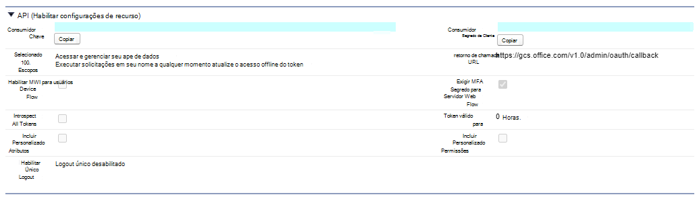

# Conector do SalesforceSalesforce connector

Com o conector do Salesforce Graph, sua organização pode indexar os objetos contatos, oportunidades, clientes potenciais e contas em sua instância do Salesforce.With the Salesforce Graph connector, your organization can index Contacts, Opportunities, Leads and Accounts objects in your Salesforce instance. Depois de configurar o conector e o conteúdo do índice a partir do Salesforce, os usuários finais podem pesquisar esses itens de qualquer cliente de pesquisa da MicrosoftAfter you configure the connector and index content from Salesforce, end users can search for those items from any Microsoft Search client

Este artigo é para os administradores do [Microsoft 365](https://www.microsoft.com/microsoft-365) ou qualquer pessoa que configure, execute e monitore um conector do Salesforce.This article is for [Microsoft 365](https://www.microsoft.com/microsoft-365) administrators or anyone who configures, runs, and monitors a Salesforce connector. Ele explica como configurar seus recursos de conector e conector, limitações e técnicas de solução de problemas.It explains how to configure your connector and connector capabilities, limitations, and troubleshooting techniques.

>[!IMPORTANT]
>No momento, o conector do Salesforce Graph é compatível com o verão de 20, Spring ' 20, o Winter ' 20 e o verão de 19.The Salesforce Graph connector currently supports Summer ’20, Spring’20, Winter’20, and Summer ’19 versions.

## Configurações de conexãoConnection settings

Para se conectar à sua instância do Salesforce, você precisa da URL da instância do Salesforce, da ID do cliente e do segredo do cliente para autenticação OAuth.To connect to your Salesforce instance, you need your Salesforce instance URL, the Client ID, and Client Secret for OAuth authentication. As etapas a seguir explicam como você ou seu administrador do Salesforce podem obter essas informações da sua conta do Salesforce:The following steps explain how you or your Salesforce administrator can get this information from your Salesforce account:

- Faça logon na sua instância do Salesforce e vá para a instalaçãoLog in to your Salesforce instance and go to Setup

- Navegue até aplicativos-> Gerenciador de aplicativos.Navigate to Apps -> App Manager.

- Selecione **novo aplicativo conectado**.Select **New connected app**.

- Conclua a seção API da seguinte maneira:Complete the API section as follows:

    - Marque a caixa de seleção para **habilitar as configurações do OAuth**.Select the checkbox for **Enable Oauth Settings**.

    - Especifique a URL de retorno de chamada como: [https://gcs.office.com/v1.0/admin/oauth/callback](https://gcs.office.com/v1.0/admin/oauth/callback)Specify the Callback URL as: [https://gcs.office.com/v1.0/admin/oauth/callback](https://gcs.office.com/v1.0/admin/oauth/callback)

    - Selecione estes escopos OAuth necessários.Select these required OAuth scopes. 

        - Acessar e gerenciar seus dados (API)Access and manage your data (api) 

        - Executar solicitações em seu nome a qualquer momento (refresh_token offline_access)Perform requests on your behalf at any time (refresh_token, offline_access) 

    - Marque a caixa de seleção para **exigir segredo para o fluxo do servidor Web**.Select the checkbox for **Require secret for web server flow**.

    - Salve o aplicativo.Save the app.
    
      

- Copie a chave do consumidor e o segredo do consumidor.Copy the consumer key and the consumer secret. Eles serão usados como a ID do cliente e o segredo do cliente quando você definir as configurações de conexão para o seu conector de gráfico no portal de administração do Microsoft 365.These will be used as the Client ID and the Client Secret when you configure the Connection Settings for your Graph Connector in the Microsoft 365 admin portal.

  
- Antes de fechar sua instância do Salesforce, execute as seguintes etapas para garantir que os tokens de atualização não expirem:Before closing your Salesforce instance, perform the following steps to ensure that refresh tokens do not expire: 
    - Vá para o Gerenciador de aplicativos do > appGo to Apps -> App Manager
    - Localize o aplicativo que você acabou de criar e selecione o menu suspenso à direita.Find the app you just created and select the drop down on the right. Selecionar **gerenciar**Select **Manage**
    - Selecionar **Editar políticas**Select **edit policies**
    - Para política de token de atualização, selecione o **token de atualização é válido até ser revogado**For refresh token policy, select **Refresh token is valid until revoked**

  

Agora você pode usar o [centro de administração do M365](https://admin.microsoft.com/) para concluir o restante do processo de configuração do seu conector do Graph.You can now use the [M365 Admin Center](https://admin.microsoft.com/) to complete the rest of the setup process for your Graph connector.  

Defina as configurações de conexão para o seu conector de gráfico da seguinte maneira:Configure the Connection settings for your Graph connector as follows:

- Para a URL da instância, use https://[domínio]. My. Salesforce. com onde domínio seria o domínio Salesforce para sua organização.For the Instance URL, use https://[domain].my.salesforce.com where domain would be the Salesforce domain for your organization. 
- Insira a ID do cliente e o segredo do cliente obtidos da sua instância do Salesforce e selecione entrar.Enter the Client ID and Client Secret you obtained from your Salesforce instance and select Sign in.
- Se esta é a primeira vez que você tentou entrar com essas configurações, receberá uma janela pop-up solicitando o login no Salesforce com seu nome de usuário e senha de administrador.If this is the first time you have attempted to Sign in with these settings, you will get a pop up asking you to login to Salesforce with your admin username and password. A captura de tela abaixo mostra o pop-up.The screenshot below shows the popup. Insira suas credenciais e selecione fazer logon.Enter your credentials and select Log in.

  

  >[!NOTE]
  >Se o pop up não aparecer, ele pode estar sendo bloqueado no navegador, portanto, você deve permitir pop-ups e redirecionamentos.If the pop up does not appear, it might be getting blocked in your browser, so you must allow pop-ups and redirects.

  >[!NOTE]
  >Se sua organização usa logon único (SSO), você pode selecionar **usar domínio personalizado** no canto inferior direito da interface de logon.If your organization uses single sign-on (SSO), you can select **Use Custom Domain** in the bottom, right-hand corner of the login interface. Insira o domínio e selecione **continuar**.Enter the domain and then select **Continue**. Ele vai para a página de login específica da sua organização, onde você terá a opção de fazer logon com SSO.It will go to your organization specific login page where you will have an option to login with SSO.

- Verifique se a conexão teve êxito procurando uma faixa verde que diga "conexão bem-sucedida", conforme mostrado na captura de tela abaixo.Check that the connection was successful by searching for a green banner that says "Connection successful" as show in the screenshot below.

  

## Gerenciar permissões de pesquisaManage search permissions
Você precisará escolher quais usuários verão os resultados da pesquisa dessa fonte de dados.You will need to choose which users will see search results from this data source. Se você permitir que apenas alguns usuários do Azure Active Directory (AAD) ou não AAD vejam os resultados da pesquisa, será necessário mapear as identidades.If you allow only certain Azure Active Directory (AAD) or Non-AAD users to see the search results, you will then need to map the identities.

### Selecionar permissõesSelect Permissions
Você pode optar por incluir listas de controle de acesso (ACLs) em sua instância do Salesforce ou pode permitir que todas as pessoas em sua organização vejam os resultados da pesquisa dessa fonte de dados.You can choose to ingest Access Control Lists (ACLs) from your Salesforce instance, or you can allow everyone in your organization to see search results from this data source. As ACLs podem incluir identidades do Azure Active Directory (AAD), identidades não AAD ou ambas.ACLs can include Azure Active Directory (AAD) identities, Non-AAD identities, or both.

### Mapear identidades não-AADMap non-AAD identities 
Se você optar por incluir uma ACL de sua instância do Salesforce e selecionar "não AAD" para o tipo de identidade, confira [mapear suas identidades não do Azure ad ](map-non-aad.md) para obter instruções sobre como mapear as identidades.If you chose to ingest an ACL from your Salesforce instance and selected "non-AAD" for the identity type see [Map your non-Azure AD Identities ](map-non-aad.md) for instructions on mapping the identities.

### Mapear identidades do AADMap AAD identities
Se você optar por incluir uma ACL de sua instância do Salesforce e selecionar "AAD" para o tipo de identidade, confira [mapear suas identidades do Azure ad](map-aad.md) para obter instruções sobre como mapear as identidades.If you chose to ingest an ACL from your Salesforce instance and selected "AAD" for the identity type see [Map your Azure AD Identities](map-aad.md) for instructions on mapping the identities.

## Atribuir rótulos de propriedadeAssign property labels 
Você pode atribuir uma propriedade Source a cada rótulo escolhendo a partir de um menu de opções.You can assign a source property to each label by choosing from a menu of options. Embora esta etapa não seja obrigatória, ter alguns rótulos de propriedade melhorará a relevância da pesquisa e garantirá resultados de pesquisa mais precisos para os usuários finais.While this step is not mandatory, having some property labels will improve the search relevance and ensure more accurate search results for end users. Por padrão, alguns dos rótulos como "title", "URL" e "LastModifiedBy" já foram atribuídos a propriedades de origem.By default, some of the Labels like ”Title”, “url”, and  “LastModifiedBy” have already been assigned source properties.

## Gerenciar esquemaManage Schema
Você pode selecionar quais propriedades de fonte devem ser indexadas para que possam ser exibidas nos resultados da pesquisa.You can select what source properties should be indexed so that they can show up in search results. Por padrão, o assistente de conexão seleciona um esquema de pesquisa com base em um conjunto de propriedades de origem.The connection wizard by default selects a search schema based on a set of source properties. Você pode modificá-lo marcando as caixas de seleção para cada propriedade e atributo na página de esquema de pesquisa.You can modify it by selecting the check boxes for each property and attribute in the search schema page. Os atributos de esquema de pesquisa incluem pesquisa, consulta, recuperação e refinamento.Search schema attributes include Search, Query, Retrieve and Refine. Refine permite que você defina as propriedades que podem ser usadas posteriormente como refinadores personalizados ou filtros na experiência de pesquisa.Refine allows you to define the properties which can be later used as custom refiners or filters in the search experience.  

## Definir o agendamento de atualizaçãoSet the refresh schedule

O conector Salesforce só suporta agendas de atualização para rastreamentos completos.The Salesforce connector only supports refresh schedules for full crawls currently.

>[!IMPORTANT]
>Um rastreamento completo localiza objetos excluídos e usuários que foram previamente sincronizados com o índice de pesquisa da Microsoft.A full crawl finds deleted objects and users that were previously synced to the Microsoft Search index.

O agendamento recomendado é uma semana para um rastreamento completo.The recommended schedule is one week for a full crawl.

## LimitaçõesLimitations

- No momento, o conector do Graph não suporta o compartilhamento baseado em território e o compartilhamento por meio de grupos pessoais do Salesforce.The Graph connector does not currently support Apex based , territory-based sharing and sharing using personal groups from Salesforce.
- Há um bug conhecido na API do Salesforce que o conector do Graph usa onde os padrões de toda a organização privada para clientes potenciais não são honrados atualmente.There is a known bug in the Salesforce API that the Graph connector uses where the private org wide defaults for leads is not honored currently.  
- Se um campo tiver um conjunto de segurança de nível de campo (FLS) definido para um perfil, o conector do gráfico não inreceberá esse campo para qualquer perfil na organização do Salesforce. Portanto, os usuários não poderão pesquisar os valores desses campos, nem eles aparecerão nos resultados.If a field has field level security (FLS) set for a profile, the Graph connector will not ingest that field for any profiles in that Salesforce org. Users will thus not be able to search on values for those fields, nor will it  show up in the results.  
- Qualquer configuração do FLS será atendida durante as sincronizações completas do conector.Any FLS set up will be honored during the Full syncs of the connector.
- Na tela Gerenciar esquema, esses nomes de propriedade padrão comuns são listados uma vez e a seleção feita para torná-los consultáveis, pesquisáveis e recuperáveis se aplicam a todos ou nenhum.In the Manage Schema screen these common standard property names are listed once and the selection done to make them queryable, searchable and retrievable apply to all or none.
    - NomeName
    - UrlUrl 
    - DescriçãoDescription
    - FaxFax
    - TelefonePhone
    - MobilePhoneMobilePhone
    - EmailEmail
    - TipoType
    - TítuloTitle
    - AccountIdAccountId
    - AccountNameAccountName
    - AccountUrlAccountUrl
    - AccountOwnerAccountOwner
    - AccountOwnerUrlAccountOwnerUrl
    - ProprietárioOwner
    - OwnerUrlOwnerUrl
    - CreatedByCreatedBy 
    - CreatedByUrlCreatedByUrl 
    - LastModifiedByLastModifiedBy 
    - LastModifiedByUrlLastModifiedByUrl 
    - LastModifiedDateLastModifiedDate
    - ObjectNameObjectName 
