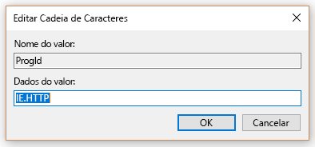
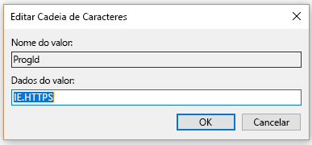

# Definir o navegador padrãoSet default browser

> [!IMPORTANT]
> Este artigo se aplica à Pesquisa do Microsoft no portal de administração do Bing.This article applies to the Microsoft Search in Bing admin portal. Estamos movendo o portal para o centro de administração do Microsoft 365 e, posteriormente, ele será removido.We’re moving the portal to the Microsoft 365 admin center, and then it will be removed. Recomendamos que você use o centro de administração do Microsoft 365 para começar.We recommend that you use the Microsoft 365 admin center to get started. [Visão geral da Pesquisa da Microsoft.Overview of Microsoft Search](overview-microsoft-search.md)
    
Configurar o navegador, o mecanismo de pesquisa e a home page padrão ajuda os usuários a descobrir os recursos, promove o uso e proporciona uma experiência aprimorada da Pesquisa da Microsoft.Configuring the default browser, default search engine, and default homepage will help your users discover Microsoft Search capabilities, encourage more usage, and provide a smoother experience.
  
Para definir o navegador padrão da organização, faça os procedimentos abaixo.To set the default browser for your organization, follow the steps below.
  
## Windows 8 e versão posteriorWindows 8 and above

Para configurar o Microsoft Edge ou Internet Explorer como navegador padrão, faça o seguinte:To set Internet Explorer or Microsoft Edge as the default browser, follow these steps:
  
### Criar um arquivo de associações padrãoCreate default associations file

1. Abra um console administrativo do PowerShell.Open an administrative PowerShell console.
    
2.  `New-Item -Path "\\$env:USERDOMAIN\SYSVOL\$env:USERDNSDOMAIN" -Type Directory -Name "Settings"`
    
3.  `$SettingsPath="\\$env:USERDOMAIN\SYSVOL\$env:USERDNSDOMAIN\Settings"`
    
4.  `Start-Process Dism.exe -PassThru "/Online /Export-DefaultAppAssociations:$SettingsPath\AppAssoc.xml"`
    
Essas etapas se destinam a testar e criar o arquivo de associações padrão na pasta SYSVOL do controlador de domínio.These steps try and create the default associations file in the SYSVOL folder of the domain controller.
  
### Adicionar ou editar um arquivo de associações padrãoAdd or edit the default associations file

1. `Notepad "$SettingsPath\AppAssoc.xml"`
    
2. Edite as seguintes entradas (.htm, .html, http, https) e remova as outras entradas, caso elas não sejam necessárias.Edit the following entries (.htm, .html, http, https), and remove other entries if they're not needed.
    
  - **Microsoft Edge****Microsoft Edge**
    
     `<Association Identifier=".htm" ProgId="AppX4hxtad77fbk3jkkeerkrm0ze94wjf3s9" ApplicationName="Microsoft Edge" />`
  
     `<Association Identifier=".html" ProgId="AppX4hxtad77fbk3jkkeerkrm0ze94wjf3s9" ApplicationName="Microsoft Edge" />`
  
     `<Association Identifier="http" ProgId="AppXq0fevzme2pys62n3e0fbqa7peapykr8v" ApplicationName="Microsoft Edge" />`
    
  - **Internet Explorer****Internet Explorer**
    
     `<Association Identifier=".htm" ProgId="htmlfile" ApplicationName="Internet Explorer" />`
  
     `<Association Identifier=".html" ProgId="htmlfile" ApplicationName="Internet Explorer" />`
  
     `<Association Identifier="http" ProgId="IE.HTTP" ApplicationName="Internet Explorer" />`
  
     `<Association Identifier="https" ProgId="IE.HTTPS" ApplicationName="Internet Explorer" />`
    
3. Abra o Console de Gerenciamento de Política de Grupo (gpmc.msc) e a opção para editar uma política existente ou criar uma nova.Open Group Policy Management Console (gpmc.msc) and switch to editing any existing policy or creating a new one.
    
1. Navegue para **Configuração do Computador\Modelos Administrativos\Componentes do Windows\Explorador de Arquivos**Navigate to **Computer Configuration\Administrative Templates\Windows Components\File Explorer**
    
2. Clique duas vezes em **Definir um arquivo de configuração de associações padrão**, defina-o como **habilitado** e insira o caminho para AppAssoc.xml (por exemplo %USERDOMAIN%\SYSVOL\%USERDNSDOMAIN%\Settings\AppAssoc.xml)Double-click **Set a default associations configuration file**, set it to **Enabled**, and enter the path to AppAssoc.xml (for example %USERDOMAIN%\SYSVOL\%USERDNSDOMAIN%\Settings\AppAssoc.xml)
    
4. Aplique o GPO resultante vinculando-o ao domínio apropriado.Enforce the resultant GPO by linking it to the appropriate domain.
    
Os usuários poderão alterar o navegador, após a definição dessa política.Users will be able to change the browser after this policy is set.
  
## Windows 7Windows 7

1. Configure o computador local que será usado para configurar o GPO.Configure the local machine that will be used to set the GPO.
    
1. Abra **Painel de Controle\Programas\Programas Padrão\Definir Programas Padrão** e defina o Internet Explorer como padrão.Open **Control Panel\Programs\Default Programs\Set Default Programs** and set Internet Explorer as the default. 
    
2. Abra o Console de Gerenciamento de Política de Grupo (gpmc.msc) e a opção para editar uma política existente ou criar uma nova.Open Group Policy Management Console (gpmc.msc) and switch to editing any existing policy or creating a new one.
    
1. Navegue para **\<Computador/Usuário\> Configuração\Políticas\Preferências\Configurações do Windows**.Navigate to **\<Computer/User\> Configuration\Policies\Preferences\Windows Settings**.
    
2. Clique com o botão direito do mouse em **Registro/Novo** e selecione **Assistente do Registro**.Right-click on **Registry\New** and select **Registry Wizard**.
    
3. Na janela do Navegador do Registro, selecione **Computador local** e clique em **Avançar**.From the Registry Browser window, select **Local Computer** and click **Next**.
    
4. Navegue para **HKEY_CURRENT_USER\Software\Microsoft\Windows\Shell\Associations\UrlAssociations\https** e selecione o valor ProgID. Verifique se o valor tem a seguinte aparência, conforme exibido abaixo:Navigate to **HKEY_CURRENT_USER\Software\Microsoft\Windows\Shell\Associations\UrlAssociations\https** and select the ProgId value. Make sure the value looks like the one below: 
    
    
  
5. Navegue para **HKEY_CURRENT_USER\Software\Microsoft\Windows\Shell\Associations\UrlAssociations\https** e selecione o valor ProgID. Verifique se o valor tem a seguinte aparência, conforme exibido abaixo:Navigate to **HKEY_CURRENT_USER\Software\Microsoft\Windows\Shell\Associations\UrlAssociations\https** and select the ProgId value. Make sure that the value looks like the one below: 
    
    
  
3. Aplique o GPO resultante vinculando-o ao domínio apropriado.Enforce the resultant GPO by linking it to the appropriate domain.
    
Os usuários poderão alterar o navegador, após a definição dessa política.Users will be able to change the browser after this policy is set.