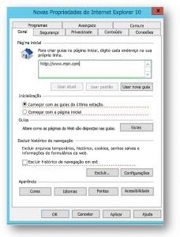

# Definir o Bing.com como página inicial padrão

Este artigo explica como definir o Bing como o mecanismo de pesquisa padrão para o Microsoft Edge, o Google Chrome e o Internet Explorer. 
  
 
## Microsoft Edge no Windows 10, Versão 1511 ou posterior

Os usuários não poderão alterar isso após a definição dessa política. 

1. Abra o Console de Gerenciamento de Política de Grupo (gpmc.msc) e a alterne para editar uma política existente ou criar uma nova. 
1. Navegue até **Modelos Administrativos\Componentes do Windows\Microsoft Edge**.    
1. Clique duas vezes em **Configurar páginas iniciais**, defina como **Habilitado** e insira `https://www.bing.com/business`
1.  Aplique o GPO resultante vinculando-o ao domínio apropriado.

  
## Google Chrome no Windows XP SP2 ou posterior

O artigo do Suporte do Windows sobre como gerenciar arquivos ADMX, bem como os arquivos ADMX mais recentes para as diversas versões do Windows estão disponíveis [no Suporte da Microsoft](https://support.microsoft.com/help/3087759/how-to-create-and-manage-the-central-store-for-group-policy-administra).

É necessário também o arquivo de política do Google mais recente, que está disponível na página de [Ajuda do Google Chrome Enterprise](https://support.google.com/chrome/a/answer/187202).
  
Caso as configurações descritas nesta seção não estejam disponíveis no GPMC, baixe o arquivo ADMX apropriado e copie-o para o [Repositório Central](/previous-versions/windows/it-pro/windows-vista/cc748955%28v%3dws.10%29). O Repositório Central no controlador é uma pasta com a seguinte convenção de nomenclatura:
  
 **%systemroot%\sysvol\\<domain\>\policies\PolicyDefinitions**
  
Cada domínio processado pelo controlador deve ter uma pasta separada. O comando a seguir pode ser usado para copiar o arquivo ADMX do prompt de comando:
  
 `Copy <path_to_ADMX.ADMX> %systemroot%\sysvol\<domain>\policies\PolicyDefinitions`
  
1. Abra o Console de Gerenciamento de Política de Grupo (gpmc.msc) e a opção para editar uma política existente ou criar uma nova.
1. Verifique se as seguintes pastas estão exibidas na seção **Modelos Administrativos** da *Configuração do Computador e da Configuração do Usuário*: Google Chrome e Configurações Padrão do Google Chrome (os usuários podem substituir).
   - As configurações da primeira seção são permanentes e o administrador local não poderá alterá-las.
   - As configurações da última seção de políticas podem ser alteradas pelos usuários nas configurações do navegador. Você deve determinar se os usuários podem substituir a configuração padrão. Nas etapas a seguir, altere a configuração na pasta que corresponde à política e às necessidades da organização. As etapas abaixo usam as Configurações Padrão do Google Chrome.

1. Navegue para **&lt;Computador/Configuração do Usuário&gt;\Modelos Administrativos\Google Chrome – Configurações Padrão\Home Page**. 
1. Clique duas vezes em **Usar página de nova guia como home page** e defina como **Habilitado**. 
1. Navegue para **&lt;Computador/Configuração do Usuário&gt;\Modelos Administrativos\Google Chrome – Configurações Padrão\Página de Nova Guia**. 
1. Clique duas vezes em **Configurar a URL da página de nova guia**, defina como **Habilitado** e insira `https://www.bing.com/business?form=BFBSPR` 
1. Aplique o GPO resultante vinculando-o ao domínio apropriado.

## Internet Explorer 5.0 ou posterior
Os usuários ainda poderão alterar a home page após a definição dessa política. 

1. Abra o Console de Gerenciamento de Política de Grupo (gpmc.msc) e a opção para editar uma política existente ou criar uma nova.
    
2. Navegue para **Configuração do Usuário\Preferências\Configurações do Painel de Controle\Configurações da Internet**.
    
3. Clique com o botão direito do mouse em **Configurações da Internet** e selecione **Internet Explorer 10**.
    
    > [!NOTE]
    > Selecione a opção do Internet Explorer 10 a fim de aplicar as configurações para o Internet Explorer 11, pois as mesmas configurações se aplicam à esta versão do programa. 
  
4. As configurações sublinhadas em vermelho não são configuradas na máquina de destino, exceto as sublinhadas em verde. Para alterar o sublinhado, use as seguintes teclas de função:
    
    F5 – Habilitar todas as configurações na guia atual
    
    F6 – Habilitar a configuração atualmente selecionada
    
    F7 – Desabilitar a configuração atualmente selecionada
    
    F8 – Desabilitar todas as configurações na guia atual
    
5. Pressione **F8** para desabilitar todas as configurações antes de configurar tudo. A tela deve ter a seguinte aparência: 
    
    
  
6. Pressione **F6** na configuração da Página Inicial e insira `https://www.bing.com/business?form=BFBSPR`
    
7. Aplique o GPO resultante vinculando-o ao domínio apropriado.