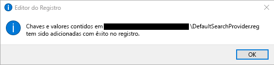
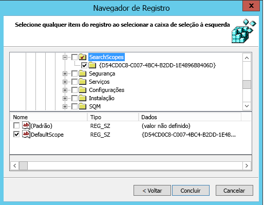
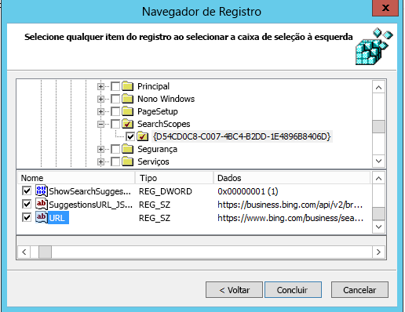

# Definir o Bing como mecanismo de pesquisa padrãoMake Bing the default search engine
  
Este artigo explica como tornar o Bing o mecanismo de pesquisa padrão para o Microsoft Edge, Google Chrome e Internet Explorer.This article explains how to make Bing the default search engine for Microsoft Edge, Google Chrome, and Internet Explorer. 
  
## Microsoft Edge no Windows 10, Versão 1703 ou posteriorMicrosoft Edge on Windows 10, Version 1703 or later

Embora você defina o Bing como mecanismo de pesquisa padrão, o Microsoft Edge permite que os usuários alterem as configurações para usar um mecanismo de pesquisa diferente.Although you'll set Bing as the default search engine, Microsoft Edge allows users to change their settings to use a different search engine.
  
Para obter os arquivos ADMX mais recentes para várias versões do Windows, confira [Como criar e gerenciar um Repositório central para modelos administrativos de política de grupo do Windows](https://support.microsoft.com/pt-BR/help/3087759/how-to-create-and-manage-the-central-store-for-group-policy-administra).For the latest ADMX files for various versions of Windows, see [How to create and manage the Central Store for Group Policy Administrative Templates in Windows](https://support.microsoft.com/en-us/help/3087759/how-to-create-and-manage-the-central-store-for-group-policy-administra).
  
Se a configuração descrita nesta seção não for encontrada dentro do GPMC, baixe o ADMX apropriado e o copie para o repositório central. Para saber mais, confira [Editar GPOs baseados em domínio usando arquivos ADMX](https://docs.microsoft.com/pt-BR/previous-versions/windows/it-pro/windows-vista/cc748955%28v%3dws.10%29). O Repositório central no controlador é uma pasta com a seguinte convenção de nomenclatura:If the setting described in this section cannot be found inside of GPMC, download the appropriate ADMX and copy them to the central store. For more information, see [Editing Domain-Based GPOs Using ADMX Files](https://docs.microsoft.com/en-us/previous-versions/windows/it-pro/windows-vista/cc748955%28v%3dws.10%29). Central store on the controller is a folder with the following naming convention:
  
 **%systemroot%\sysvol\\<domain\>\policies\PolicyDefinitions****%systemroot%\sysvol\\<domain\>\policies\PolicyDefinitions**
  
Cada domínio processado pelo controlador deve ter uma pasta separada. O comando a seguir pode ser usado para copiar o arquivo ADMX usando o prompt de comando:Each domain that your controller handles should get a separate folder. The following command can be used to copy the ADMX file from the command prompt:
  
 `Copy <path_to_ADMX.ADMX> %systemroot%\sysvol\<domain>\policies\PolicyDefinitions`
  
1. Abra o Console de Gerenciamento de Política de Grupo (gpmc.msc) e a opção para editar uma política existente ou criar uma nova.Open the Group Policy Management Console (gpmc.msc) and switch to editing an existing policy or creating a new one.
    
2. Navegue até **&lt;Computador\Configuração do usuário&gt;\Administrativos\Modelos\Componentes do Windows\Microsoft Edge**.Navigate to **&lt;Computer/User Configuration&gt;\Administrative Templates\Windows Components\Microsoft Edge**.
    
1. Clique duas vezes em **Definir mecanismo de pesquisa padrão**, defina como **Habilitado** e insira `https://www.bing.com/sa/osd/bfb.xml`Double-click **Set default search engine**, set to **Enabled**, and enter `https://www.bing.com/sa/osd/bfb.xml`
    
3. Aplique o GPO resultante vinculando-o ao domínio apropriado.Enforce the resultant GPO by linking it to the appropriate domain.

## Google Chrome no Windows XP SP2 ou posteriorGoogle Chrome on Windows XP SP2 or later

Os usuários não poderão alternar o mecanismo de pesquisa padrão após a definição dessa política.Users won't be able to change the search provider after this policy is set.
  
O Chrome vem com seu próprio conjunto de configurações de políticas de grupo que pode ser baixado na forma de um arquivo ADMX em [Ajuda do Google Chrome Enterprise](https://support.google.com/chrome/a/answer/187202). Se forem usados os sistemas operacionais Windows Vista/Server 2008 ou posteriores para gerenciar o GPO do domínio, o arquivo ADMX incluído neste pacote cuida das configurações do Chrome no Windows XP SP2 ou posterior.Chrome comes with its own set of group policy settings which can be downloaded in the form of an ADMX file from [Google Chrome Enterprise Help](https://support.google.com/chrome/a/answer/187202). If operating systems Windows Vista/Server 2008 or later are used to manage GPO's for the domain, the ADMX file provided in this package takes care of Chrome settings on Windows XP SP2 or later.
  
Copie o arquivo de modelo em um repositório central para arquivos ADMX no controlador de domínio. Para saber mais, confira [Editando GPOs baseados em domínio usando arquivos ADMX](https://docs.microsoft.com/pt-BR/previous-versions/windows/it-pro/windows-vista/cc748955%28v%3dws.10%29). O repositório central no controlador é uma pasta com a seguinte convenção de nomenclatura:Copy the template file to a central store for ADMX files on the domain controller. For more information, see [Editing Domain-Based GPOs Using ADMX Files](https://docs.microsoft.com/en-us/previous-versions/windows/it-pro/windows-vista/cc748955%28v%3dws.10%29). Central store on the controller is a folder with the following naming convention:
  
 **%systemroot%\sysvol\\<domain\>\policies\PolicyDefinitions****%systemroot%\sysvol\\<domain\>\policies\PolicyDefinitions**
  
Cada domínio processado pelo controlador deve ter uma pasta separada. O comando a seguir pode ser usado para copiar o arquivo ADMX usando o prompt de comando:Each domain that your controller handles should get a separate folder. The following command can be used to copy the ADMX file from the command prompt:
  
 `Copy <path_to_Chrome.ADMX> %systemroot%\sysvol\<domain>\policies\PolicyDefinitions`
  
1. Abra o Console de Gerenciamento de Política de Grupo (gpmc.msc) e alterne para editar uma política existente ou criar uma nova.Open the Group Policy Management Console (gpmc.msc) and switch to editing any existing policy or creating a new one.
    
2. Verifique se as seguintes pastas são exibidas na seção Modelos Administrativos da Configuração do Computador e da Configuração do Usuário: Google Chrome e Configurações Padrão do Google Chrome.Make sure the following folders appear in the Administrative Templates section of both User/Computer Configuration: Google Chrome and Google Chrome - Default Settings.
    
  - As configurações da primeira seção são permanentes e os administradores locais não podem alterá-las no navegador.The settings of the first section are fixed and local administrators won't be able to change them in the browser.
    
  - As configurações da última seção das políticas podem ser alteradas pelos usuários nas configurações do navegador.The settings of the latter section of policies can be changed by users in the browser settings.
    
3. Navegue até **\<Computador/Usuário\> Configuração\Modelos Administrativos\Google Chrome\Provedor de Pesquisa Padrão**Navigate to **\<Computer/User\> Configuration\Administrative Templates\Google Chrome\Default search provider**
    
4. Clique duas vezes em **Habilitar o provedor de pesquisa padrão** e defina como **Habilitado**.Double-click **Enable the default search provider**, and set it to **Enabled**.
    
5. Clique duas vezes em **Ícone do provedor de pesquisa padrão**, defina como **Habilitado** e insira `https://www.bing.com/sa/simg/bb.ico`Double-click **Default search provider icon**, set it to **Enabled**, and enter `https://www.bing.com/sa/simg/bb.ico`
    
6. Clique duas vezes na **URL instantânea do provedor de pesquisa padrão** e insira `https://www.bing.com/business/search?q={searchTerms}&amp;form=BFBSPR`Double-click **Default search provider instant URL**, and enter `https://www.bing.com/business/search?q={searchTerms}&amp;form=BFBSPR`
    
7. Clique duas vezes no **Nome do provedor de pesquisa padrão**, defina como Ativado e insira "Pesquisa da Microsoft no Bing"Double-click **Default search provider name**, set it to Enabled, and enter 'Microsoft Search in Bing'
    
8. Clique duas vezes na \*\*URL de pesquisa do provedor pesquisa padrão \*\*, defina como **Habilitado** e insira `https://www.bing.com/business/search?q={searchTerms}&amp;form=BFBSPR`Double-click **Default search provider search URL**, set it to **Enabled**, and enter `https://www.bing.com/business/search?q={searchTerms}&amp;form=BFBSPR`
    
9. Clique duas vezes na \*\*URL de sugestão do provedor pesquisa padrão \*\*, defina como **Habilitado** e insira `https://business.bing.com/api/v2/browser/suggest?q={searchTerms}&amp;form=BFBSPA`Double-click **Default search provider suggest URL**, set it to **Enabled**, and enter `https://business.bing.com/api/v2/browser/suggest?q={searchTerms}&amp;form=BFBSPA`
    
10. Aplique o GPO resultante ao vinculá-lo ao domínio apropriado.Enforce the resultant GPO by linking it to the appropriate domain.
    
Configure o mecanismo de pesquisa padrão para adicionar o recurso de sugestões da Pesquisa da Microsoft na barra de endereços do navegador. Atualmente há suporte apenas para indicadores. Os usuários verão as duas principais sugestões de indicadores acima das sugestões da web pública conforme digitam na barra de endereço.Setting the default search engine will add the Microsoft Search search suggestions feature in the browser address bar. Currently, this supports bookmarks only. Users will see the top two bookmark suggestions above public web suggestions as they type in the address bar.

## Internet Explorer 11 ou posteriorInternet Explorer 11 or later versions

Os usuários poderão alterar o provedor de pesquisa após a definição dessa política.Users will be able to change the search provider after this policy is set.
  
### ETAPA 1.Step 1 Configure o computador local que será usado para configurar o GPOConfigure the local machine that will be used to set the GPO.

Cole o texto a seguir em um arquivo reg (\*.reg).Paste the following text into a reg(\*.reg) file.
  
Editor do Registro do Windows Versão 5.00Windows Registry Editor Version 5.00
  
<pre>[HKEY_CURRENT_USER\Software\Microsoft\Internet Explorer\SearchScopes]
"DefaultScope"="{D54CD0C8-C007-4BC4-B2DD-1E4896B8406D}"
[HKEY_CURRENT_USER\Software\Microsoft\Internet Explorer\SearchScopes\{D54CD0C8-C007-4BC4-B2DD-1E4896B8406D}]
"Codepage"=dword:0000fde9
"DisplayName"="Microsoft Search in Bing"
"OSDFileURL"="https://www.bing.com/sa/osd/bfb.xml"
"FaviconURL"="https://www.bing.com/sa/simg/bb.ico"
"SuggestionsURL_JSON"="https://business.ing.com/api/v2/browser/suggest?q={searchTerms}&amp;form=BFBSPA"
"ShowSearchSuggestions"=dword:00000001
"URL"="https://www.bing.com/business/search?q={searchTerms}&amp;form=BFBSPR"</pre>
  
Clique duas vezes no arquivo criado e siga as etapas para importar o arquivo. Uma importação bem-sucedida deve resultar na seguinte caixa de diálogo:Double-click the file created and follow the steps to import the file. A successful import should result in the following dialog:
  

  
### ETAPA 2.Step 2 Abra o Console de Gerenciamento de Política de Grupo (gpmc.msc) e alterne para editar uma política existente ou criar uma nova.Open the Group Policy Management Console (gpmc.msc) and switch to editing an existing policy or creating a new one.

1. Navegue até **Usuário Configuração\Políticas\Preferências\Configurações do Windows**.Navigate to **User Configuration\Policies\Preferences\Windows Settings**.
    
2. Clique com botão direito em **Registro\Novo** e selecione **Assistente do registro**. Na janela do Navegador do registro, selecione **Computador local** e clique em **Próximo**.Right-click on **Registry\New** and select **Registry Wizard**. From the Registry Browser window, select **Local Computer** and click **Next**.
    
3. Navegue até **HKEY_CURRENT_USER\SOFTWARE\Microsoft\Internet Explorer\SearchScopes**.Navigate to **HKEY_CURRENT_USER\SOFTWARE\Microsoft\Internet Explorer\SearchScopes**.
    
4. Nesta chave, certifique-se de selecionar DefaultScope.From this key, make sure to select DefaultScope.
    
    
  
5. Marque todas as subchaves com a GUID da Pesquisa da Microsoft no Bing e todos os valores na chave, exceto qualquer caminho ao perfil do usuário. Role para baixo para escolher outros itens.Check all sub keys containing the GUID for Microsoft Search in Bing and every value under the key except any path to user profiles. Scroll down to select other items.
    
    
  
6. Clique em Concluir para finalizar essa configuração.Click Finish to complete this configuration.
    
### ETAPA 3.Step 3. Configurar as Preferências do usuário para ajudar a eliminar o aviso que o usuário pode receber quando a pesquisa DefaultScope for aplicada3. Set up User Preferences to help eliminate a warning the user may get when DefaultScope search is enforced

Este aviso é projetado e avisa os usuários que um programa está tentando modificar suas configurações.This warning is by design and alerts users of a program trying to modify their settings.
  
1. Dentro do mesmo GPO, clique com o botão direito do mouse em **Registro\Novo** e selecione **Assistente do Registro**.Within the same GPO, right click on **Registry\New** and select **Registry Wizard**.
    
2. Navegue até **HKEY_CURRENT_USER\SOFTWARE\Microsoft\Internet Explorer\User Preferences**.Navigate to **HKEY_CURRENT_USER\SOFTWARE\Microsoft\Internet Explorer\User Preferences**.
    
3. Selecione a chave **User Preference**.Select the **User Preference** key.
    
4. Clique em **Concluir**.Click **Finish**.
    
5. Clique no objeto recém-criado. No painel do lado direito, clique duas vezes no objeto Preferências do usuário, altere a **Ação** para **Excluir e salvar**.Click on the newly created object. On the right-side pane double click on the User Preferences object, change the **Action** to **Delete and Save**.
1. Aplique o GPO resultante vinculando-o ao domínio apropriado.Enforce the resultant GPO by linking it to the appropriate domain.