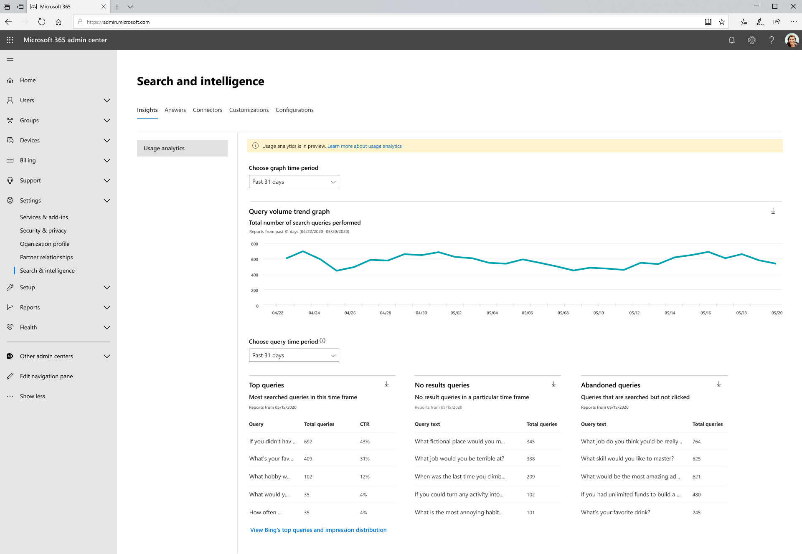

# Relatórios de uso do Microsoft Search

Os relatórios de uso de pesquisa permitem que você saiba mais sobre como a pesquisa está funcionando em sua organização. Os insights gerados desses relatórios ajudarão a facilitar [a localização de conteúdo e a](https://docs.microsoft.com/microsoftsearch/make-content-easy-to-find) realização de ações que farão a pesquisa uma experiência mais útil e Delightful para os seus usuários.

> [!IMPORTANT]
> Os relatórios de uso do Microsoft Search estão atualmente em versão prévia.

Os [relatórios de uso do Microsoft Search](https://admin.microsoft.com/Adminportal/Home?#/MicrosoftSearch/insights) incluem gráficos e tabelas gerados a partir de pesquisas executadas a partir de caixas de pesquisa do SharePoint Home e do Office.com. Você pode ver os dados dos últimos 31 dias, por dia ou mensais do ano anterior. Esses relatórios estão apenas distribuindo, portanto, levará algum tempo para acumular os dados históricos.

Uma versão anterior desta página incluiu dados de pesquisas executadas para o Microsoft Search no Bing no Bing.com. Esses dados serão integrados nesses relatórios em breve, mas por enquanto, você ainda pode ver esses relatórios clicando no link na parte inferior da página para exibir as **principais consultas e distribuição de impressão do Bing**.

## Visão geral dos relatórios de pesquisa

|**Relatório**|**Descrição**|
|:-----|:-----|
|Volume de consulta|Esse relatório mostra o número de consultas de pesquisa executadas. Use este relatório para identificar as tendências de volume da consulta de pesquisa e para determinar os períodos de alta e baixa atividade de pesquisa.|
|Principais Consultas|Esse relatório mostra as consultas de pesquisa mais populares. Use este relatório para entender quais tipos de informações seus usuários estão pesquisando.|
|Consultas abandonadas|Este relatório mostra consultas de pesquisa populares que recebem baixo clique. Use esse relatório para identificar consultas de pesquisa que podem levar à insatisfação do usuário e para aprimorar a capacidade de descoberta de conteúdo. Em seguida, você pode determinar se a criação de uma resposta, como um indicador ou a inclusão de novo conteúdo por meio de um conector de gráfico é a ação certa.|
|Nenhuma consulta de resultados|Esse relatório mostra consultas de pesquisa populares que retornaram sem resultado. Use-o para identificar as consultas que podem criar insatisfação do usuário e aprimorar a capacidade de descoberta do conteúdo. Em seguida, você pode determinar se a criação de uma resposta, como um indicador ou a inclusão de novo conteúdo por meio de um conector de gráfico é a ação certa.|

## Exibindo relatórios

Quando você navega até a página relatórios de uso, todos os relatórios estão disponíveis para exibição. Você pode usar o filtro de data para selecionar um dia ou mês específico para exibir.

Baixar um relatório permitirá que você veja relatórios de um intervalo de tempo mais amplo. Clique na seta baixar e selecione **31 dias** ou **últimos 12 meses**. O relatório é baixado como uma planilha do Excel. Se você selecionou os últimos 31 dias, a planilha terá a guia individual para cada dia. O download dos últimos 12 meses terá uma guia para cada mês.

Para exibir as principais consultas e relatórios de distribuição de impressão do Bing, clique no link na página.

## Perguntas frequentes

**Quando selecionou 31 dias ou últimos 12 meses, por que eu preciso escolher um dia específico ou mês específico, respectivamente.**

O modo de exibição calendário hoje nos relatórios de uso do Microsoft Search é um processo de duas etapas. Primeiro, selecione o intervalo de datas na lista suspensa (últimos 31 dias ou últimos 12 meses) e selecione o dia ou mês de início.

As tabelas de consulta superior, abandonadas e com falha mostram os resultados do dia ou mês que você escolher.

**Quando receberá dados agregados nos últimos 7 dias, últimos 30 dias, etc., como os relatórios de consultas principais do Bing?**

Estamos considerando esse tipo de agregação e simplificando a filtragem do intervalo de dados para versões futuras desses relatórios.

**Por que não consigo ver uma divisão dos relatórios de uso por aplicativos (fontes) diferentes?**

No momento, a filtragem por fonte não está disponível. Os relatórios combinam pesquisas do SharePoint Home e do Office.com. Nossa próxima versão incluirá filtragem de origem para que você possa ver as métricas específicas de cada aplicativo.

**Que outra filtragem de relatórios de uso está chegando?**

Estamos trabalhando em filtros adicionais que ajudarão a garantir o uso da pesquisa em um nível mais granular da sua organização. Por exemplo, você poderá ver o volume de consulta de uma geografia ou departamento específico.

**Por que a pesquisa da Microsoft em relatórios do Bing em uma página separada?**

Modernizar a pesquisa nos aplicativos do Office 365 para o Microsoft Search exigia que você ingressasse em sistemas distintos anteriormente, incluindo a geração de relatórios. Isso leva tempo e achamos que era mais importante obter esses relatórios agora, em vez de esperar até que possamos concluir a integração dos dados do Bing. Depois de concluir a integração, os dados de todos os pontos de extremidade de pesquisa serão incluídos nos mesmos relatórios.
